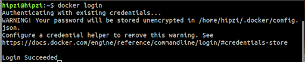
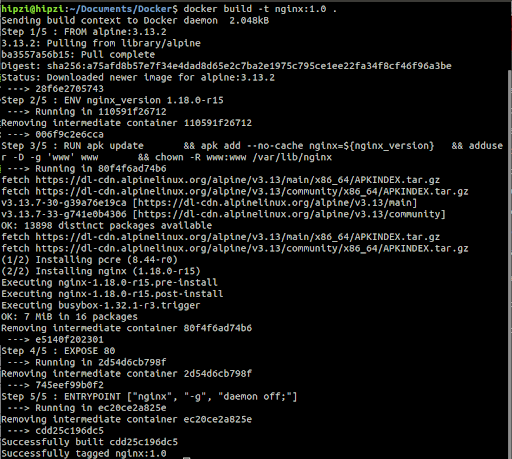
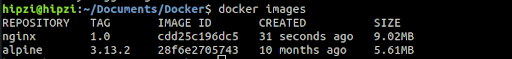
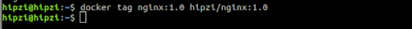
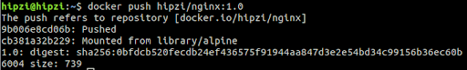
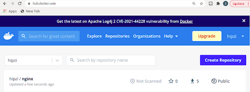

# **Pengenalan & Docker Dasar**
- [**Pengenalan & Docker Dasar**](#pengenalan--docker-dasar)
  - [Introduction](#introduction)
    - [Instalasi](#instalasi)
      - [Windows](#windows)
      - [Linux (berbasis Ubuntu)](#linux-berbasis-ubuntu)
    - [Pengenalan](#pengenalan)
    - [Kenapa kita harus menggunakan docker?](#kenapa-kita-harus-menggunakan-docker)
  - [Dockerfile](#dockerfile)
  - [Docker Hub](#docker-hub)

## Introduction
### Instalasi
#### Windows
1. Pastika bahwa WSL2 sudah terinstall
2. Download installer docker desktop di https://www.docker.com/products/docker-desktop (ukuran 490 MB)
3. Jalankan installernya, lalu pencet  ok/ install, lalu tunggu selama sekitar 2 menit
4. Docker sudah terinstall

#### Linux (berbasis Ubuntu)
1. update package apt lalu install package berikut agar apt bisa menggunakan repository https
```
sudo apt-get update

 sudo apt-get install \
    ca-certificates \
    curl \
    gnupg \
    lsb-release
```
2. tambahkan kunci GPG docker
``` curl -fsSL https://download.docker.com/linux/ubuntu/gpg | sudo gpg --dearmor -o /usr/share/keyrings/docker-archive-keyring.gpg```
3. gunakan command berikut untuk memilih repo stabil
``` echo \
  "deb [arch=$(dpkg --print-architecture) signed-by=/usr/share/keyrings/docker-archive-keyring.gpg] https://download.docker.com/linux/ubuntu \
  $(lsb_release -cs) stable" | sudo tee /etc/apt/sources.list.d/docker.list > /dev/null
 ```
4. install docker engine
``` sudo apt-get update
sudo apt-get install docker-ce docker-ce-cli containerd.io 
```
5. pastikan docker sudah terinstall dengan benar
```sudo docker run hello-world```

### Pengenalan
Salah satu tantangan bagi tim DevOps adalah mengatur dependensi dan stack teknologi sebuah aplikasi pada bermacam-macam environment cloud dan development. Sebagai bagian dari tugas mereka, mereka harus menjaga aplikasi tetap stabil dan operasional, terlepas dari platform tempatnya dijalankan.

Tim development, di sisi lain, harus berfokus pada mengeluarkan update dan fitur baru. Sayangnya, hal ini dapat mengacaukan stabilitas aplikasi dengan mengenalkan bug yang tergantung pada environment. Untuk menghindari inefisiensi ini, perusahaan-perusahaan mulai mengadopsi container framework, contohnya yaitu Docker.

Docker adalah sebuah produk PaaS (platform as a service) yang menggunakan virtualisasi level OS untuk mengirimkan software dalam paket-paket bernama container. Container terisolasi antara satu sama lain dan membundel software, library, dan file konfigurasi mereka sendiri, namun, mereka bisa berkomunikasi antara satu sama lain menggunakan saluran-saluran tertentu. Karena semua container berbagi service yang sama pada satu kernel OS, mereka menggunakan lebih sedikit sumber daya (misal RAM dan penyimpanan) daripada VM (virtual machine)

### Kenapa kita harus menggunakan docker?
Dengan docker kita mendapatkan:
- Astraksi OS level dengan penggunakan sumber daya optimal
- Interoperabilitas antara berbagai macam sistem operasi
- Proses build dan test yang lebih efisien
- Eksekusi program lebih cepat

meme docker:


<justify></justify>
<p></p>
<a id="docker-command"></a>
<p>Berikut merupakan sintaks yang terdapat pada Docker :</p>

| Sintaks                                     | Deskripsi                                                                                                                            |
| ------------------------------------------- | ------------------------------------------------------------------------------------------------------------------------------------ |
| docker run                           | Menjalankan command di container baru                                                                                       |
| docker start | Menjalankan satu atau beberapa container                                                                                      |
| docker stop  | Memberhentikan satu atau beberapa container                                                                                         |
| docker build                               | Buat sebuah image dari dockerfile                                                                                   |
| docker pull                          | Mengambil image atau repo dari registry                                                                                      |
| docker push                   | Mengirim image atau repo ke registry                                                               |
| docker export                           | Mengekspor filesystem container sebagai arsip tar                                                               |
| docker exec                  | Menjalankan command di sebuah runtime container (container yang sedang berjalan)                                                                         |
| docker search                              | Mencari image di docker hub |
| docker attach                          | Menempelkan input output terminal pada suatu container, ini memungkinkaa kita melihat output atau mengontrol container secara interaktif                                                    |
| docker commit             | Membuat image baru setelah dilakukan perubahan pada container   

## Dockerfile
<justify></justify>
<p></p>
<a id="dockerfile-command"></a>
<p>Berikut merupakan sintaks yang terdapat pada Dockerfile :</p>

| Sintaks                                     | Deskripsi                                                                                                                            |
| ------------------------------------------- | ------------------------------------------------------------------------------------------------------------------------------------ |
| FROM \<base image>                           | Mendefinisikan image yang menjadi dasar kontainer.                                                                                   |
| COPY \[--chown=\<user>:\<group>\] \<src> \<dst> | Melakukan copy file atau folder ke dalam image.                                                                                      |
| ADD \[--chown=\<user><group>\] \<src> \<dst>  | Menambahkan file atau folder ke dalam image.                                                                                         |
| RUN \<command>                               | Menjalankan perintah shell pada saat proses build.                                                                                   |
| ENV \<key>=\<value>                           | Mendefinisikan variabel di dalam image.                                                                                              |
| WORKDIR \<path to folder>                    | Melakukan pindah folder dan menetapkannya sebagai direktori saat ini.                                                                |
| USER \<nama user>                            | Melakukan ganti user untuk mengeksekusi perintah-perintah setelahnya.                                                                |
| ENTRYPOINT \<command>                        | Menjalankan perintah shell pada saat kontainer dijalankan.                                                                           |
| CMD \<command>                               | Menjalankan perintah shell pada saat kontainer dijalankan, tetapi dapat digantikan dengan paramater lain saat menjalankan kontainer. |
| ARGS \<key>=\<value>                          | Mengirimkan variabel dari perintah docker untuk dijalankan pada saat proses build                                                    |
| EXPOSE \<portNumber>/\[tcp/udp\]             | Membuka port image yang berada di dalam kontainer.                                                                                   |

<p></p>
<a id="dockerfile-example"></a>
<p>Berikut merupakan contoh Dockerfile :</p>

    FROM alpine:3.13.2

    ENV nginx_version 1.18.0-r15

    RUN apk update \
        && apk add --no-cache nginx=${nginx_version} \
        && adduser -D -g 'www' www \
        && chown -R www:www /var/lib/nginx 

    EXPOSE 80
    ENTRYPOINT ["nginx", "-g", "daemon off;"]

## Docker Hub
<justify></justify>
<p></p>
<a id="dockerhub-push-image"></a>
<p>Docker Hub merupakan registry yang berisi kumpulan image docker, kita juga dapat melakukan custom image docker menggunakan Dockerfile dan meletakkannya pada Docker Hub.</p>
<p>Berikut merupakan langkah-langkah untuk meletakkan image docker pada Docker Hub :</p>

<p>1. Melakukan login docker</p>

    docker login



<p>2. Melakukan build image (jika sudah terdapat docker image, maka langkah ini dapat dilewati)</p>

    docker build -t <nama image>:<version image> .



<p>3. Melihat image docker yang nantinya akan diletakan pada Docker Hub</p>

    docker images



<p>4. Membuat tag pada docker image</p>

    docker tag <nama image>:<version image> <nama repository>/<nama image>:<version image>



<p>5. Melakukan 'docker push' agar image tersimpan dalam docker hub</p>

     docker push <nama repository>/<nama image>:<version image>   



<p>6. Melihat image yang telah di push pada Docker Hub</p>


  
## Sumber
- https://docs.docker.com/engine/install/ubuntu/#install-using-the-repository
- https://www.bmc.com/blogs/docker-101-introduction/
- https://en.wikipedia.org/wiki/Docker_(software)
