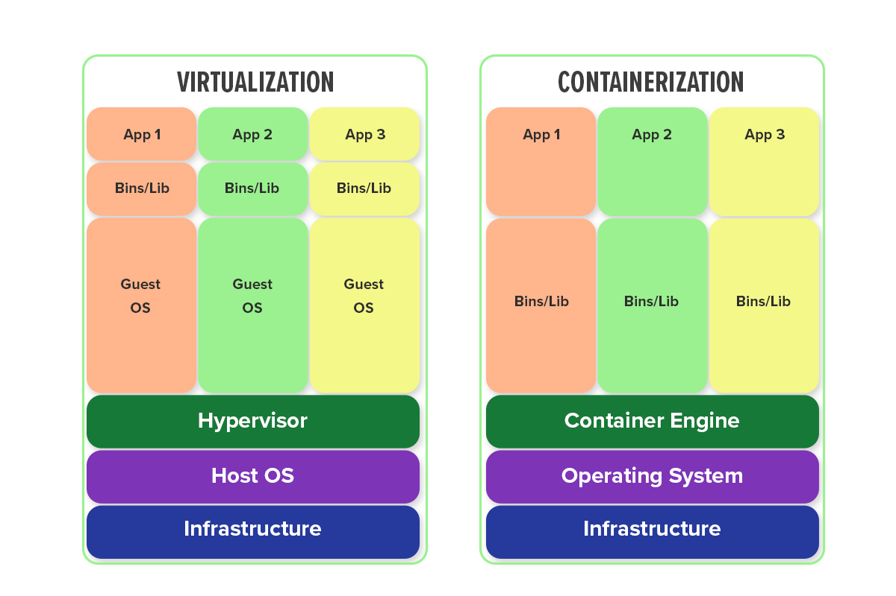

# **Pengenalan Docker**
- [**Glosarium**](#glosarium)
- [**Materi**](#materi)
  - [Host Filesystem Pollution Problem](#️host-filesystem-pollution-problem)
  - [Virtualization vs Containerization](virtualization-vs-containerization)
    - [Pengertian Virtualization dan Containerization](#pengertian-virtualization-dan-containerization)
    - [Perbedaan Virtualization dan Containerization](#perbedaan-virtualization-dan-containerization)
  - [Apa itu Docker?](#apa-itu-docker)
  - [Arsitektur Docker](#arsitektur-docker)
    - [Docker Daemon](#docker-daemon)
    - [Docker Client](#docker-client)
    - [Docker Objects](#docker-objects)
    - [Docker Registry](#docker-registry)
  - [Kelebihan dan Kekurangan Docker](#kelebihan-dan-kekurangan-docker)
- [**Sumber Referensi**](#sumber-referensi)

## Glosarium
| Kata | Pengertian |
| -------- | -------- |
| Guest operating system  | sistem operasi yang diinstal dan dijalankan di dalam virtual mesin yang berjalan di atas host operating system. |
| Host operating system  | sistem operasi yang berjalan di workstation. Host operating system ini bertanggung jawab dalam mengontrol dan mengalokasikan sumber daya komputer seperti memori, prosesor, dan penyimpanan kepada virtual mesin yang berjalan di atasnya. |

## Materi
### Host Filesystem Pollution Problem

Host Filesystem Pollution Problem merujuk pada akumulasi file, folder, atau perubahan konfigurasi yang terjadi dalam host operating system akibat instalasi perangkat lunak yang berlebihan atau tidak teratur. Dalam lingkungan pengembangan perangkat lunak, seringkali diperlukan pengujian atau penggunaan banyak perangkat lunak dan dependensi yang berbeda. Namun, jika tidak dikelola dengan baik, hal ini dapat menyebabkan host operating system menjadi tidak teratur, berantakan, atau tidak stabil.

Salah satu contoh kasus Host Filesystem Pollution Problem adalah akumulasi software yang diinstal di laptop atau komputer host tanpa pengelolaan yang baik. Pengguna sering kali menginstal banyak software untuk keperluan pengembangan perangkat lunak, tetapi tidak semuanya digunakan secara aktif. Akibatnya, file, folder, dan konfigurasi yang terkait dengan software yang tidak digunakan dapat terakumulasi di host operating system, menghasilkan tumpukan file yang tidak perlu dan memenuhi ruang penyimpanan, serta mengganggu kinerja sistem operasi.

Selain itu, Host Filesystem Pollution Problem juga dapat terjadi ketika pengguna menggunakan beberapa versi perangkat lunak yang sama secara bersamaan pada host operating system. Misalnya, dalam pengembangan perangkat lunak, terkadang diperlukan untuk menguji aplikasi pada beberapa versi perangkat lunak atau dependensi yang berbeda. Namun, jika pengelolaan versi tidak diatur dengan baik, hal ini dapat mengakibatkan banyak versi perangkat lunak yang terinstal pada host operating system, sehingga membingungkan dan mempersulit pengelolaan dan penggunaan software tersebut.

Permasalahan diataslah yang sering ditemui sebagai developer. Masih banyak lagi contoh kasus Host Filesystem Pollution Problem. Lantas bagaimana cara mengatasi permasalahan tersebut? Yuk, berkenalan dengan konsep virtualization dan containerization.

### Virtualization vs Containerization
#### Pengertian Virtualization dan Containerization
Virtualization adalah teknologi yang memungkinkan pembuatan mesin virtual di dalam satu fisik server. Dengan menggunakan hypervisor, virtualisasi memungkinkan pengelolaan beberapa sistem operasi atau aplikasi yang berjalan secara mandiri. Konsep dasar virtualisasi melibatkan isolasi sumber daya antara mesin virtual, sehingga setiap mesin virtual dapat beroperasi seolah-olah menjadi mesin fisik yang terpisah.

Sedangkan Containerization adalah teknologi yang memungkinkan pengemasan aplikasi dan dependensinya ke dalam sebuah wadah (container) yang dapat dijalankan secara konsisten di berbagai lingkungan komputasi, tanpa perlu mengubah kode atau konfigurasi aplikasi itu sendiri. Container merupakan unit yang portabel, ringan, dan dapat diisolasi, yang mengemas aplikasi, library, dan konfigurasi menjadi satu entitas yang dapat dijalankan di lingkungan yang berbeda, seperti lokal, cloud, atau pusat data.

#### Perbedaan Virtualization dan Containerization

- Virtualisasi menggunakan hypervisor untuk membuat mesin virtual yang memerlukan sistem operasi penuh dan isolasi sumber daya seperti CPU, RAM, dan storage untuk setiap mesin virtual. Sementara itu, containerization menggunakan teknologi seperti Docker untuk membuat wadah (container) yang berbagi sistem operasi host.

- Virtualisasi memungkinkan menjalankan sistem operasi dan aplikasi yang berbeda secara simultan dalam mesin virtual yang terisolasi. Sementara itu, containerization memungkinkan menjalankan aplikasi yang dikemas dalam container di dalam host yang sama, berbagi kernel OS yang sama.

- Virtualisasi cenderung lebih cocok untuk aplikasi yang membutuhkan isolasi penuh, konfigurasi yang kompleks, dan dukungan untuk berbagai sistem operasi. Di sisi lain, containerization lebih cocok untuk aplikasi yang bersifat ringan, portabel, dan bisa dijalankan di berbagai lingkungan komputasi.

- Proses start-up pada virtualisasi memerlukan waktu yang lebih lama, karena melibatkan booting sistem operasi dan konfigurasi tambahan pada setiap mesin virtual. Containerization, di sisi lain, memungkinkan proses deploy dan start-up yang lebih cepat, karena hanya perlu menjalankan container yang sudah dikemas dan siap dijalankan.

### Apa itu Docker?

Docker adalah sebuah platform yang memungkinkan pengembang perangkat lunak untuk membuat, mengemas, dan menjalankan aplikasi dalam wadah yang dapat diisolasi secara mandiri, disebut container. Container dalam Docker berfungsi seperti lingkungan eksekusi yang terisolasi untuk menjalankan aplikasi, termasuk kode sumber, runtime, dan dependensi yang diperlukan.

Dengan Docker, pengembang dapat membuat wadah yang konsisten dan portabel, yang dapat dijalankan di berbagai lingkungan komputasi, termasuk mesin lokal, server cloud, atau lingkungan pengembangan dan produksi yang berbeda. Docker memungkinkan aplikasi dan dependensinya diisolasi, sehingga aplikasi dapat dijalankan secara konsisten di berbagai lingkungan tanpa mengganggu host operating system atau aplikasi lainnya.

### Arsitektur Docker

#### Docker Daemon
Docker Daemon adalah komponen yang berjalan di latar belakang (background) pada host dan bertanggung jawab untuk menjalankan dan mengelola Docker Object seperti images, container, network, dan lain-lain. Docker Daemon adalah proses yang berjalan di dalam sistem operasi host dan menerima perintah dari Docker Client untuk membuat, menjalankan, menghentikan, dan mengelola Docker Object. Docker Daemon juga bertanggung jawab untuk mengelola sumber daya host seperti CPU, memori, dan jaringan yang digunakan oleh Docker Object.

#### Docker Client
Docker Client adalah antarmuka pengguna berbasis command-line atau GUI yang digunakan untuk berinteraksi dengan Docker. Docker Client memungkinkan pengguna untuk menjalankan perintah-perintah Docker untuk membuat, mengelola, dan mengontrol layanan pada Docker. Docker Client berkomunikasi dengan Docker Daemon untuk mengirimkan perintah-perintah Docker dan menerima output layanan Docker yang sedang berjalan.

#### Docker Objects
Docker Objects adalah komponen dasar yang terdapat di Docker. Beberapa contoh Docker Objects meliputi image, container, volume, dan network yang akan dijelaskan pada modul selanjutnya. 

#### Docker Registry 
Docker Registry adalah repositori yang digunakan untuk menyimpan dan berbagi Docker Image. Docker Registry berfungsi sebagai tempat penyimpanan untuk Docker Image yang dapat diakses oleh pengguna Docker dari berbagai lokasi. Docker Hub, yang merupakan Docker public registry, adalah salah satu contoh Docker Registry yang sering digunakan untuk menyimpan dan berbagi Docker Image secara publik. Selain Docker Hub, pengguna juga dapat membuat Docker Registry pribadi untuk menyimpan Docker Image. 

### Kelebihan dan Kekurangan Docker

Docker adalah platform open-source yang memungkinkan pengguna untuk membuat, mengelola, dan menjalankan aplikasi dalam container. Berikut adalah beberapa kelebihan dan kekurangan Docker:

| Kelebihan | Kekurangan |
|------------|------------|
| **Isolasi**: Docker Container memungkinkan aplikasi dan dependensinya diisolasi dalam lingkungan yang terpisah, sehingga tidak saling mempengaruhi. | **Kompleksitas Konfigurasi**: Konfigurasi Docker dapat menjadi kompleks, terutama untuk aplikasi yang lebih kompleks dengan banyak komponen atau dependensi. |
| **Portabilitas**: Docker memungkinkan aplikasi untuk dikemas dalam container yang dapat dijalankan di berbagai lingkungan, termasuk mesin lokal, cloud, atau lingkungan produksi. | **Keamanan**: Docker Container berbagi kernel sistem operasi host, sehingga menghadirkan potensi kerentanan keamanan jika tidak dikonfigurasi dengan benar. |
| **Efisiensi**: Docker Container memungkinkan penggunaan sumber daya yang efisien, dengan pengurangan overhead sistem operasi dan penggunaan sumber daya yang lebih ringan daripada virtualisasi tradisional. | **Pengelolaan Jaringan**: Pengaturan jaringan untuk container Docker bisa rumit, terutama ketika harus mengatur jaringan lintas host. |
| **Skalabilitas**: Docker memungkinkan aplikasi untuk dikemas sebagai layanan yang dapat dengan mudah diatur untuk berjalan pada beberapa container, memfasilitasi skalabilitas horizontal dan pengelolaan aplikasi yang mudah. | **Pemantauan**: Pemantauan Docker Container dapat lebih rumit dibandingkan dengan lingkungan tradisional, memerlukan perhatian ekstra dalam mengelola kesehatan dan kinerja container. |
| **Komunitas**: Docker memiliki komunitas yang luas yang membantu dalam perkembangan Docker itu sendiri. | **Pembelajaran Awal**: Docker memerlukan pemahaman konsep yang cukup untuk dapat menggunakannya secara efektif, yang mungkin memerlukan waktu untuk belajar bagi pengguna yang belum terbiasa dengan teknologi container. |

## Sumber Referensi

- https://docs.docker.com.xy2401.com/engine/docker-overview/
- https://insights.daffodilsw.com/blog/application-containerization-vs-virtualization-how-are-they-different
- Bullington-McGuire, R., Dennis, A. K., & Schwartz, M. (2020). Docker For Developers. Packt.

