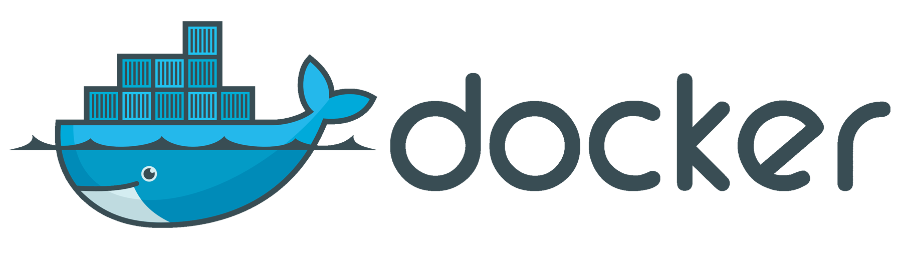

# **Pengenalan Docker**
- [**Glosarium**](#glosarium)
- [**Materi**](#materi)
  - [Host Filesystem Pollution Problem](#️host-filesystem-pollution-problem)
  - [Virtualization vs Containerization](#virtualization-vs-containerization)
  - [Apa itu Docker?](#apa-itu-docker)
  - [Arsitektur Docker](#arsitektur-docker)
    - [Docker Client](#docker-client)
    - [Docker Daemon](#docker-daemon)
    - [Docker Objects](#docker-objects)
    - [Docker Registry](#docker-registry)
  - [Kelebihan dan Kekurangan Docker](#kelebihan-dan-kekurangan-docker)
  - [Tantangan Penggunaan Docker](#tantangan-penggunaan-docker)
- [**Sumber Referensi**](#sumber-referensi)

## Glosarium
| Kata | Pengertian |
| -------- | -------- |
| Guest operating system  | sistem operasi yang berjalan di virtual mesin  |
| Host operating system  | sistem operasi yang berjalan di workstation  |

## Materi

### Host Filesystem Pollution Problem

_Host Filesystem Pollution Problem_ merujuk pada akumulasi file, folder, atau perubahan konfigurasi yang terjadi dalam _host operating system_ akibat instalasi perangkat lunak yang berlebihan atau tidak teratur. Dalam lingkungan pengembangan perangkat lunak, seringkali diperlukan pengujian atau penggunaan banyak perangkat lunak dan dependensi yang berbeda. Namun, jika tidak dikelola dengan baik, hal ini dapat menyebabkan _host operating system_ menjadi tidak teratur, berantakan, atau tidak stabil.

Salah satu contoh kasus Host Filesystem Pollution Problem adalah akumulasi software yang diinstal di laptop atau komputer host tanpa pengelolaan yang baik. Pengguna sering kali menginstal banyak software untuk keperluan pengembangan perangkat lunak, tetapi tidak semuanya digunakan secara aktif. Akibatnya, file, folder, dan konfigurasi yang terkait dengan software yang tidak digunakan dapat terakumulasi di _host operating system_, menghasilkan tumpukan file yang tidak perlu dan memenuhi ruang penyimpanan, serta mengganggu kinerja sistem operasi.

Selain itu, Host Filesystem Pollution Problem juga dapat terjadi ketika pengguna menggunakan beberapa versi perangkat lunak yang sama secara bersamaan pada _host operating system_. Misalnya, dalam pengembangan perangkat lunak, terkadang diperlukan untuk menguji aplikasi pada beberapa versi perangkat lunak atau dependensi yang berbeda. Namun, jika pengelolaan versi tidak diatur dengan baik, hal ini dapat mengakibatkan banyak versi perangkat lunak yang terinstal pada _host operating system_, sehingga membingungkan dan mempersulit pengelolaan dan penggunaan software tersebut.

Nah, permasalahan diataslah yang sering kita temui sebagai developer. Masih banyak lagi contoh kasus _Host Filesystem Pollution Problem_. Lantas bagaimana cara mengatasi permasalahan tersebut? Yuk, simak kenalan dengan _virtualization_ dan _containerization_.

### Virtualization vs Containerization
##### A. **Virtualization**

##### B. **Containerization**

### Apa itu Docker?

Docker adalah sebuah platform yang memungkinkan pengembang perangkat lunak untuk membuat, mengemas, dan menjalankan aplikasi dalam wadah yang dapat diisolasi secara mandiri, disebut _container_. _Container_ dalam Docker berfungsi seperti lingkungan eksekusi yang terisolasi untuk menjalankan aplikasi, termasuk kode sumber, runtime, dan dependensi yang diperlukan.

Dengan Docker, pengembang dapat membuat wadah yang konsisten dan portabel, yang dapat dijalankan di berbagai lingkungan komputasi, termasuk mesin lokal, server cloud, atau lingkungan pengembangan dan produksi yang berbeda. Docker memungkinkan aplikasi dan dependensinya diisolasi, sehingga aplikasi dapat dijalankan secara konsisten di berbagai lingkungan tanpa mengganggu _host operating system_ atau aplikasi lainnya.

### Arsitektur Docker

##### Docker Client
##### Docker Daemon
##### Docker Objects
##### Docker Registry  

### Kelebihan dan Kekurangan Docker
#### Kelebihan Docker
1. Portabilitas: Kontainer Docker dapat dijalankan di berbagai lingkungan, termasuk lingkungan pengembangan, uji coba, dan produksi, tanpa perlu khawatir tentang perbedaan konfigurasi atau dependensi.

2. Isolasi: Kontainer Docker menyediakan isolasi yang kuat antara aplikasi yang berjalan di dalamnya, sehingga mengurangi potensi konflik atau gangguan antara aplikasi yang berbeda.

3. Skalabilitas: Docker memungkinkan aplikasi untuk dijalankan secara horizontal, dengan kemampuan untuk mengelola dan mengatur jumlah kontainer yang berjalan sesuai dengan kebutuhan aplikasi.

4. Efisiensi Sumber Daya: Docker memungkinkan penggunaan sumber daya yang efisien, karena kontainer dapat berbagi kernel sistem operasi yang sama, mengurangi overhead sistem operasi yang diperlukan untuk setiap kontainer.

5. Pengelolaan Konfigurasi: Docker menyediakan alat untuk mengelola konfigurasi aplikasi sebagai kode, memungkinkan pengelolaan konfigurasi yang konsisten dan terdokumentasi dalam kode sumber aplikasi.

6. Ekosistem Luas: Docker memiliki ekosistem yang luas dan aktif, dengan banyak perangkat tambahan dan integrasi dengan alat-alat lain yang umum digunakan dalam pengembangan dan manajemen aplikasi.

#### Kekurangan Docker
1. Kompleksitas Konfigurasi: Docker memiliki konfigurasi yang kompleks, terutama untuk aplikasi yang lebih kompleks atau dengan kebutuhan jaringan yang rumit.

2. Keamanan: Pengaturan keamanan Docker yang salah atau tidak benar dapat memperkenalkan risiko keamanan, seperti kerentanan terhadap akses yang tidak sah atau perpindahan data antar kontainer.

3. Kompatibilitas Aplikasi: Aplikasi yang dijalankan dalam kontainer Docker harus kompatibel dengan lingkungan Docker, dan tidak semua aplikasi dapat dijalankan tanpa modifikasi dalam kontainer Docker.

4. Pengelolaan Data: Pengelolaan data dalam kontainer Docker dapat menjadi tantangan, termasuk pengelolaan penyimpanan data dalam kontainer yang berjalan dan pengelolaan data persisten di luar kontainer.

5. Monitoring dan Manajemen: Monitoring dan manajemen kontainer Docker dalam skala besar dapat kompleks, termasuk pengelolaan banyak kontainer, pengelolaan jaringan, dan pemantauan kinerja aplikasi yang berjalan dalam kontainer.

### Tantangan Penggunaan Docker

## Sumber Referensi

- https://docs.docker.com.xy2401.com/engine/docker-overview/
- Bullington-McGuire, R., Dennis, A. K., & Schwartz, M. (2020). Docker For Developers. Packt.

