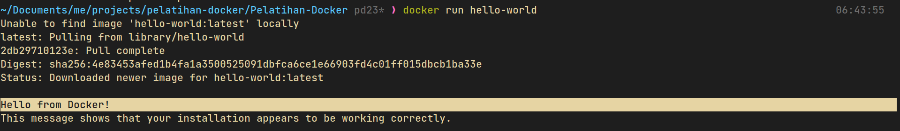
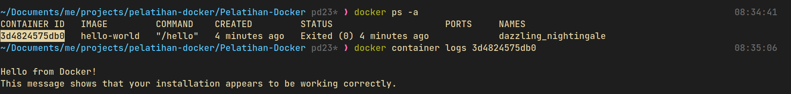

# **Docker Service Dasar**
- [**Glosarium**](#glosarium)
- [**Materi**](#materi)
  - [Docker Container](#️docker-container)
    - [Pengertian Docker Container](#pengertian-docker-container)
    - [Perintah Docker Container](#perintah-docker-container)
    - [Shell di Docker Container](#shell-di-docker-container)
  - [Docker Images](#docker-images)
    - [Pengertian Docker Image](#pengertian-docker-image)
    - [Perintah Docker Image](#perintah-docker-image)
    - [Hello-World Docker Image](#hello-world-docker-image)
  - [Dockerfile](#dockerfile)
    - [Pengertian Dockerfile](#pengertian-dockerfile)
    - [Contoh Dockerfile](#contoh-dockerfile)
  - [Docker Hub](#docker-hub)
    - [Docker Repositories](#docker-repositories)
- [**Sumber Referensi**](#sumber-referensi)

## Glosarium
## Materi

### Docker Container
#### Pengertian Docker Container
Docker container adalah sebuah unit terisolasi yang berisi perangkat lunak dan semua dependensinya, yang dijalankan pada lingkungan yang terpisah dari host dan container lainnya. Dalam container, aplikasi dapat berjalan dengan konsisten di berbagai lingkungan meskipun terdapat perbedaan dalam konfigurasi dan infrastruktur.

Docker container bisa diibaratkan seperti kotak berisi program dan semua bahan yang dibutuhkan agar program tersebut bisa berjalan dengan baik. Kotak ini dijalankan secara terpisah dari komputer aslinya, sehingga program dalam kotak ini dapat berjalan dengan konsisten pada berbagai lingkungan tanpa terpengaruh oleh konfigurasi dan infrastruktur yang ada pada komputer aslinya. Dengan Docker container, kita bisa dengan mudah mengelola dan menjalankan aplikasi di berbagai lingkungan tanpa harus khawatir dengan masalah konfigurasi dan dependensi.

#### Perintah Docker Container
Berikut adalah beberapa perintah penting yang tersedia pada **`docker container COMMAND`**. Setiap perintah dijelaskan dengan singkat dan jelas.

| Perintah | Deskripsi |
| --- | --- |
| `attach` | Menjalankan perintah pada kontainer yang sedang berjalan. Perintah ini akan memasukkan pengguna ke dalam sesi terminal kontainer. |
| `commit` | Membuat sebuah image baru dari perubahan yang dilakukan pada kontainer yang sedang berjalan. |
| `cp` | Menyalin file atau direktori antara file sistem host dan file sistem dalam kontainer. |
| `create` | Membuat sebuah kontainer baru, tetapi tidak menjalankannya. |
| `diff` | Menunjukkan perubahan pada file sistem kontainer yang sedang berjalan. |
| `exec` | Menjalankan sebuah perintah pada kontainer yang sedang berjalan. |
| `export` | Mengekspor sebuah kontainer ke dalam file tar. |
| `inspect` | Melihat detail dari sebuah kontainer. |
| `kill` | Menghentikan sebuah kontainer yang sedang berjalan secara paksa. |
| `logs` | Melihat log dari sebuah kontainer. |
| `ls` | Menampilkan daftar kontainer yang sedang berjalan. |
| `pause` | Menjeda sebuah kontainer yang sedang berjalan. |
| `port` | Menampilkan port yang dibuka oleh sebuah kontainer. |
| `prune` | Menghapus kontainer yang tidak sedang berjalan. |
| `rename` | Mengubah nama dari sebuah kontainer yang sedang berjalan. |
| `restart` | Menghidupkan kembali sebuah kontainer yang sedang berjalan. |
| `rm` | Menghapus sebuah kontainer yang sedang berjalan. |
| `run` | Membuat sebuah kontainer baru dan menjalankannya. |
| `start` | Menjalankan sebuah kontainer yang telah dibuat. |
| `stats` | Menampilkan informasi CPU, memori, dan jaringan dari sebuah kontainer yang sedang berjalan. |
| `stop` | Menghentikan sebuah kontainer yang sedang berjalan. |
| `top` | Menampilkan proses yang sedang berjalan di dalam sebuah kontainer. |
| `unpause` | Meneruskan sebuah kontainer yang telah dijeda. |
| `update` | Memperbarui sebuah kontainer dengan konfigurasi baru. |
| `wait` | Menunggu kontainer selesai menjalankan sebuah perintah sebelum melanjutkan. |

#### Shell di Docker Container

Untuk menggunakan shell di Docker Container bisa dengan menggunakan perintah **`docker exec -it <nama_container> /bin/sh`**. Di mana:

- **`docker exec`** digunakan untuk mengeksekusi perintah pada container yang sudah berjalan.
- **`-it`** digunakan agar perintah dijalankan dalam mode interaktif dengan terminal.
- **`<nama_container>`** adalah nama atau ID dari container yang ingin diakses.
- **`/bin/sh`** digunakan untuk menjalankan shell di dalam container.

Contoh penggunaan:
**`
docker exec -it my_container /bin/sh
`**
Perintah di atas akan membuka shell di dalam container dengan nama **`my_container`**. Dengan ini, kita bisa melakukan perintah-perintah shell seperti biasa setelah masuk ke dalam shell tersebut. Untuk keluar dari shell gunakan perintah **`exit`**.

### Docker Images
#### Pengertian Docker Image
Docker images adalah template atau blueprints yang digunakan untuk membuat Docker containers. Image ini berisi sistem operasi dan aplikasi yang sudah dikonfigurasi dengan baik serta siap digunakan. Image dapat dibangun secara manual dengan membuat Dockerfile atau dapat diunduh dari Docker Hub, yaitu repositori publik yang menyediakan banyak image yang sudah siap digunakan.

Docker images bersifat immutables, artinya setelah dibuat, image tidak bisa diubah secara langsung. Namun, image dapat dibuat baru dengan melakukan modifikasi pada image sebelumnya dan memberikan nama yang berbeda. Setiap image memiliki nama dan tag untuk mengidentifikasinya secara unik. Dalam Docker Hub, nama image biasanya terdiri dari beberapa bagian, seperti nama pengguna (username), nama image, dan tag, seperti contoh **`username/nama_image:tag`**.

Setelah image dibuat, bisa menggunakan perintah docker run untuk membuat instance dari image tersebut dalam bentuk container.

#### Perintah Docker Image
Berikut adalah beberapa perintah penting yang tersedia pada `docker images COMMNAD`. Setiap perintah dijelaskan dengan singkat dan jelas.

| Perintah | Deskripsi |
| --- | --- |
| `build` | Membuat sebuah image dari Dockerfile. |
| `history` | Menampilkan riwayat perubahan pada sebuah image. |
| `import` | Mengimpor sebuah image dari sebuah file. |
| `inspect` | Melihat detail dari sebuah image. |
| `load` | Memuat sebuah image dari sebuah arsip yang telah disimpan. |
| `ls` | Menampilkan daftar image yang telah terunduh. |
| `prune` | Menghapus image yang tidak terpakai. |
| `pull` | Mengunduh sebuah image dari Docker Hub atau registry lainnya. |
| `push` | Mengunggah sebuah image ke Docker Hub atau registry lainnya. |
| `rename` | Mengubah nama dari sebuah image yang telah terunduh. |
| `rm` | Menghapus sebuah image yang telah terunduh. |
| `save` | Menyimpan sebuah image ke dalam sebuah arsip yang dapat diunduh. |
| `tag` | Memberikan sebuah tag pada sebuah image. |

#### Hello-World Docker Image

"Hello World" Docker Image adalah contoh sederhana dari sebuah image yang berisi aplikasi yang sangat sederhana, yaitu hanya mencetak kata "Hello World" pada layar. Image ini digunakan untuk menjelaskan secara singkat tentang bagaimana cara membuat Docker Image, membagikan image ke Docker Hub, serta cara menjalankan Docker Image dalam bentuk container. Image ini juga sering digunakan sebagai langkah awal ketika pertama kali belajar Docker.

Berikut adalah langkah-langkah menggunakan Hello-World docker image.
1. Buka terminal atau command prompt dan ketikkan perintah **`docker run hello-world`**. Perintah ini akan mengunduh image "Hello World" dari Docker Hub jika image belum ada di dalam host lokal. Setelah itu, Docker akan menjalankan image tersebut dalam bentuk container dan aplikasi "Hello World" akan berjalan, mencetak kata "Hello from Docker!" pada layar, kemudian menampilkan informasi tambahan tentang Docker.

 

2. Setelah container selesai berjalan, untuk melihat log dari container tersebut dengan menjalankan perintah **`docker container logs [container ID]`**. Untuk mendapatkan container ID bisa dengan menjalankan perintah **`docker ps -a`**.

 

3. Setelah selesai, container yang tidak diperlukan dapat dihapus dengan menjalankan perintah **`docker rm [container ID]`**. Selain container, image "Hello World" dapat dihapus dari host lokal dengan menjalankan perintah **`docker rmi hello-world`**.

### Dockerfile
#### Pengertian Dockerfile
<justify></justify>

Berikut merupakan sintaks yang terdapat pada Dockerfile :

| Sintaks                                     | Deskripsi                                                                                                                            |
| ------------------------------------------- | ------------------------------------------------------------------------------------------------------------------------------------ |
| FROM \<base image>                           | Mendefinisikan image yang menjadi dasar kontainer.                                                                                   |
| COPY \[--chown=\<user>:\<group>\] \<src> \<dst> | Melakukan copy file atau folder ke dalam image.                                                                                      |
| ADD \[--chown=\<user><group>\] \<src> \<dst>  | Menambahkan file atau folder ke dalam image.                                                                                         |
| RUN \<command>                               | Menjalankan perintah shell pada saat proses build.                                                                                   |
| ENV \<key>=\<value>                           | Mendefinisikan variabel di dalam image.                                                                                              |
| WORKDIR \<path to folder>                    | Melakukan pindah folder dan menetapkannya sebagai direktori saat ini.                                                                |
| USER \<nama user>                            | Melakukan ganti user untuk mengeksekusi perintah-perintah setelahnya.                                                                |
| ENTRYPOINT \<command>                        | Menjalankan perintah shell pada saat kontainer dijalankan.                                                                           |
| CMD \<command>                               | Menjalankan perintah shell pada saat kontainer dijalankan, tetapi dapat digantikan dengan paramater lain saat menjalankan kontainer. |
| ARGS \<key>=\<value>                          | Mengirimkan variabel dari perintah docker untuk dijalankan pada saat proses build                                                    |
| EXPOSE \<portNumber>/\[tcp/udp\]             | Membuka port image yang berada di dalam kontainer.                                                                                   |

Berikut merupakan contoh Dockerfile :

    FROM alpine:3.13.2

    ENV nginx_version 1.18.0-r15

    RUN apk update \
        && apk add --no-cache nginx=${nginx_version} \
        && adduser -D -g 'www' www \
        && mkdir -p /run/nginx \
        && mkdir -p /www \
        && chown -R www:www /var/lib/nginx \
        && chown -R www:www /run/nginx

    ADD nginx.conf /etc/nginx/nginx.conf 
    ADD index.html /www/index.html

    EXPOSE 80
    ENTRYPOINT ["nginx", "-g", "daemon off;"]

## Docker Hub
<justify></justify>

Docker Hub merupakan registry yang berisi kumpulan image docker, kita juga dapat melakukan custom image docker menggunakan Dockerfile dan meletakkannya pada Docker Hub.

Berikut merupakan langkah-langkah untuk meletakkan image docker pada Docker Hub :

1. Melakukan login docker

    docker login

2. Melakukan build image (jika sudah terdapat docker image, maka langkah ini dapat dilewati)

    docker build -t <nama image>:<version image> .

3. Melihat image docker yang nantinya akan diletakan pada Docker Hub

    docker images

4. Membuat tag pada docker image

    docker tag <nama image>:<version image> <nama repository>/<nama image>:<version image>

5. Melakukan 'docker push' agar image tersimpan dalam docker hub

     docker push <nama repository>/<nama image>:<version image>   

6. Melihat image yang telah di push pada Docker Hub

## Sumber Referensi
- https://docs.docker.com/engine/reference/commandline/container/
- https://docs.docker.com/engine/reference/commandline/image/