# **Docker Service Dasar**

- [**Glosarium**](#glosarium)
- [**Materi**](#materi)
  - [Docker Container](#️docker-container)
    - [Pengertian Docker Container](#pengertian-docker-container)
    - [Perintah Docker Container](#perintah-docker-container)
    - [Shell di Docker Container](#shell-di-docker-container)
  - [Docker Images](#docker-images)
    - [Pengertian Docker Image](#pengertian-docker-image)
    - [Perintah Docker Image](#perintah-docker-image)
    - [Hello-World Docker Image](#hello-world-docker-image)
  - [Dockerfile](#dockerfile)
    - [Pengertian Dockerfile](#pengertian-dockerfile)
    - [Perintah Dockerfile](#perintah-dockerfile)
    - [Contoh Implementasi Dockerfile](#contoh-implementasi-dockerfile)
  - [Docker Hub](#docker-hub)
    - [Pengertian Docker Hub](#pengertian-docker-hub)
    - [Docker Repository](#docker-repository)
    - [Langkah-Langkah Penggunaan Docker Hub](#langkah-langkah-penggunaan-docker-hub)
- [**Sumber Referensi**](#sumber-referensi)

## Glosarium

## Materi

### Docker Container

#### Pengertian Docker Container

Docker Container adalah sebuah unit terisolasi yang berisi perangkat lunak dan semua dependensinya, yang dijalankan pada lingkungan yang terpisah dari host dan container lainnya. Dalam container, aplikasi dapat berjalan dengan konsisten di berbagai lingkungan meskipun terdapat perbedaan dalam konfigurasi dan infrastruktur.

Docker Container bisa diibaratkan seperti kotak berisi program dan semua bahan yang dibutuhkan agar program tersebut bisa berjalan dengan baik. Kotak ini dijalankan secara terpisah dari komputer aslinya, sehingga program dalam kotak ini dapat berjalan dengan konsisten pada berbagai lingkungan tanpa terpengaruh oleh konfigurasi dan infrastruktur yang ada pada komputer aslinya. Dengan Docker Container,dapat dengan mudah mengelola dan menjalankan aplikasi di berbagai lingkungan tanpa harus khawatir dengan masalah konfigurasi dan dependensi.


#### Perintah Docker Container

Berikut adalah beberapa perintah penting beserta penjelasannya yang tersedia untuk memanage container pada Docker.

| Perintah  | Deskripsi                                                                                                                         |
| --------- | --------------------------------------------------------------------------------------------------------------------------------- |
| `attach`  | Menjalankan perintah pada kontainer yang sedang berjalan. Perintah ini akan memasukkan pengguna ke dalam sesi terminal kontainer. |
| `commit`  | Membuat sebuah image baru dari perubahan yang dilakukan pada kontainer yang sedang berjalan.                                      |
| `cp`      | Menyalin file atau direktori antara file sistem host dan file sistem dalam kontainer.                                             |
| `create`  | Membuat sebuah kontainer baru, tetapi tidak menjalankannya.                                                                       |
| `diff`    | Menunjukkan perubahan pada file sistem kontainer yang sedang berjalan.                                                            |
| `exec`    | Menjalankan sebuah perintah pada kontainer yang sedang berjalan.                                                                  |
| `export`  | Mengekspor sebuah kontainer ke dalam file tar.                                                                                    |
| `inspect` | Melihat detail dari sebuah kontainer.                                                                                             |
| `kill`    | Menghentikan sebuah kontainer yang sedang berjalan secara paksa.                                                                  |
| `logs`    | Melihat log dari sebuah kontainer.                                                                                                |
| `ls`      | Menampilkan daftar kontainer yang sedang berjalan.                                                                                |
| `pause`   | Menjeda sebuah kontainer yang sedang berjalan.                                                                                    |
| `port`    | Menampilkan port yang dibuka oleh sebuah kontainer.                                                                               |
| `prune`   | Menghapus kontainer yang tidak sedang berjalan.                                                                                   |
| `rename`  | Mengubah nama dari sebuah kontainer yang sedang berjalan.                                                                         |
| `restart` | Menghidupkan kembali sebuah kontainer yang sedang berjalan.                                                                       |
| `rm`      | Menghapus sebuah kontainer yang sedang berjalan.                                                                                  |
| `run`     | Membuat sebuah kontainer baru dan menjalankannya.                                                                                 |
| `start`   | Menjalankan sebuah kontainer yang telah dibuat.                                                                                   |
| `stats`   | Menampilkan informasi CPU, memori, dan jaringan dari sebuah kontainer yang sedang berjalan.                                       |
| `stop`    | Menghentikan sebuah kontainer yang sedang berjalan.                                                                               |
| `top`     | Menampilkan proses yang sedang berjalan di dalam sebuah kontainer.                                                                |
| `unpause` | Meneruskan sebuah kontainer yang telah dijeda.                                                                                    |
| `update`  | Memperbarui sebuah kontainer dengan konfigurasi baru.                                                                             |
| `wait`    | Menunggu kontainer selesai menjalankan sebuah perintah sebelum melanjutkan.                                                       |

untuk lebih lengkapnya perintah perintah apa saja yang ada dan serta penjelasannya bisa melihat dokumentasinya dengan menjalankan command **`docker container command`**

#### Shell di Docker Container

Ketika sebuah container dijalankan, maka akan berjalan di dalam lingkungan terisolasi yang terpisah dari lingkungan host. Oleh karena itu, tidak mungkin untuk menjalankan perintah langsung di dalam container menggunakan shell host (terminal local).

Untuk menggunakan shell di Docker Container bisa dengan menggunakan perintah **`docker exec [OPTIONS] <CONTAINER> <COMMAND> `** :

- **`docker exec`** digunakan untuk mengeksekusi perintah pada container yang sudah berjalan.
- **`[OPTIONS]`** ada beberapa option yang dapat dipakai dan memiliki fungsi yang berbeda beda.

| Options                 | Deskripsi                                                                                                     |
| ----------------------- | ------------------------------------------------------------------------------------------------------------- |
| `-d`,`--detach`         | Menjalankan perintah di dalam container dalam (detached mode), sehingga container berjalan di latar belakang. |
| `-e`,`--env list`       | Mengatur variabel lingkungan (environment variables) pada container.                                          |
| `-i`,`--interactive`    | Menjalankan perintah dalam mode interaktif pada container.                                                    |
| `-t`,`--tty`            | Mengalokasikan pseudo-TTY (TeleTYpewriter) pada container.                                                    |
| `-u`,`--user string`    | Menentukan pengguna atau UID (user ID) yang akan digunakan untuk menjalankan perintah di dalam container.     |
| `-w`,`--workdir string` | Mengatur direktori kerja di dalam container                                                                   |

- **`<nama_container>`** adalah nama atau ID dari container yang ingin diakses.
- **`<COMMAND>`** adalah command yang akan dijalankan seperti: ls, bash, dan lain lain.

Contoh penggunaan:

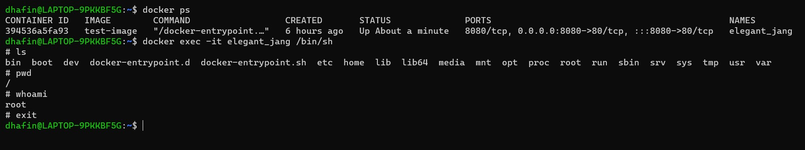

**`docker exec -it my_container /bin/sh`**

Perintah di atas akan membuka shell di dalam container dengan nama **`my_container`**. Dengan ini, maka melakukan perintah-perintah shell seperti biasa bisa dilakukan setelah masuk ke dalam shell tersebut. Untuk keluar dari shell gunakan perintah **`exit`**.

Namun, juga bisa melakukan Docker Exec tanpa harus masuk kedalam shell di dalam container tersebut.
Contoh penggunaan :

**`docker exec my_container ls /etc/nginx`**

Perintah di atas akan menampilkan isi dari direktori **`/etc/nginx`** di dalam container dengan nama **`my_container`**.

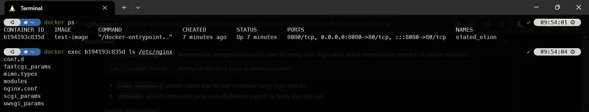

### Docker Images

#### Pengertian Docker Image

Docker Images adalah template atau blueprints yang digunakan untuk membuat Docker Containers. Image ini berisi sistem operasi dan aplikasi yang sudah dikonfigurasi dengan baik serta siap digunakan. Image dapat dibangun secara manual dengan membuat Dockerfile atau dapat diunduh dari Docker Hub, yaitu repositori publik yang menyediakan banyak image yang sudah siap digunakan.

Docker Images bersifat immutables, artinya setelah dibuat, image tidak bisa diubah secara langsung. Namun, image dapat dibuat baru dengan melakukan modifikasi pada image sebelumnya dan memberikan nama yang berbeda. Setiap image memiliki nama dan tag untuk mengidentifikasinya secara unik. Dalam Docker Hub, nama image biasanya terdiri dari beberapa bagian, seperti nama pengguna (username), nama image, dan tag, seperti contoh **`username/nama_image:tag`**.

Setelah image dibuat, bisa menggunakan perintah **`docker run`** untuk membuat instance dari image tersebut dalam bentuk container.

#### Perintah Docker Image

Berikut adalah beberapa perintah penting beserta penjelasannya yang tersedia pada

**`docker image COMMNAD`**.

| Perintah  | Deskripsi                                                        |
| --------- | ---------------------------------------------------------------- |
| `build`   | Membuat sebuah image dari Dockerfile.                            |
| `history` | Menampilkan riwayat perubahan pada sebuah image.                 |
| `import`  | Mengimpor sebuah image dari sebuah file.                         |
| `inspect` | Melihat detail dari sebuah image.                                |
| `load`    | Memuat sebuah image dari sebuah arsip yang telah disimpan.       |
| `ls`      | Menampilkan daftar image yang telah terunduh.                    |
| `prune`   | Menghapus image yang tidak terpakai.                             |
| `pull`    | Mengunduh sebuah image dari Docker Hub atau registry lainnya.    |
| `push`    | Mengunggah sebuah image ke Docker Hub atau registry lainnya.     |
| `rename`  | Mengubah nama dari sebuah image yang telah terunduh.             |
| `rm`      | Menghapus sebuah image yang telah terunduh.                      |
| `save`    | Menyimpan sebuah image ke dalam sebuah arsip yang dapat diunduh. |
| `tag`     | Memberikan sebuah tag pada sebuah image.                         |

#### Hello-World Docker Image


"Hello World" Docker Image adalah contoh sederhana dari sebuah image yang berisi aplikasi yang sangat sederhana, yaitu hanya mencetak kata "Hello World" pada layar. Image ini digunakan untuk menjelaskan secara singkat tentang bagaimana cara membuat Docker Image, membagikan image ke Docker Hub, serta cara menjalankan Docker Image dalam bentuk container. Image ini juga sering digunakan sebagai langkah awal ketika pertama kali belajar Docker.

Berikut adalah langkah-langkah menggunakan Hello-World Docker image.

1. Buka terminal atau command prompt dan ketikkan perintah **`docker run hello-world`**. Perintah ini akan mengunduh image "Hello World" dari Docker Hub jika image belum ada di dalam host lokal. Setelah itu, Docker akan menjalankan image tersebut dalam bentuk container dan aplikasi "Hello World" akan berjalan, mencetak kata "Hello from Docker!" pada layar, kemudian menampilkan informasi tambahan tentang Docker.
   
   <br>

2. Setelah container selesai berjalan, untuk melihat log dari container tersebut dengan menjalankan perintah **`docker container logs [container ID]`**. Untuk mendapatkan container ID bisa dengan menjalankan perintah **`docker ps -a`**.
   
   <br>

3. Setelah selesai, container yang tidak diperlukan dapat dihapus dengan menjalankan perintah **`docker rm [container ID]`**. Selain container, image "Hello World" dapat dihapus dari host lokal dengan menjalankan perintah **`docker rmi hello-world`**.

#### Konsep Docker Image Layer

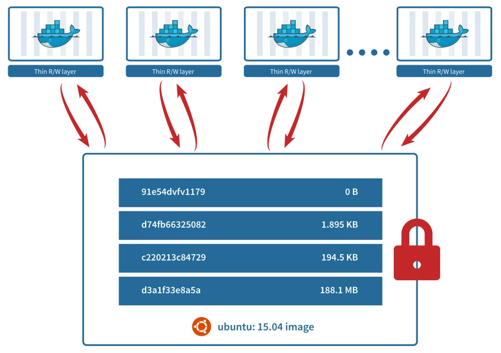

Docker Image layer adalah konsep penting dalam Docker yang memungkinkan pengguna untuk membuat, memperbarui, dan membagikan image Docker secara efisien. Image layer pada dasarnya adalah _file system_ baca saja yang menyimpan perubahan pada _file system_ pada suatu tahap dalam proses pembuatan image Docker.

Setiap perubahan yang terjadi pada image Docker, seperti menambahkan file, memperbarui paket atau mengubah konfigurasi, akan ditambahkan ke layer baru dalam image Docker. Layer baru ini akan menjadi layer anak dari layer sebelumnya dalam image Docker, yang berarti bahwa setiap layer akan memiliki layer induk yang berbeda dan akan menambahkan perubahan pada layer sebelumnya.Sehingga, layer image baru hanya menyimpan perubahan yang terjadi pada layer image sebelumnya dan tidak perlu menyimpan seluruh image Docker. Oleh karena itu, image Docker terdiri dari beberapa layer yang bersama-sama membentuk sistem file root yang lengkap di dalam kontainer.

Dan nantinya jika dilakukan `run` pada image akan menambah satu layer , yaitu writable layer yang disebut dengan `container layer`. Jadi dalam sebuah image tidak dapat melakukan edit `kecuali jika melakukan uild image baru` dan hanya dapat melakukan edit saat nanti sudah dalam bentuk container.

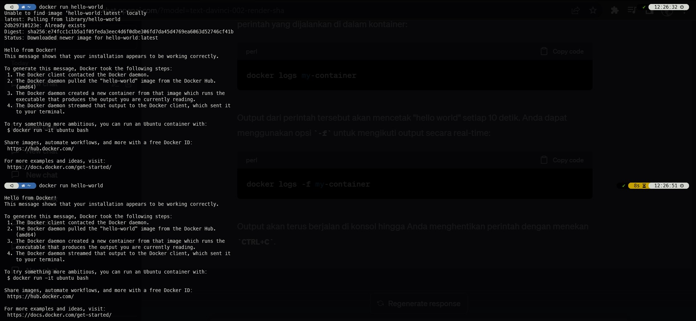

Pada contoh diatas, pada saat `run` container pertama Docker otomatis melakukan `pull` terlebih dahulu karena image yang dimaksud belum ada, namun ketika `run` untuk kedua kalinya dapat langsung di `run` tanpa melakukan `pull` terlebih dahulu.

Hal ini dikarenakan satu image Docker dapat digunakan oleh banyak container, sesuai dengan konsep Docker image.

### Dockerfile

#### Pengertian Dockerfile

Dockerfile adalah file teks yang berisi instruksi untuk membangun sebuah Docker Image. Dalam Dockerfile, dapat menentukan berbagai komponen dan konfigurasi yang diperlukan untuk membuat sebuah image, seperti base image yang digunakan, perintah-perintah yang harus dijalankan, file yang harus di-copy, serta variabel lingkungan yang perlu di-set.

Dockerfile sangat penting dalam membangun sebuah image karena memungkinkan pengguna untuk membuat image dengan cara yang konsisten dan terdokumentasi dengan baik. Dengan Dockerfile, seorang developer dapat mereplikasi pengaturan dan konfigurasi yang sama setiap kali membangun sebuah image, bahkan pada lingkungan yang berbeda-beda.

Selain itu, Dockerfile juga memungkinkan seorang developer untuk menggunakan konsep modularitas dalam membangun image dengan memisahkan komponen-komponen image menjadi layer-layer yang berbeda dalam Dockerfile. Sehingga memungkinkan untuk memperbarui atau mengganti komponen tertentu tanpa harus membangun ulang seluruh image.

Sebagai studi kasus, bayangkan ada seorang web developer yang sedang mengembangkan sebuah aplikasi web dengan menggunakan bahasa pemrograman Python. Aplikasi tersebut memerlukan beberapa library tambahan seperti Flask dan SQLAlchemy, serta database PostgreSQL sebagai back-end.

Jika tidak menggunakan Dockerfile untuk membangun Docker image untuk aplikasi tersebut, maka developer tersebut harus melakukan instalasi semua library dan dependensi secara manual pada setiap mesin atau lingkungan di mana aplikasi tersebut di-deploy. Hal ini dapat menjadi sangat merepotkan, terutama jika aplikasi memiliki banyak dependensi atau memerlukan konfigurasi yang kompleks.

Dengan menggunakan Dockerfile, developer tersebut dapat menentukan semua dependensi dan konfigurasi yang diperlukan dalam satu file yang dapat di-replikasi pada semua mesin atau lingkungan. Hal ini memudahkan pengembangan dan deployment aplikasi, karena tidak perlu melakukan instalasi manual pada setiap mesin atau lingkungan yang berbeda.

#### Perintah Dockerfile

Berikut adalah beberapa perintah penting beserta penjelasannya yang bisa diimplementasikan pada **`Dockefile`**.

| Perintah     | Deskripsi                                                                                                                                   |
| ------------ | ------------------------------------------------------------------------------------------------------------------------------------------- |
| `FROM`       | Menentukan base image yang akan digunakan untuk build.                                                                                      |
| `COPY`       | Menyalin file atau folder dari host ke dalam image.                                                                                         |
| `ADD`        | Menyalin file atau folder dari host ke dalam image, bisa juga digunakan untuk men-download file dari URL dan mengekstraknya ke dalam image. |
| `RUN`        | Menjalankan perintah pada layer yang sedang dibangun dan membuat image baru.                                                                |
| `CMD`        | Menentukan perintah default yang akan dijalankan saat container di-start.                                                                   |
| `ENTRYPOINT` | Menentukan perintah yang akan dijalankan saat container di-start, dapat juga di-overwrite oleh perintah saat container di-run.              |
| `ENV`        | Menentukan environment variable di dalam container.                                                                                         |
| `EXPOSE`     | Menentukan port yang akan di-expose dari container ke host.                                                                                 |
| `VOLUME`     | Menentukan direktori yang akan di-mount sebagai volume di dalam container.                                                                  |

#### Sekilas Tentang NGINX

Nginx adalah sebuah web server yang dapat digunakan sebagai reverse proxy, load balancer, mail proxy, dan HTTP cache. Nginx dikembangkan oleh Igor Sysoev pada tahun 2002 untuk digunakan pada situs dengan traffic tinggi. Nginx dapat digunakan sebagai pengganti Apache karena memiliki fitur yang lebih ringan dan cepat.Nginx bekerja dengan cara memproses request yang masuk dari client dan mengirimkan response berupa file HTML atau data lainnya.

Untuk dapat menjalankan Nginx di local dapat menginstallnya dengan menggunakan perintah berikut:

```shell
sudo apt install nginx
```

untuk melihat konfigurasinya dapat dilihat pada direktori `/etc/nginx/` dan untuk melihat konfigurasi defaultnya dapat dilihat pada direktori `/etc/nginx/sites-available/default`

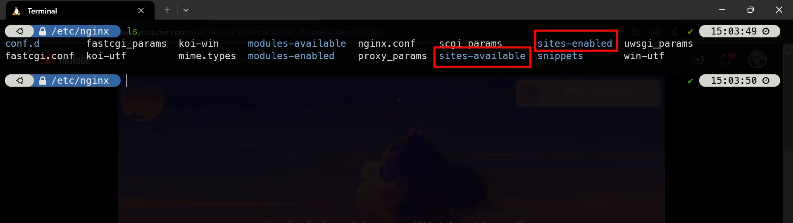

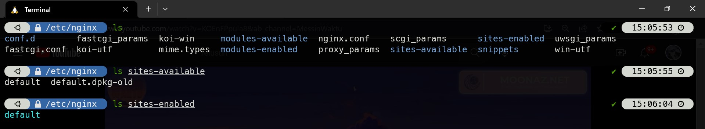

pada file `/etc/nginx/sites-available/default` konfigurasi defaultnya terdapat beberapa konfigurasi yang dapat diubah sesuai dengan kebutuhan, berikut adalah penjelasan konfigurasi defaultnya:

```shell
server {
        listen 80 default_server;
        listen [::]:80 default_server;

        root /var/www/html;

        index index.html index.htm index.nginx-debian.html;

        server_name _;

        location / {
                try_files $uri $uri/ =404;
        }
}
```

`root /var/www/html` menunjukkan direktori root server, tempat Nginx akan mencari file yang diminta oleh klien.

`index index.html index.htm index.nginx-debian.html` menunjukkan urutan file indeks yang akan dicari oleh Nginx jika permintaan tidak menyebutkan nama file.

`server_name _` mengonfigurasi server untuk merespons permintaan yang datang ke semua host.

`location /` menentukan bagaimana Nginx akan menangani permintaan yang diterima. Di sini, Nginx akan mencoba mencari file yang diminta dalam direktori root, dan jika tidak ditemukan, akan memberikan respons 404 Not Found.

Dan jika konfigurasi sudah benar (bisa dicek dengan `nginx -t`) maka dapat menjalankan Nginx dengan perintah berikut:

```shell
sudo systemctl start nginx
```

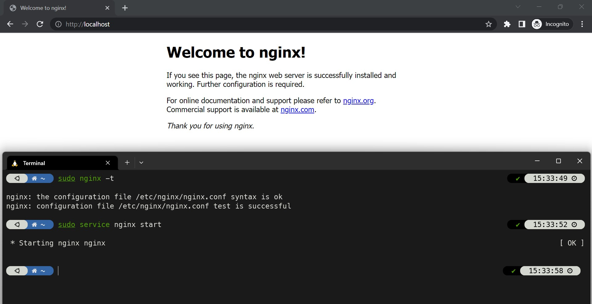

#### Contoh Dockerfile

Berikut adalah contoh Dockerfile untuk untuk membuat sebuah image untuk mendeploy aplikasi **`index.html`** dengan menggunakan Nginx.

```dockerfile
FROM nginx

 RUN apt-get update && apt-get upgrade -y

 COPY index.html /usr/share/nginx/html

 EXPOSE 8080

 CMD ["nginx", "-g", "daemon off;"]
```

Dalam Dockerfile di atas, langkah-langkah yang dilakukan adalah sebagai berikut:

- Menetapkan base image yang digunakan yaitu official image nginx.
- Menjalankan perintah apt-get update dan apt-get upgrade untuk melakukan update dan upgrade package yang ada di image.
- Menyalin file index.html dari direktori saat ini ke direktori /usr/share/nginx/html di dalam container.
- Menetapkan port yang akan digunakan untuk mengakses aplikasi yaitu port 8080.
- Menetapkan perintah CMD yang akan dijalankan saat container di-start. Dalam hal ini, perintah yang dijalankan adalah nginx -g 'daemon off;'.

#### Contoh Implementasi Dockerfile

1. Buat direktori baru , dalam direktori tersebut buat `Dockerfile` dan `index.html` sesuaikan dengan [ini](./custom-nginx-image/)


2. Dalam direktori yang sudah tersebut, jalankan command `docker build -t <nama image>` untuk membuat image baru dari Dockerfile yang sudah ada. Isi nama image sesuai dengan yang diinginkan.

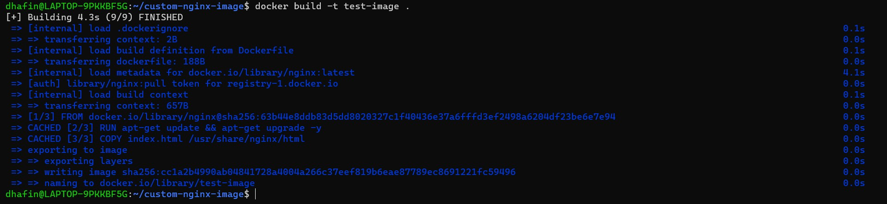

3. Lalu cek pada `docker image ls` , apakah image yang dibuild sudah tersedia.


4. Selanjutnya image yang sudah ada dapat di gunakan, dengan command `docker run -d -p 8080:80 <nama image>` untuk menjalankan sebuah container dari image tersebut. Cek dengan `docker ps` apakah container sudah berjalan.


5. kunjungi hasil running container pada `localhost:8080`

### Docker Hub

#### Pengertian Docker Hub

Docker Hub adalah sebuah platform cloud yang menyediakan repository untuk image Docker. Docker Hub memungkinkan pengguna untuk mengambil, menyimpan, dan mendistribusikan image Docker dengan mudah. Di Docker Hub, pengguna dapat mencari image Docker yang dibuat oleh komunitas atau membuat image mereka sendiri dan membagikannya ke orang lain. Docker Hub juga memungkinkan pengguna untuk melakukan otomatisasi build dan testing image dengan menggunakan Dockerfile. Dengan Docker Hub, pengguna dapat dengan mudah mengelola image Docker yang mereka gunakan dalam aplikasi mereka dan mengurangi waktu dan upaya dalam pengembangan, distribusi, dan deployment aplikasi.

#### Docker Repository

Docker Repository pada Docker Hub adalah tempat penyimpanan untuk Docker Images yang dibuat oleh pengguna Docker. Pengguna Docker dapat membuat repository pada Docker Hub untuk menyimpan Docker Images yang telah mereka buat dan ingin berbagi ke publik atau hanya untuk pengguna yang mereka izinkan. Repository pada Docker Hub dapat berisi satu atau beberapa Docker Images dan dapat diberi nama dan deskripsi yang jelas agar mudah dikenali oleh pengguna lainnya. Selain itu, Docker Repository pada Docker Hub juga dapat digunakan sebagai tempat penyimpanan untuk Docker Images yang dibangun oleh organisasi atau perusahaan, sehingga memudahkan pengguna Docker lainnya untuk menemukan dan mengunduh Images tersebut.

#### Langkah-Langkah Penggunaan Docker Hub

Berikut merupakan langkah-langkah untuk meletakkan image Docker pada Docker Hub:

1. Melakukan login docker

```
 docker login
```

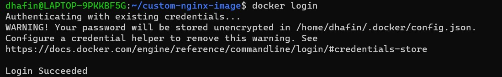

2. Melakukan build image (jika sudah terdapat docker image, maka langkah ini dapat dilewati)

```
    docker build -t <nama image>:<version image> .
```


3. Melihat image docker yang nantinya akan diletakan pada Docker Hub

```
    docker image ls
```


4. Membuat tag pada docker image

```
    docker tag <nama image>:<version image> <nama repository>/<nama image>:<version image>
```

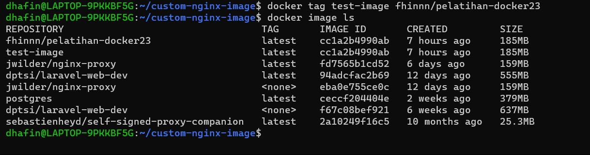

5. Melakukan **`docker push`** agar image tersimpan dalam docker hub

```
    docker <nama image>:<version image>
```

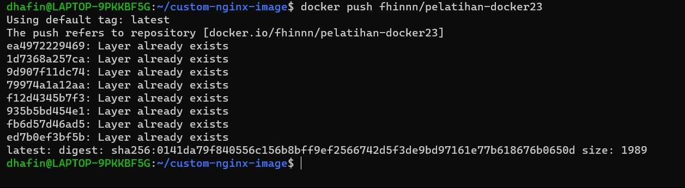

6. Melihat image yang telah di push pada Docker Hub


## Sumber Referensi

- https://docs.docker.com/engine/reference/commandline/container/
- https://docs.docker.com/engine/reference/commandline/image/
- https://docs.docker.com/docker-hub/
- Bullington-McGuire, R., Dennis, A. K., & Schwartz, M. (2020). Docker For Developers. Packt.
