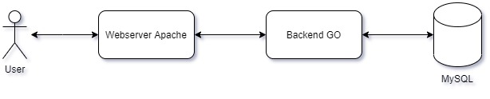

# **Docker Compose & Monitoring**
- [**Docker Compose & Monitoring**](#docker-compose--monitoring)
  - [🧬 Docker Compose](#-docker-compose)
    - [🔭 Apa itu Docker Compose?](#-apa-itu-docker-compose)
    - [🧪 File Compose](#-file-compose)
    - [🗓️ Version](#️-version)
    - [🛂 Services](#-services)
    - [☢️ Volumes](#️-volumes)
    - [📳 Network](#-network)
    - [‼️ Secrets](#️-secrets)
    - [🔱 Commands](#-commands)
      - [🔠 Options](#-options)
      - [▶️ Commands](#️-commands)
  - [⚠️ Monitoring](#️-monitoring)

## 🧬 Docker Compose
### 🔭 Apa itu Docker Compose?
Docker Compose adalah tools untuk mendefinisikan dan menjalankan aplikasi Docker multi-kontainer. Dengan Docker Compose, kita menggunakan file YAML untuk mengonfigurasi layanan aplikasi kita. Kemudian, dengan satu perintah, kita bisa membuat dan memulai semua layanan dari konfigurasi yang ada.



Contoh kasus penggunaan Docker Compose adalah semisal ketika kita memiliki banyak layanan yang terdapat di beberapa Dockerfile. 

Layanan-layanan tersebut yang saling terhubung satu sama lain bisa saja kita jalankan satu per satu. Namun hal ini tentu sangat menguras tenaga.

Dengan Docker Compose kita dapat menjalankan seluruh layanan diatas hanya dengan satu file YAML dan satu command yaitu `docker-compose up`.
### 🧪 File Compose
```yaml
version: '3'
services:
  db:
    image: mariadb:10.6.5-focal
    command: '--default-authentication-plugin=mysql_native_password'
    restart: always
    secrets:
      - db-password
    volumes:
      - db-data:/var/lib/mysql
    environment:
      - MYSQL_DATABASE=example
      - MYSQL_ROOT_PASSWORD_FILE=/run/secrets/db-password
    expose:
      - 3306
  backend:
    build: back
    ports: 
      - 3334:8000
    secrets:
      - db-password
    depends_on:
      - db
  web:
    build: web
    ports:
      - 3335:80
    depends_on:
      - backend
    volumes:
      - ./web/src:/var/www/html
volumes:
  db-data:
secrets:
  db-password:
    file: db/password.txt
```
File Compose adalah file berekstensi yaml atau yml yang biasanya berisi `version`, `services`, `networks`, `volumes`, `configs`, `secrets` dan konfigurasi lain yang dibutuhkan untuk menjalankan layanan-layanan yang kita miliki.

YAML sendiri merupakan singkatan dari Yet Another Markup Language atau YAML ain't markup language. YAML biasanya digunakan untuk melakukan serialisasi data yang digunakan untuk menulis file konfigurasi.

Spesifikasi atau syntax yang digunakan pada file Compose selengkapnya bisa dilihat di sini https://github.com/compose-spec/compose-spec/blob/master/spec.md. 

Pada subbab selanjutnya akan dijelaskan setiap top-level element pada contoh file compose diatas. Untuk resource lengkap yang digunakan, dapat dilihat pada folder `docker-compose`.

### 🗓️ Version
Pada baris pertama di file Compose, terdapat `version` yang berfungsi untuk menentukan versi Compose yang ingin digunakan. Pada umumnya properti ini bersifat backward compatible, jadi tidak ada salahnya untuk selalu menggunakan versi yang paling terbaru. Untuk penjelasan lebih detail tentang file Compose dapat dilihat di sini https://docs.docker.com/compose/compose-file.

Versi yang digunakan pada contoh file compose diatas adalah versi `3`.
### 🛂 Services
Element service merupakan tempat kita mendefinisikan computing resources dari aplikasi yang kita jalankan. Setiap komponen yang ada dalam elemen ini dapat di scale secara independen dari komponen lainnya.

Pembuatan service dimulai dengan mendefinisikan nama servicenya. Kita bisa membuat nama yang sesuai dengan service yang dijalankan. Contohnya pada file Compose diatas kita membuat service `db`, `backend`, dan `web`.

Pembuatan suatu kontainer pada service dapat dilakukan dengan membuat image dari Dockerfile atau mengambil image suatu docker. Apabila kita ingin membuat image dari Dockerfile maka kita harus menyertakan section `build`. Apabila kita ingin menggunakan image yang sudah ada, maka kita harus menggunakan section `image`. Pada contoh diatas, kita mengambil image `mariadb:10.6.5-focal` dan mem-build dua image dari Dockerfile pada `backend` dan `web`.

Kita bisa melakukan override terhadap command default yang telah tersedia pada docker image yang akan digunakan. Dengan menggunakan section `command`, kita bisa mengganti perintah yang terdapat pada `CMD` di docker image. Contohnya pada service `db`, kita menambahkan command `--default-authentication-plugin=mysql_native_password` untuk mengganti autentikasi mysql.

Untuk mengganti environment pada kontainer, kita bisa menggunakan section `environment`. Cara kerja section ini sama dengan seperti kita menggunakan flag `-e` pada perintah `docker run`. Contohnya pada service `db`, kita menambahkan dua environemnt.

```yaml
...
environment:
  - MYSQL_DATABASE=example
  - MYSQL_ROOT_PASSWORD_FILE=/run/secrets/db-password
...
```

Untuk mengekspose port seperti pada command `docker run` yang menggunakan flag `-p`, kita bisa menggunakan section `port`. Kita bisa menggunakan port HOST:CONTAINER atau hanya CONTAINER dan port akan dipilih secara acak pada host.

Kita juga bisa menambahkan `secrets`. `secrets` adalah semacam value konstant yang bisa kita gunakan. Contohnya pada service `db` dan `backend` yang menggunakan secret `db-password` yang kita definisikan.

Terakhir kita juga dapat menambahkan volume dan network pada kontainer yang akan dijalankan dengan menggunakan section `volumes` dan `networks`. Volume dan network bisa menggunakan volume atau network yang sudah ada atau dapat kita deklarasikan pada top level elemen `volumes` dan `networks` yang akan kita bahas selanjutnya.

Pada contoh diatas, kita menggunakan `networks` yang dibuat secara otomatis oleh docker-compose. Ketika pertama kali menjalankan perintah `docker-compose up`, maka akan muncul line

`Creating network "docker-compose_default" with the default driver`

yang menandakan bahwa telah dibuat network baru oleh docker-compose dan secara default seluruh service yang dideklarasikan pada file compose akan menggunakan network tersebut.

### ☢️ Volumes
Elemen ini berisi dengan docker volume yang akan dibuat. Elemen ini bersifat opsional. Pembuatan docker volume pada file Compose ini bertujuan untuk pengaturan volume yang lebih mudah. Dengan command yang terdapat pada `docker-compose` kita bisa menjalankan seluruh service sekaligus membuat docker volume yang telah dideklarasikan. Banyak hal lain yang kita lakukan terhadap volume yang dibuat dengan file Compose dengan command `docker-compose`. Volume yang kita deklarasikan pada file compose ini adalah `db-data` dengan perintah ini.
```yaml
volumes:
  db-data:
```
### 📳 Network
Elemen network berisi network yang ingin kita buat ketika menjalankan layanan. Elemen ini bersifat opsional karena kalau kita tidak menspesifikasikan elemen ini, maka docker akan secara otomatis membuat satu network yang dapat digunakan. Kalau pada service tidak ditentukan network mana yang akan digunakan, maka akan digunakan network yang secara otomatis dibuat tadi.

### ‼️ Secrets
Elemen secret adalah elemen yang berisi data sensitif. Data yang dimasukkan pada elemen ini dapat berasal dari 2 sumber, `external`, atau `file`. Kita juga dapat memberikan nama tertentu ke secret. Dengan menggunakan `file`, maka value dari secret akan diisi dengan isi dari file yang dituju. Dengan mengganti value dari `external` menjadi true, maka docker compose tidak akan mencoba membuat secret, namun akan mencoba mencari value dari secret tersebut. Pada contoh yang digunakan, kita mendeklarasikan `db-password` dengan sumber data `file` yang berlokasi di `db/password.txt`.

### 🔱 Commands
Terdapat beberapa command yang biasanya sering digunakan. Contohnya `docker-compose up` untuk menjalankan docker compose, `docker-compose down` untuk menghentikan seluruh service docker compose, dan `docker-compose up -d` untuk menjalankan service dalam background.

Ketika kita melakukan perubahan terhadap image yang digunakan, kita bisa menambahkan `--build`untuk membangun ulang image agar image yang digunakan adalah image yang telah kita perbarui. Misalnya pada contoh awal yang kita gunakan, jkita bisa mengganti versi dari php pada Dockerfile di directory `web` menjadi versi 8.0, setelah itu untuk menjalankannya bisa digunakan command `docker-compose up --build`.

Berikut adalah penjelasan singkat mengenai command `docker-compose`.

```
docker-compose [-f <arg>...] [--profile <name>...] [options] [COMMAND] [ARGS...]
```

Untuk lebih jelasnya dapat digunakan command berikut.
```
docker-compose -h|--help
```

Command help diatas akan mengeluarkan hasil berupa usage, options, dan commands.

#### 🔠 Options
| Options                    | Description                                                                                   |
|----------------------------|-----------------------------------------------------------------------------------------------|
| -f, --file FILE            | Specify an alternate compose file (default: docker-compose.yml)                               |
| -p, --project-name NAME    | Specify an alternate project name (default: directory name)                                   |
| --profile NAME             | Specify a profile to enable                                                                   |
| --verbose                  | Show more output                                                                              |
| --log-level LEVEL          | Set log level (DEBUG, INFO, WARNING, ERROR, CRITICAL)                                         |
| --no-ansi                  | Do not print ANSI control characters                                                          |
| -v, --version              | Print version and exit                                                                        |
| -H, --host HOST            | Daemon socket to connect to                                                                   |
| --tls                      | Use TLS; implied by --tlsverify                                                               |
| --tlscacert CA_PATH        | Trust certs signed only by this CA                                                            |
| --tlscert CLIENT_CERT_PATH | Path to TLS certificate file                                                                  |
| --tlskey TLS_KEY_PATH      | Path to TLS key file                                                                          |
| --tlsverify                | Use TLS and verify the remote                                                                 |
| --skip-hostname-check      | Don't check the daemon's hostname against the name specified in the client certificate        |
| --project-directory PATH   | Specify an alternate working directory (default: the path of the Compose file)                |
| --compatibility            | If set, Compose will attempt to convert deploy keys in v3 files to their non-Swarm equivalent |
#### ▶️ Commands
| Command | Description                                               |
|---------|-----------------------------------------------------------|
| build   | Build or rebuild services                                 |
| bundle  | Generate a Docker bundle from the Compose file            |
| config  | Validate and view the Compose file                        |
| create  | Create services                                           |
| down    | Stop and remove containers, networks, images, and volumes |
| events  | Receive real time events from containers                  |
| exec    | Execute a command in a running container                  |
| help    | Get help on a command                                     |
| images  | List images                                               |
| kill    | Kill containers                                           |
| logs    | View output from containers                               |
| pause   | Pause services                                            |
| port    | Print the public port for a port binding                  |
| ps      | List containers                                           |
| pull    | Pull service images                                       |
| push    | Push service images                                       |
| restart | Restart services                                          |
| rm      | Remove stopped containers                                 |
| run     | Run a one-off command                                     |
| scale   | Set number of containers for a service                    |
| start   | Start services                                            |
| stop    | Stop services                                             |
| top     | Display the running processes                             |
| unpause | Unpause services                                          |
| up      | Create and start containers                               |
| version | Show the Docker-Compose version information               |

Referensi : 
- https://docs.docker.com/compose/compose-file/
- https://docs.docker.com/compose/environment-variables/
- https://vegibit.com/docker-compose-tutorial/
- https://github.com/compose-spec/compose-spec/blob/master/spec.md
- https://github.com/docker/awesome-compose/tree/master/nginx-golang-mysql
- https://www.youtube.com/watch?v=qH4ZKfwbO8w
- https://www.youtube.com/watch?v=Qw9zlE3t8Ko


## ⚠️ Monitoring
Dalam penggunaan docker, kita dapat memonitor/memantau resource yang digunakan oleh docker. Docker memberikan beberapa command untuk melakukan hal tersebut. Monitoring resource sangatlah penting agar anda dapat mengetahui batasan perangkat anda dan dengan demikian anda dapat menghindar dari crash. Hal-hal yang perlu dimonitor disebut `metrics` pada modul ini. Metrics yang perlu diperhatikan secara umum adalah storage, memory, CPU Utilization, dan I/O Speed baik network maupun disk.

Anda dapat memonitor resource memory, CPU Util dan IO yang digunakan oleh docker dengan `docker stats`. Berikut adalah beberapa command:
- ```docker stats```<br>
Mendapatkan informasi tentang penggunaan resource oleh tiap container secara realtime. Metrics yang didapatkan berupa CPU Usage (%), MEM Usage, Network Usage, Block Usage, dan PIDS.<br>
- ```docker stats --no-stream```<br>
Command diatas akan memberikan informasi resource pada saat ini (tidak realtime). Dengan option `no-stream` anda diberikan kebebasan untuk membuat scheduler anda sendiri.

Anda dapat memonitor storage yang digunakan oleh Docker Image maupun Docker Container dengan `docker system`. Terdapat berbagai command untuk monitoring storage.
- ```docker system df```<br>
Menampilkan storage yang digunakan untuk masing-masing image dan container

- ```docker system prune```<br>
Command diatas menghapus image dan container yang sudah tidak berjalan. Image yang dihapus adalah image yang tidak digunakan di container manapun. Dengan `docker system prune` anda dapat mengklaim kembali storage. Hati-hati menggunakan docker system prune, karena mungkin saja karena kesalahan konfigurasi akan menghapus image yang masih anda perlukan.

Referensi: https://docs.docker.com/engine/reference/commandline/system/
