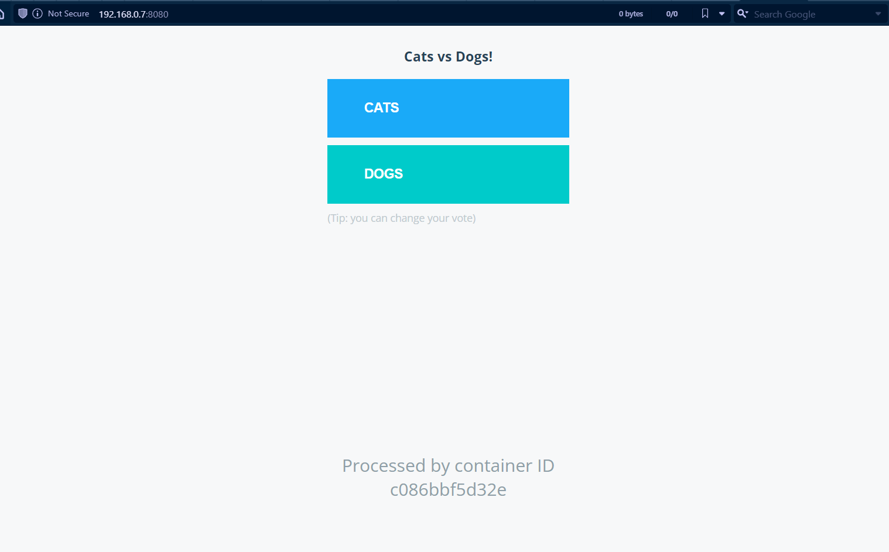
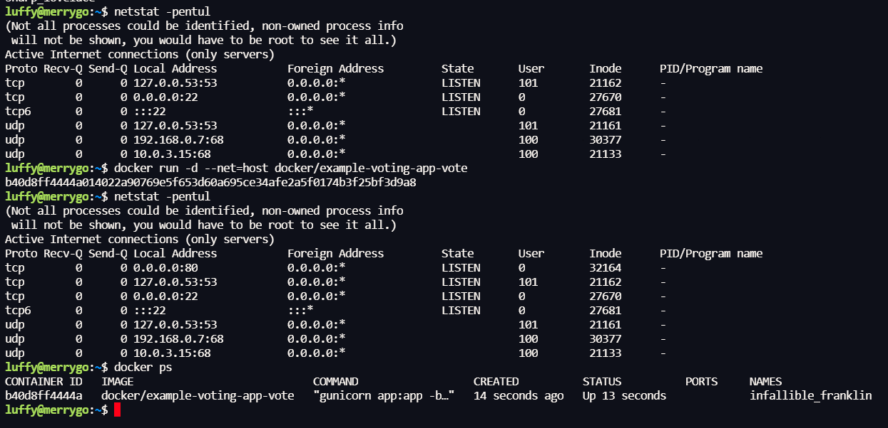
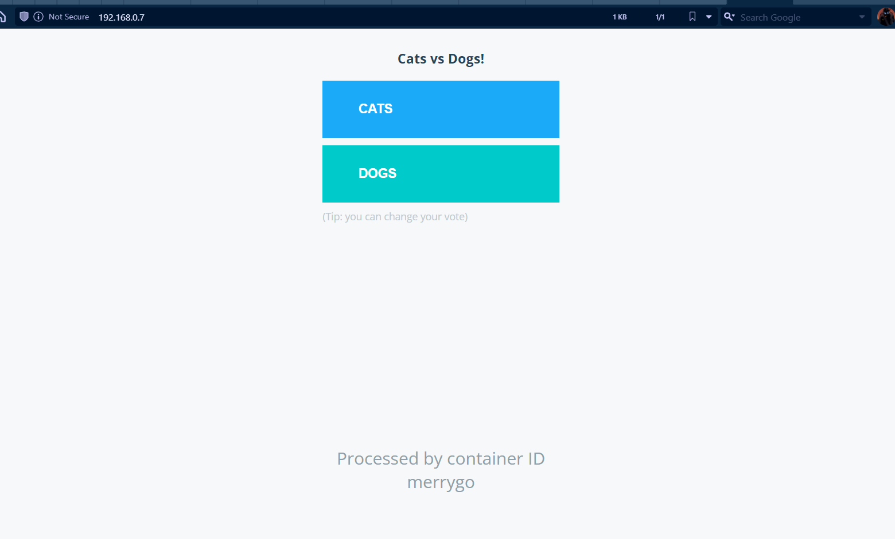
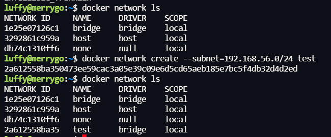
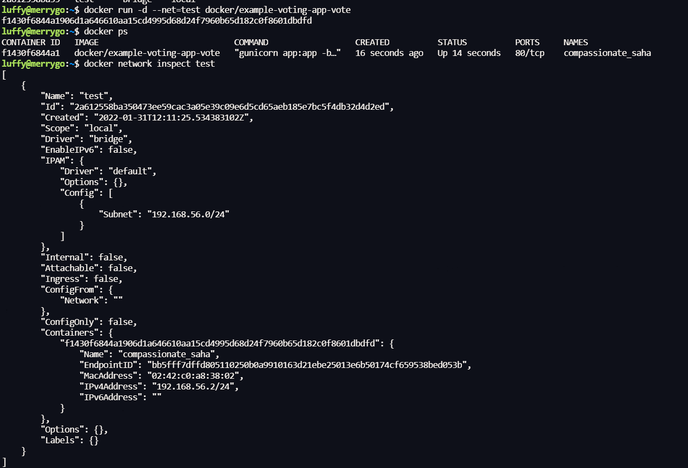
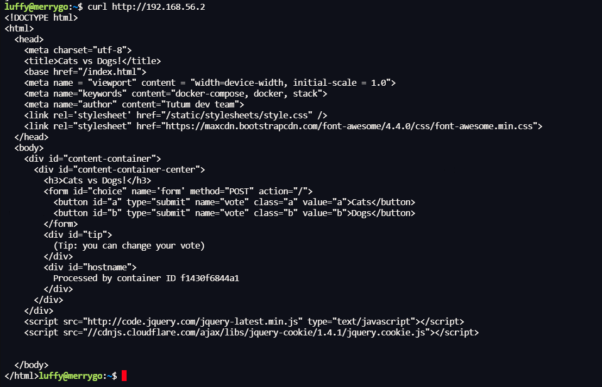

# **Mengelola Data di Docker & Networking dengan Docker**
- [**Mengelola Data di Docker & Networking dengan Docker**](#mengelola-data-di-docker--networking-dengan-docker)
  - [📜 Mengelola Data Di Docker](#-mengelola-data-di-docker)
    - [📌 Bagaimana Cara Mengelola Data Pada Docker](#-bagaimana-cara-mengelola-data-pada-docker)
    - [📌 Docker Volume](#-docker-volume)
      - [🧷 Apa Itu Docker Volume?](#-apa-itu-docker-volume)
      - [🧷 Command-Command Pada Docker Volume](#-command-command-pada-docker-volume)
    - [📌 Docker Bind Mount](#-docker-bind-mount)
      - [🧷 Apa Itu Docker Bind Mount?](#-apa-itu-docker-bind-mount)
      - [🧷 Contoh Ilustrasi Penggunaan Docker Bind Mount](#-contoh-ilustrasi-penggunaan-docker-bind-mount)
      - [🧷 Contoh Real Repo Penggunaan Docker Bind Mount](#-contoh-real-repo-penggunaan-docker-bind-mount)
    - [📌 Perbedaan Antara Docker Volume dan Bind Mount](#-perbedaan-antara-docker-volume-dan-bind-mount)
  - [🌐 Networking dengan Docker](#-networking-dengan-docker)
    - [🚡 Port](#-port)
    - [🌉 Host](#-host)
    - [🛰️ Docker Network](#️-docker-network)
  - [🔚 Sumber](#-sumber)

## 📜 Mengelola Data Di Docker


### 📌 Bagaimana Cara Mengelola Data Pada Docker


**Container** Docker digunakan untuk menjalankan aplikasi di isolated environment (environment khusus).  Secara default, semua perubahan di dalam **container** akan hilang saat **container** berhenti.  Jika kalian ingin menyimpan data yang sudah diproses, kalian dapat menggunakan **docker volume**, **bind mount**, **tmpfs mount** sebagai alat bantunya.

### 📌 Docker Volume

#### 🧷 Apa Itu Docker Volume?


Docker Volume akan disimpan menjadi bagian dari sistem file host yang akan dibuat dan dikelola oleh Docker. Misalkan kalau kalian menggunakan Linux ada pada path ```/var/lib/docker/volume```. Ketika kalian membuat volume, volume akan disimpan di directory docker host. Volumes dapat di mount ke beberapa container secara bersamaan. Ketika volumes tidak ada yang menggunakan tetap tidak akan terhapus.

#### 🧷 Command-Command Pada Docker Volume

Command | Fungsi 
--- | --- 
```docker volume create [nama-volume]``` | Membuat Volume Baru
```docker volume ls``` | List Volume Yang Telah Dibuat
```docker volume inspect [nama-volume]``` | Lihat Detil Volume Yang Telah Dibuat
```docker volume rm [nama-volume]``` | Menghapus Volume Yang Telah Dibuat

**Note: [nama-volume] pada command berarti diganti sesuai kondisi tanpa menggunakan '[' dan ']'** 

### 📌 Docker Bind Mount

#### 🧷 Apa Itu Docker Bind Mount?


Docker Bind Mount adalah teknik untuk menyimpan data dimana saja pada sistem host. Host sistem dan Container satu sama lain dapat menulis, membaca dan mengubah file yang akan dimount kapanpun. Jika dibandingkan dengan volumes, bind mount tidak bisa menggunakan CLI docker, akan tetapi bind mount biasa digunakan pada development environment.

#### 🧷 Contoh Ilustrasi Penggunaan Docker Bind Mount


- Host / Filesystem memiliki folder mysql yang berisi sebuah database aplikasi dalam format MySQL.
- Di Container Docker ada sebuah aplikasi MySQL.
- Untuk Penyimpanan Database dan Tabel serta Isi dari Aplikasi MySQL di Container berada pada folder /var/lib/mysql yang dicopy dari folder mysql di Host / Filesystem.

#### 🧷 Contoh Real Repo Penggunaan Docker Bind Mount

Untuk Penggunaan Docker Bind Mount dapat dilihat di repo github [disini](https://github.com/ishaqadhel/docker-laravel-mysql-nginx-starter).

### 📌 Perbedaan Antara Docker Volume dan Bind Mount

Pada contoh kasus nyata di pengembangan aplikasi, seringkali masih sulit untuk membedakan apakah sebuah script dari docker-compose.yml menggunakan management data berbasis volume atau bind mount. Pada bagian ini akan dijelaskan lebih detil bagaimana cara mengetahui apakah script dari docker-compose.yml menggunakan volume atau bind mount.

Syntax umum pada docker-compose.yml untuk management data adalah ```[SOURCE:]TARGET[:MODE]```.

Untuk lebih jelas pembahasannya langsung ke contoh kasus penggunaan database postgresql menggunakan docker-compose.yml. Untuk syntax penggunaannya ada 3 cara, yaitu:

1. Source tidak diketahui


Untuk contoh diatas, ketika penyimpanan data pada script docker compose tidak disertai dengan path source, maka docker compose otomatis akan membuat direktori dan mount sebagai volume pada folder docker area. Script diatas termasuk menggunakan metode **volume**.

2. Source ada tetapi tidak path


Untuk contoh diatas, ketika penyimpanan data pada script docker compose menggunakan source tetapi bukan sebagai path melainkan nama volume, maka docker compose otomatis akan membuat direktori atas nama source yang ditulis pada script dan mount sebagai volume pada folder docker area. Script diatas termasuk menggunakan metode **volume**.

3. Source menggunakan path


Untuk contoh diatas, ketika penyimpanan data pada script docker compose disertai dengan full path source, maka docker compose otomatis akan membuat bind mount folder source ke target. Script diatas termasuk menggunakan metode **bind mount**.

## 🌐 Networking dengan Docker

Salah satu alasan mengapa docker sangat populer adalah karena Anda bisa menghubungkan beberapa container secara bersamaan atau menghubungkan container dengan aplikasi di luar docker. Container dan service docker pun tidak perlu tau apakah dia dideploy di docker atau aplikasi yang terhubung dengan mereka juga menggunakan docker atau tidak.

Di bagian ini kita akan belajar bagaimana membuat docker bisa terhubung dengan environment di luar docker. Di sini kita akan membahas beberapa cara yang sering dipakai oleh para pengguna docker seperti berikut:

### 🚡 Port

Dalam dunia networking, Port adalah endpoint komunikasi yang digunakan oleh suatu aplikasi untuk mengidentifikasi aplikasi tersebut dengan menggunakan angka, contohnya port untuk HTTP adalah 80 dan HTTPS adalah 443. Biasanya port digunakan bersamaan dengan IP seperti `127.0.0.1:80`. 

Secara default, menjalankan suatu container docker tidak akan membuat port yang digunakan oleh aplikasi di dalam container tersebut bisa diakses dari luar container. Kita bisa membuat port dari aplikasi di dalam container bisa diakses dengan flag `-p` atau `--publish`. Untuk contoh cara penggunaannya adalah sebagai berikut:

| Flag dan valuenya                                     | Deskripsi                                                                                                                            |
| ------------------------------------------- | ------------------------------------------------------------------------------------------------------------------------------------ |
| `-p 8080:80`                           | Membuat port 80 di dalam container bisa diakses dengan port 8080 di host                                                                                       |
| `-p 192.168.1.100:8080:80` | Membuat port 80 di dalam container bisa diakses dengan port 8080 di host dengan IP 192.168.1.100                                                                                      |

Untuk melakukan percobaan, mari kita pakai image `docker/example-voting-app-vote` dengan mengambil image tersebut menggunakan command `docker pull docker/example-voting-app-vote`.

Lalu mari kita coba jalankan image yang kita ambil tersebut dengan membuat port nya bisa diakses dengan command berikut:

```bash
docker run -d -p 8080:80 docker/example-voting-app-vote
```

Kita menggunakan port 80 yang ada di dalam container agar bisa terhubung dengan website yang ada di dalam container. Lalu kita sambungkan dengan port 8080 di host. Jika sudah berhasil di run, kita bisa membuka hasilnya di browser seperti berikut.



### 🌉 Host

Di docker, host network bisa membuat container untuk terhubung dan menggunakan network dari host untuk berkomunikasi. Dengan ini docker juga bisa langsung membuat port yang ada di dalamnya bisa diakses langsung dengan network milik host.

Untuk menggunakan host network pada docker, kita bisa menggunakan flag `--net=host`. Mari kita coba dengan menjalankan command berikut untuk menjalankan image yang kita dapat sebelumnya:

```bash
docker run -d --net=host docker/example-voting-app-vote
```

Lalu kita cek:




Di sini terlihat bahwa port yang dipakai di docker bisa terbuka di network dari host dan juga kita bisa mengakses langsung ke ip host tersebut tanpa harus melakukan penggunaan port lain.

### 🛰️ Docker Network

Kita juga bisa membuat network untuk docker kita sesuai keinginan kita. Kita bisa mengakses network untuk docker dengan command `docker network <command>`. Untuk command-command ini ada beberapa jenis yaitu:

| Command                                     | Deskripsi                                                                                                                            |
| ------------------------------------------- | ------------------------------------------------------------------------------------------------------------------------------------ |
| `docker network create`                           | Membuat sebuah network                                                                                       |
| `docker network connect` | Menyambungkan container dengan network                                                                                      |
| `docker network disconnect` | Memutuskan sambungan container dengan network                                                                                      |
| `docker network inspect` | Melihat informasi detail dari suatu network                                                                                      |
| `docker network ls` | Melihat daftar network                                                                                      |
| `docker network rm` | Menghapus suatu network                                                                                      |
| `docker network prune` | Menghapus network-network yang tidak terpakai                                                                                      |

Di tiap commandnya sendiri, ada banyak variasi penggunaan serta parameter yang bisa dipakai. Untuk sesi ini kita akan belajar menggunakan command `docker network create` dan menggunakan network yang  telah dibuat untuk container kita.

1. Mari kita buat dulu network kita dengan command berikut.

```bash
docker network create --subnet=192.168.56.0/24 test
```



Ini artinya kita akan menggunakan subnet `192.168.56.0/24` untuk network kita, lalu kita menamai network tersebut dengan nama `test`.

2. Lalu kita coba jalankan image yang tadi dengan network yang telah kita buat dengan command:
  
```bash
docker run -d --net=test docker/example-voting-app-vote
```



Di sini kita bisa melihat bahwa container sudah berjalan dan menggunakan network `test` yang sudah kita buat. Kita bisa mengetest apakah kita bisa mengakses aplikasi di dalam contaiiner dengan network yang sudah terpasang dengan command `curl http://<ip container>` dan akan mengeluarkan hasil sebagai berikut.



## 🔚 Sumber
- https://docs.docker.com/storage/
- https://digitalvarys.com/docker-volume-vs-bind-mounts-vs-tmpfs-mount/
- https://maximorlov.com/docker-compose-syntax-volume-or-bind-mount/
- https://docs.docker.com/network/
- https://en.wikipedia.org/wiki/Port_(computer_networking)
- https://docs.docker.com/config/containers/container-networking/- 
- https://docs.docker.com/network/bridge/
- https://docs.docker.com/network/overlay/