# **Docker Service Lanjutan**
- [**Docker Service Lanjutan**](#docker-service-lanjutan)
  - [Glosarium](#glosarium)
  - [Materi](#materi)
    - [Docker Compose](#docker-compose)
      - [Pengertian Docker Compose](#pengertian-docker-compose)
      - [Contoh Implementasi Docker Compose](#contoh-implementasi-docker-compose)
      - [Depend On Docker Compose](#depend-on-docker-compose)
      - [Inheritance di Docker Compose](#inheritance-di-docker-compose)
      - [Mengelola Docker Compose](#mengelola-docker-compose)
    - [Docker Data Management](#docker-data-management)
      - [Pengenalan Docker Data Management](#pengenalan-docker-data-management)
      - [Jenis-Jenis Docker Mount](#jenis-jenis-docker-mount)
      - [Shared File System](#shared-file-system)
    - [Docker Networking](#docker-networking)
      - [Pengenalan Docker Networking](#pengenalan-docker-networking)
      - [Konsep Dasar di Docker Networking](#konsep-dasar-di-docker-networking)
      - [Jenis-Jenis Docker Network Driver](#jenis-jenis-docker-network-driver)
      - [Mengelola Docker Networking di Docker Compose](#mengelola-docker-networking-di-docker-compose)
  - [Sumber Referensi](#sumber-referensi)


## Glosarium
Seperti materi sebelumnya, selalulah untuk keep in mind beberapa istilah berikut ini.

<details>
  <summary>Daftar Istilah Glosarium</summary>

| Istilah           | Deskripsi |
|-------------------|-----------|
| Alamat MAC       | Alamat MAC merupakan sebuah alamat fisik pada jaringan komputer yang terdiri dari 6 byte atau 48 bit. Alamat MAC digunakan untuk mengidentifikasi setiap perangkat yang terhubung pada jaringan, sehingga memungkinkan komunikasi antar perangkat. |
| Alamat IP        | Alamat IP adalah alamat unik yang diberikan pada setiap perangkat yang terhubung ke jaringan komputer. Alamat IP terdiri dari serangkaian angka, yang dibagi menjadi beberapa segmen. Ada dua jenis alamat IP, yaitu IPv4 dan IPv6. |
| Bridge Network    | Bridge Network adalah sebuah jaringan virtual yang memungkinkan komunikasi antara beberapa container atau antara container dan host. Bridge Network dapat diatur menggunakan driver yang berbeda, dan setiap container akan memiliki alamat IP sendiri-sendiri pada jaringan tersebut. |
| Cluster           | Cluster adalah kumpulan beberapa host yang bekerja sama untuk menjalankan aplikasi. Dalam konteks Docker, cluster dapat digunakan untuk mengelola container pada beberapa host secara bersamaan. |
| Compose           | Docker Compose adalah sebuah tool yang digunakan untuk mendefinisikan, menjalankan, dan mengelola aplikasi multi-container dengan Docker. Compose memungkinkan untuk mendefinisikan semua konfigurasi aplikasi dalam sebuah file YAML, sehingga memudahkan pengguna untuk mengelola dan melakukan deployment aplikasi dengan Docker. |
| Container         | Container adalah sebuah unit perangkat lunak yang berisi semua yang diperlukan untuk menjalankan sebuah aplikasi. Container berjalan di atas Docker Engine, dan memiliki sistem file yang terisolasi serta sumber daya (seperti CPU, memori, dan jaringan) yang terisolasi. Container sangat ringan dan portabel, sehingga memungkinkan aplikasi dapat dijalankan di mana saja. |
| Data Management   | Data Management dalam konteks Docker merujuk pada cara pengelolaan data yang digunakan oleh container, seperti persistent storage dan backup. Data Management yang baik sangat penting untuk menghindari kehilangan data dan memastikan keandalan dan kesinambungan aplikasi. |
| Driver            | Driver dalam konteks Docker merujuk pada komponen yang digunakan untuk mengatur komunikasi antara Docker Engine dan sistem penyimpanan. Driver dapat diatur untuk berbagai jenis sistem penyimpanan, seperti file system lokal, Amazon S3, dan lain-lain. |                                             
| Environment       | Environment dalam konteks Docker merujuk pada variabel lingkungan yang didefinisikan untuk sebuah container atau aplikasi. Variabel lingkungan ini dapat digunakan untuk konfigurasi aplikasi, seperti konfigurasi database dan koneksi ke server lain. |
| Host Machine      | Host Machine adalah mesin fisik di mana Docker Engine di-instal dan berjalan. Host Machine dapat berupa laptop, desktop, atau server. |
| Interface Virtual | Virtual Interface adalah sebuah interface jaringan virtual yang digunakan oleh container untuk terhubung ke jaringan host atau ke jaringan lain. Interface virtual memungkinkan container untuk berkomunikasi dengan host atau container lain, dengan menggunakan alamat IP yang terpisah dari alamat IP host. |
| Image             | Image adalah sebuah template atau blueprints untuk membuat container. Image berisi semua yang diperlukan untuk menjalankan sebuah aplikasi, seperti kode aplikasi, dependensi, dan konfigurasi. Image dapat diunduh dari Docker Hub atau dibuat secara lokal menggunakan Dockerfile. |
| Mount             | Mount adalah cara untuk menghubungkan sebuah volume ke dalam sebuah container, sehingga memungkinkan container untuk mengakses dan memodifikasi data di volume tersebut. Mount dapat dilakukan secara read-only atau read-write. |
| Network Host      | Network Host adalah mode jaringan di mana container menggunakan jaringan host yang sama dengan host machine. Dalam mode ini, container tidak akan memiliki alamat IP sendiri, sehingga dapat mengakses aplikasi yang berjalan pada host machine. |
| Overlay Network   | Overlay Network adalah sebuah jaringan virtual yang memungkinkan komunikasi antara beberapa host. Overlay Network digunakan untuk menghubungkan beberapa container pada beberapa host yang berbeda. Setiap container pada overlay network akan memiliki alamat IP yang unik. |
| Port              | Port adalah alamat yang digunakan untuk mengirim dan menerima data melalui jaringan. Setiap aplikasi atau layanan pada sebuah host dapat diakses melalui port tertentu. |
| Port Mapping      | Port Mapping adalah proses untuk memetakan port pada host machine ke port pada container. Port Mapping digunakan untuk mengakses aplikasi yang berjalan di dalam container dari luar host machine. |
| Routing           | Routing adalah proses mengarahkan lalu lintas jaringan dari satu jaringan ke jaringan lain. Dalam konteks Docker, routing digunakan untuk mengarahkan lalu lintas jaringan antara container yang berbeda dalam sebuah overlay network. |
| Standalone        | Standalone adalah sebuah container yang berjalan sendiri, tanpa terhubung ke container lain atau ke jaringan. Standalone container dapat diakses melalui port yang di-expose. |
| Subnet            | Subnet adalah jaringan kecil yang terdiri dari sekelompok alamat IP yang sama. Dalam konteks Docker, subnet digunakan untuk mengatur jaringan antara container pada sebuah overlay network. Setiap subnet memiliki rentang alamat IP yang unik. |
| Topologi Jaringan | Topologi Jaringan adalah cara di mana komponen-komponen jaringan saling terhubung dan berinteraksi. Dalam konteks Docker, topologi jaringan digunakan untuk mengatur bagaimana container saling terhubung dalam sebuah overlay network. Topologi jaringan dapat berupa tree, star, mesh, atau jenis topologi jaringan lainnya. |
| Volume            | Volume adalah tempat untuk menyimpan dan mengelola data di dalam container. Volume digunakan untuk menyimpan data yang ingin dijaga persisten dan tidak ingin hilang saat container dihapus atau dimulai ulang. Volume dapat digunakan untuk menghubungkan data di host machine ke dalam container atau antara beberapa container. |

</details>
  
## Materi
Materi ketiga ini akan dibagi menjadi tiga topik bahasan, yaitu tentang Docker Compose, Docker Data Management, dan juga Docker Networking. 

### Docker Compose
#### Pengertian Docker Compose

Docker Compose adalah sebuah alat atau tool untuk mengelola dan menjalankan aplikasi yang terdiri dari satu atau beberapa container. Docker Compose memungkinkan untuk mendefinisikan, mengonfigurasi, dan menjalankan beberapa Docker Container sekaligus dengan menggunakan file konfigurasi YAML yang sederhana.

Docker Compose juga dapat menentukan Docker Image untuk setiap Docker Container, mengatur pengaturan jaringan, menentukan volume yang dibutuhkan, dan melakukan konfigurasi lainnya dalam satu file konfigurasi. Selain itu, Docker Compose juga memudahkan proses pengaturan dan penyebaran aplikasi pada lingkungan produksi atau development yang berbeda dengan cara yang konsisten.

> Baca juga: [**A Docker Analogy**](https://davidtruxall.com/a-docker-analogy/)

Dalam pengembangan perangkat lunak modern, aplikasi terdiri dari banyak komponen yang dapat dijalankan secara terpisah dan berinteraksi satu sama lain melalui jaringan. Dalam hal ini, Docker Compose menjadi alat yang sangat berguna untuk mengatur aplikasi tersebut dengan menggunakan Docker Container, sehingga memudahkan proses pengembangan, pengujian, dan penyebaran aplikasi yang kompleks.

#### Contoh Implementasi Docker Compose
> **Catatan**<br>Implementasi Docker Compose akan dipraktikan bersamaan dengan implementasi membangun aplikasi microservice dengan Docker. Untuk detailnya bisa dilihat di [Modul 4](https://github.com/arsitektur-jaringan-komputer/Pelatihan-Docker/tree/master/4.%20Membangun%20Aplikasi%20di%20Docker).

Berikut adalah contoh penerapan Docker Compose untuk membuat sebuah aplikasi web yang terdiri dari tiga service, yaitu frontend, backend, dan database.

```YAML
version: '3'
services:
  backend:
    build: ./backend
    ports:
      - "8080:8080"
    environment:
      DB_HOST: database
  frontend:
    build: ./frontend
    ports:
      - "3000:3000"
    environment:
      REACT_APP_BACKEND_URL: http://backend:8080
  database:
    image: postgres
    environment:
      POSTGRES_USER: myuser
      POSTGRES_PASSWORD: mypassword
      POSTGRES_DB: mydb
```

Berikut adalah penjelasan dari konfigurasi diatas:

| Properti | Deskripsi |
| --- | --- |
| `version: '3'` | Versi dari Docker Compose yang digunakan dalam konfigurasi tersebut. |
| `services` | Komponen utama yang mendefinisikan service yang akan dijalankan. Dalam konfigurasi diatas, terdapat 3 service, yaitu frontend, backend, dan database. |
| `backend` | Nama service yang akan dijalankan. |
| `build: ./backend` | Menentukan direktori dimana Docker akan melakukan build image untuk service backend. |
| `ports: - "8080:8080"` | Mendefinisikan port mapping, dimana `port 8080` pada container akan di-forward ke `port 8080` pada host. |
| `environment: DB_HOST: database` | Mendefinisikan environment variable pada service backend, dimana `DB_HOST` akan di-set sebagai database. |
| `frontend` | Nama service yang akan dijalankan. |
| `build: ./frontend` | Menentukan direktori dimana Docker akan melakukan build image untuk service frontend. |
| `ports: - "3000:3000"` | Mendefinisikan port mapping, dimana `port 3000` pada container akan di-forward ke `port 3000` pada host. |
| `environment: REACT_APP_BACKEND_URL: http://backend:8080` | Mendefinisikan environment variable pada service frontend, dimana `REACT_APP_BACKEND_URL` akan di-set sebagai `http://backend:8080`. |
| `database` | Nama service yang akan dijalankan. |
| image: postgres | Mendefinisikan image yang akan digunakan untuk service database. |
| `environment: POSTGRES_USER: myuser POSTGRES_PASSWORD: mypassword POSTGRES_DB: mydb` | Mendefinisikan environment variable pada service database, dimana `POSTGRES_USER` akan di-set sebagai `myuser`, `POSTGRES_PASSWORD` akan di-set sebagai `mypassword`, dan `POSTGRES_DB` akan di-set sebagai `mydb`. |

Untuk praktik lebih lanjut akan dicontohkan pada [**Modul 4**](https://github.com/arsitektur-jaringan-komputer/Pelatihan-Docker/tree/pd23/4.%20Membangun%20Aplikasi%20di%20Docker) sekaligus sebagai materi selanjutnya. 

#### Depend On Docker Compose
Pada konfigurasi Docker Compose, terdapat fitur **`depends_on`** yang berguna untuk menentukan urutan dalam membangun dan menjalankan container. Hal ini dibutuhkan ketika terdapat container yang membutuhkan layanan dari container lain yang harus sudah terlebih dahulu dibangun dan dijalankan. Contohnya pada konfigurasi Docker Compose sebelumnya, container backend membutuhkan service dari database untuk terkoneksi sehingga perlu menunggu container database terlebih dahulu dibangun dan dijalankan. 

Perhatikan konfigurasi Docker Compose hasil modifikasi **`docker-compose.yml`** sebelumnya berikut ini.

```YAML
version: '3'
services:
  backend:
    build: ./backend
    ports:
      - "8080:8080"
    depends_on:
      - database
    environment:
      DB_HOST: database
  frontend:
    build: ./frontend
    ports:
      - "3000:3000"
    environment:
      REACT_APP_BACKEND_URL: http://backend:8080
  database:
    image: postgres
    environment:
      POSTGRES_USER: myuser
      POSTGRES_PASSWORD: mypassword
      POSTGRES_DB: mydb
```

Dari konfigurasi diatas, ditambahkan fitur **`depends_on`** pada service backend untuk memastikan container tersebut tidak akan dijalankan sebelum container database siap digunakan.

#### Inheritance di Docker Compose
Inheritance (pewarisan) adalah fitur penting di Docker Compose untuk mengelola Docker Container yang terkait. Inheritance memungkinkan untuk mewarisi konfigurasi dari file konfigurasi lain. Dalam Docker Compose, ini dilakukan dengan menggunakan opsi **`extends`** di dalam file konfigurasi YAML.

Sehingga, contoh kerangka implementasi inheritance adalah sebagai berikut dengan contoh pada lingkungan staging.

```YAML
version: '3'
services:
  backend:
    extends:
      file: docker-compose.yml
      service: backend
    environment:
      DB_HOST: database
      DB_PORT: 5432
    ...
  frontend:
    extends:
      file: docker-compose.yml
      service: frontend
    ...
  database:
    extends:
      file: docker-compose.yml
      service: database
    ...
```
Pada konfigurasi diatas, dilakukan inherintance dari konfigurasi docker-compose.yaml pada service **`frontend`** **`backend`** dan **`database`** serta melakukan perubahan pada service **`backend`** yaitu **`DB_HOST`** dan **`DB_PORT`**. 

Dengan cara ini, developer dapat membuat file konfigurasi yang lebih spesifik untuk setiap lingkungan, seperti production, staging, atau development, sementara masih mewarisi konfigurasi yang sama dari file konfigurasi yang lebih umum.

#### Mengelola Docker Compose
Berikut adalah beberapa perintah penting untuk mengelola Docker Compose beserta penjelasannya yang tersedia pada **`docker compose COMMAND`**.
> **Catatan**<br>Apabila installasi Docker Compose dilakukan melalui standalone maka format perintahnya adalah **`docker-compose COMMAND`** 

| Perintah | Deskripsi |
| ---   | --- |
|`up` | Membuat dan memulai container sesuai dengan konfigurasi di dalam file Docker Compose. |
|`up -d`|	Sama seperti `docker-compose up`, tetapi menjalankan container di background (detached mode). Sehingga proses docker compose tidak ditampilkan di terminal. |
|`down`	| Menghentikan dan menghapus container yang dihasilkan oleh docker-compose up. |
|`build` |	Membuat image untuk service yang didefinisikan di dalam konfigurasi Docker Compose. |
|`start` | Menjalankan container yang sudah dibuat. |
|`stop` |	Menghentikan container yang sedang berjalan. |
|`restart` |	Menghentikan dan menjalankan kembali container. |
|`ps` |	Menampilkan status dari container yang dijalankan oleh Docker Compose. |
|`logs` |	Menampilkan log dari service yang dijalankan oleh Docker Compose. |
|`exec` |	Menjalankan perintah di dalam container. |
|`config` |	Memvalidasi dan menampilkan konfigurasi dari Docker Compose |
|`kill` |	Memaksa menghentikan container yang sedang berjalan. |

### Docker Data Management
#### Pengenalan Docker Data Management 
Docker Data Management adalah sebuah konsep untuk mengelola data atau file yang ada di Docker. Ketika menjalankan sebuah aplikasi atau layanan di dalam Docker Container, data yang dihasilkan oleh aplikasi tersebut dapat disimpan dalam container itu sendiri atau dalam sebuah volume yang terpisah dari container.

Dalam Docker, terdapat beberapa jenis mount atau penghubung yang digunakan untuk mengelola data, seperti volume, bind mount, dan tmpfs mount. Seorang developer dapat memilih jenis mount yang tepat sesuai dengan kebutuhan aplikasi yang dijalankan di dalam container.

Selain itu, Docker juga menyediakan beberapa perintah untuk mengelola data pada Docker Volume, seperti menampilkan informasi volume, menghapus volume, dan mengatur volume driver options. Dengan menggunakan perintah-perintah ini, developer dapat mengelola data di Docker dengan mudah dan efisien.

Pemahaman tentang Docker Data Management sangat penting untuk memastikan data yang dihasilkan oleh aplikasi yang dijalankan di dalam container tetap terjaga dan tidak hilang saat container dihapus atau dimatikan.

#### Jenis-Jenis Docker Mount


Terdapat beberapa jenis Docker Mount sebagai berikut.

- ##### Volume
    Docker Volume adalah fitur pada Docker yang memungkinkan developer untuk mengelola data yang dibutuhkan oleh container secara terpisah dari container itu sendiri. Docker Volume memungkinkan container untuk berbagi data dengan host, container lain, atau dengan layanan penyimpanan data yang disediakan oleh penyedia layanan cloud.

    Dalam Docker, setiap container memiliki file system sendiri yang terisolasi dari host dan container lainnya. Dalam beberapa kasus, data yang diperlukan oleh container perlu disimpan secara persisten, sehingga tidak hilang saat container dihapus atau dihentikan. Docker Volume memungkinkan untuk membuat penyimpanan data persisten untuk container tersebut, dan memungkinkan container lain atau host untuk mengakses data tersebut.

    Berikut adalah contoh menerapkan Docker Volume pada konfigurasi Docker Compose **`docker-compose.yml`** sebelumnya.

    ```YAML
    version: '3'
    services:
    backend:
        build: ./backend
        ports:
        - "8080:8080"
        environment:
        DB_HOST: database
    frontend:
        build: ./frontend
        ports:
        - "3000:3000"
        environment:
        REACT_APP_BACKEND_URL: http://backend:8080
    database:
        image: postgres
        volumes:
        - ./data:/var/lib/postgresql/data
        environment:
        POSTGRES_USER: myuser
        POSTGRES_PASSWORD: mypassword
        POSTGRES_DB: mydb
    ```
    Pada konfigurasi di atas, ditambahakan sebuah volume dengan nama **`./data`** yang akan diikatkan (bind) ke direktori **`/var/lib/postgresql/data`** di dalam container. Artinya, data yang dibuat atau dimodifikasi oleh service database akan disimpan dalam direktori **`./data`** di host. Dengan menambahkan konfigurasi volumes pada Docker Compose, maka data dari database akan tersimpan dan tidak hilang meskipun container dimatikan.

    Selain melalui konfigurasi Docker Compose, mengelola Docker Volume dapat dilakukan dengan menggunakan perintah yang telah disediakan oleh Docker yang diantaranya akan dicontohkan sebagai berikut:

  - ##### Membuat Docker Volume

      Untuk membuat Docker Volume dapat menggunakan perintah **`docker volume create`**. Contoh sintaks perintahnya adalah sebagai berikut: **`docker volume create <nama_volume>`**
      ```bash
      docker volume create test-volume
      ```
      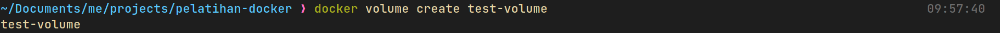


  - ##### Melihat Daftar Docker Volume
    Untuk melihat daftar Docker Volume yang sudah dibuat, gunakan perintah **`docker volume ls`**. Contoh sintaks perintahnya adalah sebagai berikut: 
    ```bash
    docker volume ls
    ```

    

  - ##### Menggunakan Docker Volume pada Container
    Untuk menggunakan Docker Volume pada container dengan menggunakan opsi -v pada perintah **`docker run`**. Contoh sintaks perintahnya adalah sebagai berikut: **`docker run -v <nama_volume>:<lokasi_mount_container> <image_name>`**

    ```bash
    docker run -d \
    --name devtest \
    -v test-volume:/app \
    nginx:latest
    ```
    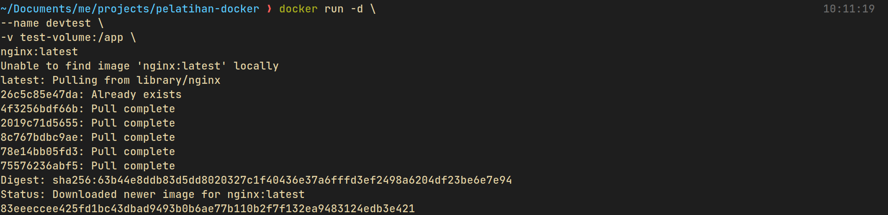


  - ##### Meng-Inspect Docker Volume
    Untuk melihat detail dari Docker Volume yang sudah dibuat, gunakan perintah **`docker volume inspect`**. Contoh sintaks perintahnya adalah sebagai berikut: **`docker volume inspect <nama_volume>`**
    ```bash
    docker volume inspect test-volume
    ```
    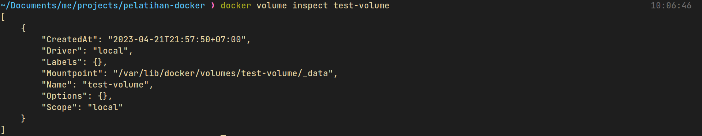

  - ##### Meng-Copy Data ke dalam Docker Volume
    Untuk dapat meng-copy data ke dalam Docker Volume dengan menggunakan perintah **`docker cp`**. Contoh sintaks perintahnya adalah sebagai berikut: **`docker cp <nama_file> <nama_container>:<lokasi_mount_container>`**

    Dimana **`<nama_file>`** adalah nama file yang akan di-copy, **`<nama_container>`** adalah nama dari container yang akan di-copy file tersebut, dan **`<lokasi_mount_container>`** adalah lokasi di dalam container dimana file tersebut akan di-copy.

    ```
    docker cp target/flag.txt devtest:/app
    ```
    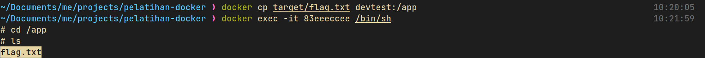

  - ##### Menghapus Data dalam Docker Volume
    Untuk menghapus data dalam Docker Volume, cukup hapus file yang berada di dalam volume tersebut dapat menggunakan perintah **`docker exec`** untuk menjalankan perintah di dalam container. Contoh sintaks perintahnya adalah sebagai berikut: **`docker exec <nama_container> rm <lokasi_file_di_volume>`** Dimana **`<nama_container>`** adalah nama dari container yang akan dihapus file tersebut, dan **`<lokasi_file_di_volume>`** adalah lokasi file yang akan dihapus dalam volume tersebut.

    ```bash
    docker exec devtest rm /app/flag.txt 
    ```
    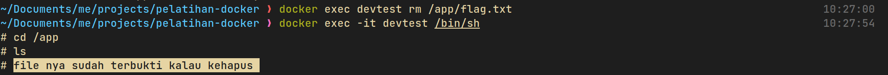

  - ##### Menghapus Docker Volume
    Untuk menghapus Docker Volume, gunakan perintah **`docker volume rm`**. Contoh sintaks perintahnya adalah sebagai berikut: **`docker volume rm <nama_volume>`**. Akan tetapi, pastikan tidak ada container yang sedang menggunakan volume tersebut. Jika ada maka volume tidak dapat dihapus.

    ```bash
    docker container rm devtest
    docker volume rm test-volume
    ```
    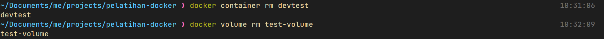

    Itulah beberapa cara untuk mengelola Docker Volume seperti membuat, melihat daftar, menghapus, menggunakan, inspect, copy data ke dalam, dan menghapus data dalam Docker Volume. Dengan Docker Volume pengelolaan data pada container dengan lebih mudah dan efisien.

- ##### Bind Mount
    Bind mount adalah tipe mount di Docker yang memungkinkan suatu file atau direktori di mesin host digunakan oleh Docker Container. Dalam bind mount, container dan mesin host menggunakan file system yang sama, sehingga jika suatu file diubah dalam container, perubahannya juga akan terlihat di mesin host, dan sebaliknya.

    Dalam penggunaannya, bind mount dapat digunakan untuk mengakses file-file atau direktori dari mesin host dan menggunakan data tersebut dalam container. Misalnya, jika ingin menjalankan sebuah aplikasi web di dalam container, tetapi ingin menggunakan file konfigurasi yang ada di mesin host, maka dapat dilakukan bind mount dari direktori yang berisi file konfigurasi tersebut ke dalam direktori di dalam container.

    Berikut adalah contoh implementasi dari bind mount.

    ```bash
    docker run -d \
    -it \
    --name bind-container \
    --mount type=bind,source="$(pwd)"/target,target=/app \
    node:16-alpine
    ``` 
    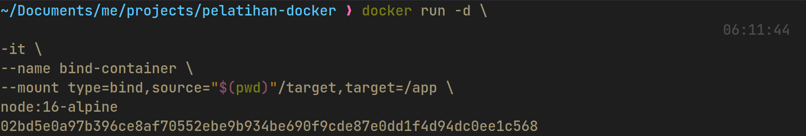

    Kode di atas merupakan perintah untuk menjalankan sebuah container dari image **`node:16-alpine`**, dengan beberapa opsi seperti berikut.

    | Opsi          | Keterangan                                                  |
    | ------------- | ------------------------------------------------------------ |
    | `-d`          | menjalankan container di background (detach mode).          |
    | `-it`         | mengalihkan interaksi ke terminal container (interactive mode dan attach to container). |
    | `--name`      | memberikan nama `bind-container` container.                  |
    | `--mount`     | menentukan opsi mount pada container. Pada kasus ini, menggunakan `opsi type=bind` untuk membuat bind mount, di mana direktori lokal pada host `$(pwd)/target` di-mount pada direktori `/app` pada container. |
    | `node:16-alpine` | image yang akan digunakan untuk menjalankan container.        |

    Untuk memastikan proses bind mount berjalan dengan baik dapat menggunakan perintah **`docker inspect nama_container`** dan lihat outputnya pada bagian **`Mounts`**.
    ```bash
    docker inspect bind-container
    ```
    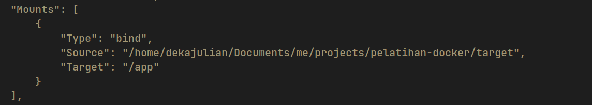

    Untuk memverifikasi kesesuaian antara isi file di directory host dengan directory target dapat dilakukan dengan masuk ke mode shell dari container itu sendiri.
    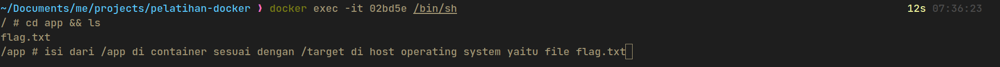

    Keuntungan dari bind mount adalah fleksibilitasnya yang tinggi, karena memungkinkan akses langsung ke file di mesin host. Namun, Bind Mount tidak memberikan isolasi penuh antara mesin host dan container. Jika suatu file atau direktori pada host dihapus atau dimodifikasi, maka akan mempengaruhi container yang menggunakan bind mount tersebut.

- ##### tmpfs Mount
    tmpfs mount adalah salah satu jenis mount pada Docker yang memungkinkan untuk menyimpan data secara sementara di dalam memory RAM pada host. Dengan menggunakan tmpfs mount, data akan cepat diakses karena langsung disimpan di dalam memory RAM, namun data tersebut tidak akan persisten karena hanya disimpan di dalam memory dan tidak disimpan ke dalam disk fisik.

    Cara penggunaannya yaitu dengan menambahkan opsi **`--mount`** pada saat menjalankan container, lalu menentukan tipe mount tmpfs dan ukuran memory yang akan digunakan untuk menyimpan data. Berikut contoh perintah untuk menggunakan tmpfs mount dengan ukuran memory 100 MB pada container:

    ```bash
    docker run -d \
    -it \
    --name tmpfs-container \
    --mount type=tmpfs,destination=/app,tmpfs-size=100M \
    node:16-alpine
    ```

    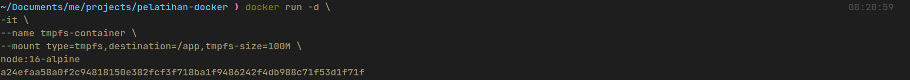

    | Opsi | Deskripsi |
    | --- | --- |
    | `-d` | Menjalankan container di background (detach mode). |
    | `-it` | Mengalihkan interaksi ke terminal container (interactive mode dan attach to container). |
    | `--name` | Memberikan nama `bind-container` container. |
    | `--mount` | Digunakan untuk memasang sebuah volume pada container. `type=tmpfs` menentukan jenis volume yang akan digunakan, yaitu tmpfs volume. `destination=/app` menunjukkan direktori tujuan dari volume ini, yaitu `/app`. |
    | `tmpfs-size=100M` | Digunakan untuk menentukan ukuran maksimum volume tmpfs dalam container, dalam hal ini sebesar 100 megabyte. |
    | `node:16-alpine` | Image yang akan digunakan untuk menjalankan container. |

    Untuk memastikan proses tmpfs mount berjalan dengan baik dapat menggunakan perintah docker inspect nama_container dan lihat outputnya pada bagian Mounts.
    ```
    docker inspect tmpfs-container
    ```

    

#### Shared File System
Shared file system adalah sebuah sistem yang memungkinkan beberapa komputer untuk mengakses dan berbagi file atau direktori yang sama secara bersamaan. Dalam sebuah jaringan komputer, shared file system memungkinkan pengguna untuk saling berbagi informasi atau file tanpa harus melakukan pengiriman file secara terpisah melalui email atau media penyimpanan portabel lainnya.

Shared file system sering digunakan dalam lingkungan kantor atau organisasi untuk memungkinkan karyawan untuk berbagi file dan dokumen secara efisien dan efektif. Dengan shared file system, pengguna dapat mengakses, membaca, menulis, dan mengedit file yang sama, terlepas dari lokasi mereka di dalam jaringan. Hal ini juga memungkinkan untuk berkolaborasi dalam waktu dan proyek yang sama.

Shared file system dapat digunakan pada berbagai jenis jaringan, termasuk jaringan lokal (LAN) dan jaringan area luas (WAN). Beberapa contoh dari shared file system termasuk Network File System (NFS), Common Internet File System (CIFS), dan Distributed File System (DFS). Keuntungan dari shared file system meliputi efisiensi dan efektivitas dalam berbagi informasi, memudahkan kolaborasi, meningkatkan produktivitas, serta menghemat waktu dan biaya yang diperlukan untuk pengiriman file secara terpisah.

- ##### Network File System
  > **Catatan**<br>Konsep Network File System (NFS) ini akan digunakan pada implementasi Docker Swarm. Untuk detailnya bisa dilihat di [Modul 4](https://github.com/arsitektur-jaringan-komputer/Pelatihan-Docker/tree/master/4.%20Membangun%20Aplikasi%20di%20Docker).

  NFS (Network File System) pada Docker adalah cara untuk menghubungkan shared file system yang terpisah di antara beberapa host atau Docker Container yang berbeda. NFS memungkinkan Docker Container untuk berbagi file dengan mudah di antara satu sama lain, bahkan ketika container berjalan pada host yang berbeda atau pada swarm cluster yang terdiri dari beberapa host.

  Keuntungan dari menggunakan NFS pada Docker antara lain:
  - Mudah digunakan: NFS dapat dengan mudah diimplementasikan pada Docker, terutama ketika digunakan dalam lingkungan cluster yang besar.
  - Menyederhanakan manajemen file: Dengan menggunakan NFS, file hanya perlu disimpan di satu lokasi, dan semua Docker Container dapat mengakses file tersebut tanpa perlu menyimpannya di dalam container itu sendiri. Hal ini menyederhanakan manajemen file dan membuatnya lebih mudah untuk diatur dan dikelola.
  - Skalabilitas: NFS memungkinkan pengguna untuk menambahkan host atau Docker Container dengan mudah tanpa perlu menambahkan file atau konfigurasi pada setiap host baru. Ini membuat skala aplikasi menjadi lebih mudah dan cepat.
  - Efisiensi: Dalam beberapa kasus, menggunakan NFS lebih efisien daripada melakukan copy file ke dalam setiap container. Ini dapat meningkatkan kinerja aplikasi dan menghemat ruang penyimpanan pada setiap host.

  NFS cocok digunakan pada saat ingin menggunakan shared file system pada beberapa host atau Docker Container yang berbeda. Contoh penggunaannya adalah ketika ingin membagikan file konfigurasi, data atau aplikasi di antara beberapa Docker Container, bahkan ketika container berjalan pada host yang berbeda atau pada cluster Docker Swarm. Namun, NFS tidak cocok digunakan jika hanya perlu berbagi file antara beberapa container di host yang sama.

### Docker Networking
#### Pengenalan Docker Networking
Dalam pengembangan dan implementasi aplikasi modern yang kompleks, penggunaan teknologi kontainer seperti Docker telah menjadi semakin umum. Docker memungkinkan para developer untuk memisahkan aplikasi dari lingkungan host dan infrastruktur di mana mereka dijalankan, sehingga memungkinkan lebih banyak fleksibilitas dan portabilitas.

Namun, ketika menjalankan beberapa container pada satu host, perlu untuk memungkinkan container untuk berkomunikasi satu sama lain, dan juga terhubung ke sumber daya di luar container seperti jaringan host atau jaringan eksternal. Disinilah Docker Networking berperan.

Docker Networking adalah cara untuk menghubungkan antara Docker Container yang berbeda sehingga mereka dapat berkomunikasi satu sama lain. Saat menjalankan beberapa container di Docker, setiap container memiliki alamat IP yang berbeda dan terisolasi satu sama lain. Oleh karena itu, Docker Networking memungkinkan Docker Container untuk terhubung ke jaringan yang sama atau subnet dan berkomunikasi satu sama lain, serta dapat terhubung dengan host mesin fisik atau jaringan eksternal.

Tanpa Docker Networking, setiap container berjalan pada subnet yang terisolasi, yang berarti mereka tidak dapat berkomunikasi satu sama lain atau dengan sumber daya di luar subnet tersebut. Dengan menggunakan Docker Networking, Docker Container dapat terhubung ke jaringan yang sama atau subnet, dan dapat berkomunikasi dengan container lain dan sumber daya di luar container, seperti basis data atau layanan web yang terpisah.

Selain itu, Docker Networking memungkinkan pengguna untuk membuat lingkungan jaringan yang aman dan terisolasi di mana setiap container dapat berinteraksi satu sama lain, tetapi tetap terpisah dari lingkungan jaringan host. Ini memungkinkan para developer untuk menciptakan aplikasi yang lebih aman dan lebih mudah untuk dikelola, serta memfasilitasi pengembangan dan implementasi skala besar.

Oleh karena itu, Docker Networking adalah komponen kunci dalam penggunaan Docker Container dengan memungkinkan container untuk berkomunikasi satu sama lain dan terhubung ke sumber daya di luar container. Docker Networking memungkinkan para developer untuk menciptakan aplikasi yang lebih fleksibel, portabel, aman, dan mudah dielola.

#### Konsep Dasar di Docker Networking
- ##### Docker Network Driver
    Docker Network Driver adalah komponen utama yang memungkinkan Docker Container terhubung ke jaringan. Network Driver adalah plug-in yang diinstal pada host Docker dan mengatur bagaimana container terhubung ke jaringan.

    Docker menyediakan beberapa jenis Network Driver yang berbeda, masing-masing dengan karakteristik yang unik, dan memungkinkan pengguna untuk memilih Network Driver yang tepat untuk kebutuhan aplikasi mereka. Berikut adalah beberapa jenis Network Driver yang tersedia di Docker: **`bridge network`**, **`host network`**, **`overlay network`**, **`ipvlan`**, **`macvlan network`**, **`network plugins`**. Detail pembahasan akan dijelaskan pada sub materi [Jenis-Jenis Docker Network Driver](https://github.com/arsitektur-jaringan-komputer/Pelatihan-Docker/tree/master/3.%20Docker%20Service%20Lanjutan#jenis-jenis-docker-network-driver)

    Dengan pemilihan Network Driver yang tepat, pengguna dapat memaksimalkan fleksibilitas, portabilitas, dan keamanan aplikas di dalam container.

- ##### IP Address Management

    IP Address Management (IPAM) adalah proses manajemen alamat IP di dalam jaringan Docker. Docker memungkinkan pengguna untuk mengontrol pengaturan IP pada setiap jaringan yang dibuat, termasuk pemberian alamat IP secara otomatis atau manual. Penjelasan detail mengenail IP Address dapat dilihat pada [Jarkom Modul 4](#https://github.com/arsitektur-jaringan-komputer/Modul-Jarkom/tree/master/Modul-4).

    Dalam Docker, setiap container dapat memiliki alamat IP unik pada jaringan tertentu. IPAM memastikan bahwa alamat IP yang diberikan pada container tidak bertabrakan dengan alamat IP yang sudah ada di jaringan, sehingga mencegah masalah komunikasi dan konflik alamat IP.

    Untuk melihat ip address yang digunakan oleh sebuah Docker container dapat menggunakan perintah **`docker container inspect <container_id>`**. Informasi seputar IP Address biasanya terdapat di **`NetworkSettings`**.

    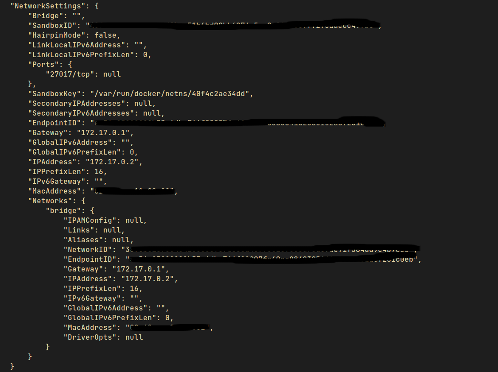


    Dalam Docker, IPAM menawarkan beberapa mode pengaturan IP address, antara lain:

    - **`Default`**: Mode ini memungkinkan Docker secara otomatis memberikan alamat IP untuk setiap container dalam jaringan. Docker akan membuat subnet baru untuk setiap jaringan dan mengalokasikan alamat IP dari subnet tersebut.

    - **`User-defined`**: Mode ini memungkinkan pengguna untuk secara manual menentukan subnet dan rentang alamat IP yang akan digunakan pada jaringan tertentu. Pengguna dapat menentukan rentang IP yang tersedia dan menentukan alamat IP yang akan digunakan pada setiap container.

    - **`External`**: Mode ini memungkinkan Docker untuk terhubung ke IPAM pihak ketiga seperti DHCP server atau sistem manajemen alamat IP lainnya untuk mengelola alamat IP pada jaringan.

    Pengaturan IPAM pada Docker memungkinkan pengguna untuk lebih mudah mengelola alamat IP pada jaringan Docker dan mencegah masalah komunikasi dan konflik alamat IP. Dalam lingkungan yang lebih kompleks, IPAM dapat membantu meningkatkan efisiensi dan skalabilitas jaringan Docker.

- ##### DNS Name Resolution
    DNS name resolution adalah proses mengubah nama domain menjadi alamat IP yang terkait dengannya. Ketika seseorang mengakses sebuah website, misalnya, browser harus mengetahui alamat IP dari server tempat website tersebut dihosting. Namun, manusia tentunya lebih mudah mengingat nama domain daripada alamat IP yang panjang dan sulit diingat.

    

    Dalam DNS name resolution, nama domain akan dicocokkan dengan alamat IP yang terkait dengannya dalam database DNS (Domain Name System). Database DNS adalah sistem terdistribusi yang memungkinkan pengguna untuk mencari informasi tentang nama domain dan mengembalikan alamat IP yang terkait dengan domain tersebut. Dalam praktiknya, server DNS biasanya memegang informasi tentang beberapa domain dan mungkin perlu meminta informasi dari server DNS lain jika informasi yang diminta tidak tersedia pada server tersebut. Pembahasan lebih lanjut tentang DNS name resolution dapat dilihat di [Jarkom Modul DNS](#https://github.com/arsitektur-jaringan-komputer/Modul-Jarkom/tree/master/Modul-2/DNS)

    DNS name resolution sangat penting dalam internet, karena tanpa itu, pengguna akan kesulitan mengakses situs web dan layanan online. Dalam Docker, DNS name resolution memungkinkan container untuk berkomunikasi dengan menggunakan nama yang mudah diingat daripada alamat IP yang sulit diingat.

- ##### Port mapping
    Port mapping adalah proses untuk menghubungkan antara port yang digunakan oleh sebuah aplikasi atau layanan dalam container dengan port yang tersedia pada host atau mesin tempat container dijalankan. Dalam Docker, port mapping memungkinkan container untuk menerima permintaan dari luar melalui port yang terbuka pada host atau mesin tempat container berjalan.

    Misalnya, jika sebuah container menjalankan sebuah layanan web pada port 8080, namun port 8080 tidak terbuka pada host, maka layanan tersebut tidak dapat diakses dari luar. Namun, dengan melakukan port mapping dapat menghubungkan port 8080 pada container dengan port yang tersedia pada host, seperti port 8000. Dengan demikian, layanan web pada container dapat diakses melalui port 8000 pada host.

    Port mapping dapat dilakukan pada saat menjalankan container dengan menggunakan perintah **`docker run`**. Untuk melakukan port mapping dapat menentukan port pada host dengan opsi **`-p`** dan port pada container dengan format **`port_container`**. Contohnya, jika ingin menghubungkan port 8080 pada container dengan port 8000 pada host dapat menjalankan perintah berikut:

    ```
    docker run -p <port_host>:<port_container> <nama_container>
    ```
    atau dengan menambahkan konfigurasi port mapping di Docker Compose pada contohkan sebelumnya.

#### Jenis-Jenis Docker Network Driver
- ##### bridge Network
    Bridge network merupakan salah satu jenis network yang ada pada Docker. Bridge network digunakan untuk menghubungkan container dengan container lainnya pada satu host. Dalam bridge network, setiap container memiliki alamat IP yang unik dan terisolasi dalam network yang sama. Dalam jaringan bridge, setiap container dapat berkomunikasi dengan container lainnya melalui alamat IP yang diberikan oleh Docker.

    Bridge network pada Docker merupakan default network yang dibuat oleh Docker ketika Docker diinstal pada sebuah host. Setiap container yang dibuat tanpa menyebutkan network yang digunakan, secara otomatis akan terhubung dengan jaringan bridge yang telah dibuat. Setiap jaringan bridge yang dibuat akan memiliki sebuah gateway yang bertindak sebagai titik masuk ke jaringan dari host.

    Dalam bridge network pada Docker, container dapat diakses menggunakan alamat IP dari jaringan yang sama, atau menggunakan nama container yang diberikan pada saat pembuatan container. Container juga dapat dihubungkan dengan network lainnya melalui fitur bridge network yang disediakan oleh Docker. Dalam hal ini, sebuah container dapat terhubung dengan beberapa network secara bersamaan untuk memungkinkan interaksi dengan container lain yang berada pada jaringan yang berbeda.

    Bridge network pada Docker dapat diatur secara manual dengan cara membuat jaringan baru atau mengatur konfigurasi dari jaringan yang sudah ada. Untuk membuat bridge network di Docker dapat menggunakan perintah: **`docker network create <nama_network>`**  atau dengan menulis driver network secara eksplisit **`docker network create --driver bridge <nama_network>`**.

    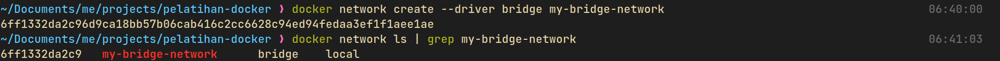

    Untuk memasang bridge network ke Docker container baru dapat menggunakan perintah **`docker run --name <nama_container> --network <nama_network>`** atau ke container yang sudah ada dengan perintah **`docker network connect <nama_network> <nama_container>`**.

    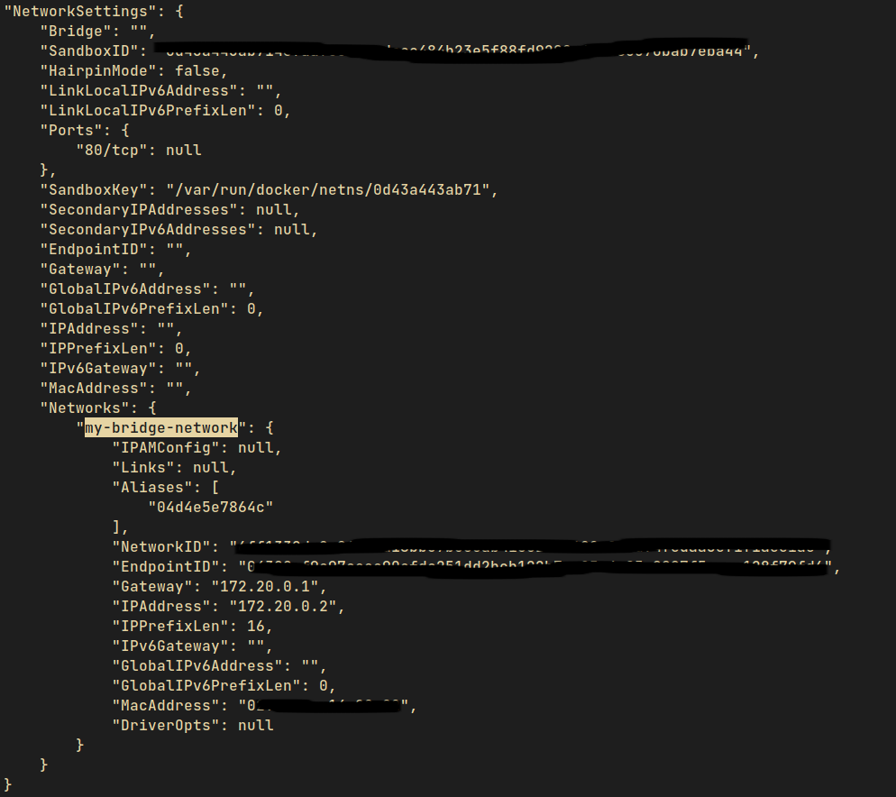

    Setelah menambahkan container ke dalam Docker bridge network, container tersebut dapat diakses melalui alamat IP di dalam jaringan tersebut. Selain itu juga dapat menjalankan container baru dan menetapkannya ke dalam network yang sama untuk memungkinkan container tersebut berkomunikasi dengan container yang telah ada di dalam network.

- ##### host Network
    Selain bridge network, Docker juga mendukung host network. Host network memungkinkan container untuk menggunakan network interface yang sama dengan host. Dengan host network, container tidak dibatasi oleh isolasi network yang diberikan oleh Docker, sehingga container dapat langsung mengakses network host.

    Perbedaan utama antara host network dan bridge network adalah pada tingkat isolasi network. Dalam host network, container berbagi alamat IP dengan host, sehingga tidak ada isolasi network antara container dan host. Sementara itu, pada bridge network, Docker membuat network virtual yang terpisah dari network host. Dalam bridge network, container berada di dalam network virtual yang terisolasi, sehingga tidak dapat langsung mengakses network host.

    Keuntungan menggunakan host network adalah performa yang lebih baik karena container tidak melalui jaringan virtual yang terisolasi. Namun, kelemahan dari host network adalah kurangnya isolasi yang menyebabkan potensi masalah keamanan dan tidak fleksibel dalam hal port mapping.

    Untuk membuat host network di Docker dapat dilakukan dengan perintah **`docker network create --driver=host <nama-network>`** dengan memberikan jenis driver secara eksplisit. Akan tetapi perlu diperhatikan kalau host network hanya diperbolehkan satu karena host network memberikan akses langsung ke semua port dan service pada host, sehingga dapat menimbulkan masalah keamanan jika lebih dari satu container menggunakan host network pada saat yang bersamaan. Selain itu, karena host network tidak memiliki isolasi seperti yang dimiliki oleh bridge network, maka ketika dua container menggunakan host network yang sama, mereka akan saling bersaing untuk menggunakan port yang sama, yang dapat menyebabkan konflik dan kegagalan dalam menjalankan container. Oleh karena itu, disarankan untuk menggunakan host network dengan hati-hati dan hanya jika memang benar-benar diperlukan.

    Host network paling tepat digunakan ketika performa jaringan menjadi faktor kritis dan isolasi network tidak diperlukan. Contohnya adalah ketika menjalankan aplikasi yang memerlukan koneksi jaringan yang sangat cepat dan membutuhkan akses ke port host yang spesifik, seperti aplikasi game online atau streaming media. Selain itu, host network juga cocok digunakan untuk aplikasi yang sudah teroptimasi untuk dijalankan pada lingkungan host dan tidak memerlukan isolasi network. Misalnya, aplikasi yang hanya digunakan untuk pengujian atau aplikasi yang sifatnya sementara.

- ##### overlay Network
    > **Catatan**<br>Konsep overlay network ini akan digunakan pada implementasi Docker Swarm. Untuk detailnya bisa dilihat di [Modul 4](https://github.com/arsitektur-jaringan-komputer/Pelatihan-Docker/tree/master/4.%20Membangun%20Aplikasi%20di%20Docker).

    Overlay network di Docker adalah jenis jaringan yang memungkinkan beberapa host Docker terhubung dan berkomunikasi satu sama lain melalui jaringan yang sama. Overlay network menggunakan teknologi Virtual Extensible LAN (VXLAN) untuk memungkinkan container di mesin Docker yang berbeda untuk berkomunikasi satu sama lain seakan-akan mereka berada dalam satu jaringan lokal.

    Overlay network sangat berguna dalam skenario di mana perlu menjalankan aplikasi yang terdiri dari banyak container pada beberapa mesin Docker yang berbeda, seperti pada cluster atau lingkungan produksi yang terdistribusi. Dalam kasus seperti itu, overlay network memungkinkan container pada mesin yang berbeda untuk berkomunikasi dengan mudah satu sama lain, tanpa perlu memperhatikan topologi jaringan fisik di belakangnya.

- ##### ipvlan Network
    IPvlan network merupakan salah satu tipe driver network di Docker yang memungkinkan Docker Container untuk memiliki satu atau beberapa interface virtual yang terhubung ke jaringan host. Interface virtual ini akan terhubung langsung ke interface fisik host, sehingga dapat digunakan untuk melakukan komunikasi langsung dengan jaringan eksternal.

    Salah satu kelebihan dari IPvlan network adalah kemampuan untuk mengoptimalkan kinerja aplikasi dan mengurangi latensi dengan menghindari overhead dari proses routing yang terjadi pada driver network lain seperti bridge network. Selain itu, IPvlan network juga mendukung kemampuan untuk melakukan isolasi jaringan dengan menggunakan VLAN ID.

    Namun, terdapat juga beberapa kekurangan dari penggunaan IPvlan network, antara lain:
    - Konfigurasi yang rumit dan memerlukan pengetahuan yang cukup untuk dapat menggunakannya dengan efektif
    - Tidak mendukung kemampuan port mapping secara langsung, sehingga diperlukan konfigurasi tambahan untuk dapat melakukan port mapping
    - Memerlukan kernel yang mendukung fitur IPvlan untuk dapat digunakan.

    Oleh karena itu, sebaiknya melakukan evaluasi terlebih dahulu sebelum memutuskan untuk menggunakan IPvlan network di Docker.

- ##### macvlan Network
    Macvlan network adalah jenis jaringan Docker yang memungkinkan Docker Container terhubung ke jaringan seperti virtual interface yang terpisah dan dapat memiliki alamat MAC yang berbeda. Dalam konfigurasi ini, setiap container memiliki alamat MAC yang unik, yang memungkinkan untuk terhubung ke jaringan fisik dengan alamat MAC yang sama.

    Macvlan network sangat berguna ketika Docker Container harus terhubung ke jaringan fisik yang sama dengan host Docker. Sebagai contoh, ketika Docker Container harus terhubung ke jaringan yang memiliki protokol broadcast atau multicast, seperti protokol DHCP, NetBIOS, atau mDNS.

    Namun, sama seperti dengan ipvlan network, konfigurasi macvlan network memerlukan beberapa pengetahuan dan pemahaman tentang jaringan. Selain itu, macvlan network memiliki beberapa batasan, seperti tidak dapat melakukan komunikasi antara container dalam jaringan yang sama, dan tidak dapat melakukan port mapping ke host.

    Oleh karena itu, sebaiknya melakukan evaluasi terlebih dahulu sebelum memutuskan untuk menggunakan macvlan network di Docker.

- ##### Network plugins
    Docker Network Plugin adalah mekanisme yang memungkinkan pengguna untuk menggunakan fitur jaringan yang tidak disediakan oleh driver bawaan Docker. Plugin ini memungkinkan integrasi ke dalam sistem jaringan yang ada, seperti jaringan SDN atau jaringan virtual yang telah disiapkan oleh penyedia cloud. Contoh plugin jaringan yang tersedia untuk Docker antara lain: Flannel, Calico, Weave Net, Cilium, dan lain-lain.

    Kelebihan dari menggunakan Docker Network Plugin adalah:
    - Kompatibilitas: Plugin memungkinkan pengguna untuk menggunakan jaringan yang telah disiapkan oleh penyedia cloud, sehingga memungkinkan pengguna untuk mengintegrasikan Docker ke dalam lingkungan cloud yang lebih besar.

    - Skalabilitas: Plugin memungkinkan pengguna untuk memperluas kapasitas jaringan Docker ke dalam sistem jaringan yang lebih besar, sehingga memungkinkan pengguna untuk mengelola jaringan Docker dengan lebih efisien.

    Kekurangan dari menggunakan Docker Network Plugin adalah:
    - Kompleksitas: Penggunaan plugin memerlukan pengetahuan yang lebih dalam tentang jaringan dan konfigurasi Docker, sehingga memerlukan waktu dan usaha yang lebih banyak untuk mengonfigurasi dan mengelola jaringan Docker.

    - Ketergantungan: Penggunaan plugin memerlukan ketergantungan pada plugin yang diinstal, sehingga jika plugin tidak tersedia atau mengalami masalah, maka jaringan Docker tidak dapat digunakan dengan efektif.

#### Mengelola Docker Networking di Docker Compose
Masih ingatkah dengan konfigurasi Docker Compose sebelumnya? Pada konfigurasi sebelumnya masih belum mengimplementasikan Docker Networking. Pada sub materi ini, akan ditambahkan konfigurasi untuk mengatur Docker Networking menggunakan network driver **`bridge`**.

```YAML
version: '3'
services:
  backend:
    build: ./backend
    ports:
      - "8080:8080"
    depends_on:
      - database
    environment:
      DB_HOST: database
    networks:
      - mynetwork
  frontend:
    build: ./frontend
    ports:
      - "3000:3000"
    environment:
      REACT_APP_BACKEND_URL: http://backend:8080
  database:
    image: postgres
    volumes:
      - ./data:/var/lib/postgresql/data
    environment:
      POSTGRES_USER: myuser
      POSTGRES_PASSWORD: mypassword
      POSTGRES_DB: mydb
    networks:
      - mynetwork
  networks:
    mynetwork:
      driver: bridge
```
Pada konfigurasi Docker Compose di atas, ditambahkan sebuah network dengan nama **`mynetwork`** dengan driver **`bridge`**. Selain itu, setiap service (backend, frontend, dan database) juga ditambahkan ke dalam network tersebut.

Penambahan network ini dilakukan agar ketiga service yang ada di dalam Docker Compose dapat saling berkomunikasi melalui network yang sama. Dengan adanya network ini, antar service dapat berkomunikasi dengan menggunakan nama service sebagai host name, misalnya **`database`** untuk menghubungi service database dari service backend.

Alasan penambahan network ini adalah untuk mempermudah pengaturan komunikasi antar service dan menghindari masalah yang dapat timbul akibat penggunaan IP address yang berubah-ubah setiap kali melakukan start ulang terhadap container. Selain itu, dengan menggunakan network ini juga dapat dengan mudah menambahkan service baru ke dalam komposisi yang sudah ada tanpa harus memodifikasi ulang konfigurasi setiap service.

## Sumber Referensi
- https://docs.docker.com/compose/compose-file/
- https://docs.docker.com/storage/
- https://docs.docker.com/storage/volumes/
- https://docs.docker.com/network/network-tutorial-overlay/
- https://raidboxes.io/en/blog/webdesign-development/domain-name-system-dns/
