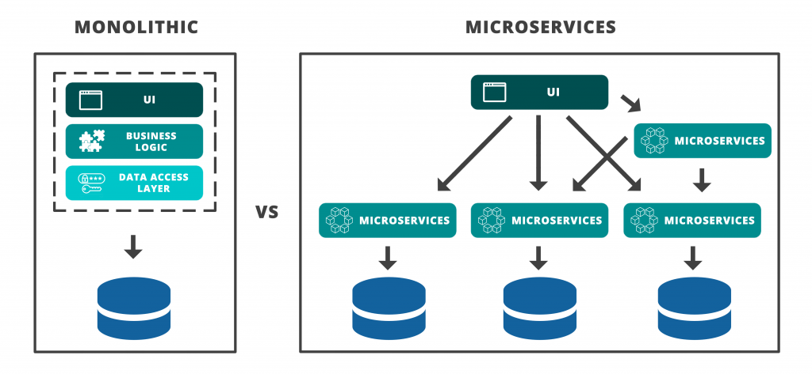

# **Membangun Aplikasi di Docker**
- [**Glosarium**](#glosarium)
- [**Materi**](#materi)
  - [Mikroservice](#️arsitektur-mikroservice)
    - [Pengertian Mikroservice](#pengertian-mikroservice)
    - [Karakteristik Mikroservice](#karakteristik-mikroservice)
    - [Arsitektur Mikroservice](#arsitektur-mikroservice)
    - [Inter-container communication](#inter-container-communication)
      - [Sockets](#sockets)
      - [Filesystem](#filesystem)
      - [Database records](#database-record)
      - [HTTP](#http)
      - [MQTT](#mqtt)
  - [Docker Swarm](#docker-swarm)
  - [Membuat Aplikasi Mikroservice dengan Docker](#membuat-aplikasi-mikroservice-dengan-docker)
- [**Sumber**](#-sumber)

## Glosarium

## Materi
### Mikroservice
#### Pengertian Mikroservice
Microservice adalah sebuah pendekatan arsitektur perangkat lunak untuk membangun sebuah aplikasi dengan memecahnya menjadi beberapa komponen kecil yang berdiri sendiri (independen) dan saling berkomunikasi melalui antarmuka yang terstandardisasi. Dalam arsitektur microservice, setiap komponen atau service memiliki tanggung jawab yang spesifik dan dijalankan secara independen dari komponen lainnya.

Secara umum, arsitektur microservice menawarkan beberapa keuntungan, seperti memudahkan skalabilitas, mempercepat waktu deployment dan pengembangan, serta memudahkan untuk memperbaiki atau meng-upgrade aplikasi. Hal ini disebabkan karena setiap service dapat dikembangkan, di-deploy, dan di-maintain secara terpisah tanpa mempengaruhi service lainnya.

Namun, di sisi lain, menggunakan arsitektur microservice juga memiliki beberapa tantangan, seperti pengelolaan service yang lebih kompleks dan koordinasi antar service yang harus dilakukan secara hati-hati. Oleh karena itu, pemilihan arsitektur yang tepat harus dipertimbangkan berdasarkan kebutuhan bisnis dan teknologi yang digunakan.

#### Karakteristik Mikroservice
#### Arsitektur Mikroservice
#### Inter-container communication
##### Sockets
##### Filesystem
##### Database records
##### HTTP
##### MQTT

### Docker Swarm

### Membuat Aplikasi Mikroservice dengan Docker
## Sumber Referensi
- https://datacommcloud.co.id/microservices-adalah-perbedaan-monolithic-architecture/