# **Membangun Aplikasi di Docker**
- [**Glosarium**](#glosarium)
- [**Materi**](#materi)
  - [Microservice](#microservice)
    - [Pengertian Microservice](#pengertian-microservice)
    - [Karakteristik Microservice](#karakteristik-microservice)
    - [Inter-container communication](#inter-container-communication)
      - [Sockets](#sockets)
      - [Filesystem](#filesystem)
      - [Database Records](#database-records)
      - [HTTP](#http)
      - [MQTT](#mqtt)
  - [Docker Swarm](#docker-swarm)
    - [Konfigurasi Docker Swarm](#konfigurasi-docker-swarm)
    - [Konsep-Konsep Dasar pada Docker Swarm](#konsep-konsep-dasar-pada-docker-swarm)
      - [Node](#node)
      - [Service](#service)
      - [Task](#task)
      - [Overlay Network](#overlay-network)
  - [Membuat Aplikasi Microservice dengan Docker](#membuat-aplikasi-microservice-dengan-docker)
  - [Tambahan](#tambahan)
    - [Pengantar Aplikasi Web](#pengantar-aplikasi-web)
- [**Sumber Referensi**](#sumber-referensi)


## Glosarium

## Materi
### Microservice
#### Pengertian Microservice
Microservice adalah sebuah pendekatan arsitektur perangkat lunak untuk membangun sebuah aplikasi dengan memecahnya menjadi beberapa komponen kecil yang berdiri sendiri (independen) dan saling berkomunikasi melalui antarmuka yang terstandarisasi. Dalam arsitektur microservice, setiap komponen atau service memiliki tanggung jawab yang spesifik dan dijalankan secara independen dari komponen lainnya.


Secara umum, arsitektur microservice menawarkan beberapa keuntungan, seperti memudahkan skalabilitas, mempercepat waktu deployment dan pengembangan, serta memudahkan untuk memperbaiki atau meng-upgrade aplikasi. Hal ini disebabkan karena setiap service dapat dikembangkan, di-deploy, dan di-maintain secara terpisah tanpa mempengaruhi service lainnya.

Namun, di sisi lain, menggunakan arsitektur microservice juga memiliki beberapa tantangan, seperti pengelolaan service yang lebih kompleks dan koordinasi antar service yang harus dilakukan secara hati-hati. Oleh karena itu, pemilihan arsitektur yang tepat harus dipertimbangkan berdasarkan kebutuhan bisnis dan teknologi yang digunakan.

#### Karakteristik Microservice

- Autonomous
Salah satu karakteristik penting dari aplikasi microservice adalah keberadaan setiap komponen atau layanan yang dapat beroperasi secara independen. Dengan arsitektur microservice, setiap komponen dapat dikembangkan, di-deploy, dioperasikan, dan diskalakan tanpa mempengaruhi komponen atau layanan lain. Dengan kata lain, setiap komponen dapat berjalan seperti sistem yang mandiri, dan jika terjadi masalah pada salah satu komponen, hanya layanan tersebut yang akan terpengaruh.

- Service-oriented
Aplikasi microservice dirancang dengan orientasi pada layanan. Setiap komponen aplikasi dirancang untuk melakukan satu tugas atau layanan khusus. Hal ini membuat aplikasi lebih modular dan memudahkan pengembangan dan pemeliharaannya.

- Terdistribusi
Aplikasi microservice terdiri dari beberapa komponen yang terdistribusi dan dapat berjalan di lingkungan yang berbeda-beda. Hal ini memungkinkan aplikasi untuk dapat dijalankan secara horizontal dan meningkatkan skalabilitasnya.

#### Inter-container communication
Inter-container communication di aplikasi microservice merujuk pada cara komunikasi antar service atau container yang berbeda dalam suatu aplikasi yang menggunakan arsitektur microservice. Karena setiap service dijalankan pada container yang terpisah dan terisolasi, maka inter-container communication harus dilakukan melalui mekanisme tertentu.

##### Sockets
Sockets adalah salah satu mekanisme yang dapat digunakan dalam inter-container communication pada aplikasi microservice. Socket dapat diartikan sebagai titik akhir dari suatu koneksi yang digunakan untuk berkomunikasi antar service atau container yang berbeda.

Dalam konteks aplikasi microservice, socket biasanya digunakan untuk melakukan komunikasi antar service pada jaringan lokal atau antar container pada mesin yang sama. Socket dapat digunakan untuk melakukan komunikasi secara sinkron atau asinkron.

Pada umumnya, penggunaan socket dalam inter-container communication pada aplikasi microservice dapat dilakukan dengan beberapa cara, seperti:

- TCP Socket: digunakan untuk melakukan komunikasi yang reliable dan ordered antar service atau container pada jaringan lokal.

- Unix Domain Socket: digunakan untuk melakukan komunikasi antar container pada mesin yang sama. Unix domain socket dapat lebih cepat daripada TCP socket karena tidak perlu melalui jaringan.

- Datagram Socket: digunakan untuk melakukan komunikasi yang tidak reliable dan unordered antar service atau container pada jaringan lokal. Datagram socket dapat digunakan untuk transfer data yang relatif kecil dan tidak memerlukan protokol seperti TCP.

Pemilihan jenis socket yang tepat harus dipertimbangkan berdasarkan kebutuhan bisnis dan teknologi yang digunakan dalam aplikasi microservice. Penggunaan socket dalam inter-container communication dapat membantu meningkatkan efisiensi dan performa dari aplikasi microservice.

##### Filesystem
Filesystem pada inter-container communication mengacu pada mekanisme berbagi file antara container pada sistem operasi host yang sama. Dalam aplikasi microservice, mekanisme ini dapat digunakan untuk berbagi data atau file konfigurasi antar service atau container yang berjalan pada mesin yang sama.

Dalam mekanisme filesystem, container yang berbagi data dapat diatur untuk menggunakan volume yang sama untuk mengakses file yang sama. Volume ini dapat diatur untuk berada di dalam atau di luar container. Jika volume berada di dalam container, maka setiap container yang berbagi volume dapat melihat isi volume secara bersamaan. Sedangkan jika volume berada di luar container, maka setiap container akan mengakses file atau data pada volume melalui jaringan file, sehingga memungkinkan container untuk berbagi data atau file konfigurasi dengan mudah.

Beberapa keunggulan dari mekanisme filesystem pada inter-container communication pada aplikasi microservice adalah sebagai berikut:

- Efisien: Mekanisme filesystem pada inter-container communication sangat efisien karena container tidak perlu mengirim atau menerima data melalui jaringan.
- Mudah diatur: Filesystem pada inter-container communication mudah diatur dan dikonfigurasi untuk berbagi data atau file konfigurasi antar container.
- Menyediakan akses bersama: Dengan mekanisme filesystem, setiap container yang berbagi volume dapat melihat isi volume secara bersamaan, sehingga memungkinkan container untuk berbagi data atau file konfigurasi dengan mudah.

Namun, penggunaan mekanisme filesystem juga memiliki beberapa kelemahan, seperti:

- Tidak cocok untuk container yang berjalan pada mesin yang berbeda: Mekanisme filesystem hanya dapat digunakan untuk berbagi data atau file konfigurasi antar container yang berjalan pada mesin yang sama. Jika container berjalan pada mesin yang berbeda, maka mekanisme ini tidak dapat digunakan.
- Memerlukan koordinasi yang baik: Mekanisme filesystem memerlukan koordinasi yang baik antara container yang berbagi volume untuk memastikan bahwa data atau file konfigurasi yang digunakan sama di setiap container.

Pemilihan mekanisme inter-container communication yang tepat harus dipertimbangkan berdasarkan kebutuhan bisnis dan teknologi yang digunakan dalam aplikasi microservice. Mekanisme filesystem dapat menjadi pilihan yang baik terutama jika container berjalan pada mesin yang sama dan membutuhkan akses bersama ke data atau file konfigurasi.

##### Database Records
Inter-container communication dengan database records mengacu pada kemampuan container dalam berbagi data atau informasi melalui database yang sama.

Dalam aplikasi yang terdiri dari beberapa container, terdapat kemungkinan beberapa container memerlukan akses ke data yang sama di database. Misalnya, aplikasi e-commerce dengan container untuk web front-end, container untuk pengelolaan persediaan, dan container untuk pemrosesan pembayaran. Semua container ini perlu akses ke database yang sama untuk mengambil data produk, informasi persediaan, dan transaksi pembayaran.

Pengimplementasian inter-container communication dengan database records dapat menggunakan berbagai teknologi dan bahasa pemrograman seperti Python, Java, atau Node.js. Salah satu contoh teknologi yang populer dalam inter-container communication dengan database records adalah ORM (Object-Relational Mapping) seperti Hibernate, Sequelize, atau SQLAlchemy. ORM memungkinkan untuk memetakan objek dalam aplikasi ke struktur tabel dalam database dan memungkinkan container untuk mengakses data yang sama dari database yang sama.

Beberapa keunggulan dari mekanisme database record pada inter-container communication pada aplikasi microservice adalah sebagai berikut:

- Konsistensi data - Inter-container communication dengan database records memastikan bahwa setiap container menggunakan data yang sama dari database yang sama, sehingga menjaga konsistensi data di seluruh aplikasi.
- Penghematan waktu - Penggunaan inter-container communication dengan database records memungkinkan container untuk berbagi data tanpa harus mengirimkan data melalui jaringan, sehingga dapat menghemat waktu dan meningkatkan kecepatan aplikasi.
- Skalabilitas - Dengan menggunakan database yang sama untuk semua container, aplikasi dapat dengan mudah ditingkatkan dengan menambahkan atau menghapus container tanpa mempengaruhi konsistensi data.

Namun, penggunaan mekanisme database record juga memiliki beberapa kelemahan, seperti:

- Kompleksitas konfigurasi - Inter-container communication dengan database records memerlukan konfigurasi yang kompleks untuk memastikan setiap container dapat mengakses database yang sama dengan benar.
- Risiko keamanan - Jika tidak diatur dengan benar, inter-container communication dengan database records dapat meningkatkan risiko keamanan aplikasi karena container dapat memiliki akses ke data sensitif dalam database yang sama.

Penting untuk diingat bahwa inter-container communication dengan database records memerlukan koordinasi yang baik antara container dan penggunaan teknologi yang tepat. Hal ini meliputi penggunaan teknologi yang dapat menangani concurrency, isolasi transaksi, dan penggunaan teknologi yang tepat untuk penggunaan yang sesuai dengan skala aplikasi. Selain itu, penggunaan teknologi dan bahasa pemrograman yang sama di semua container dapat mempermudah koordinasi dan interaksi antara container.

##### HTTP
HTTP (Hypertext Transfer Protocol) adalah protokol komunikasi yang umum digunakan dalam inter-container communication pada aplikasi microservice. HTTP adalah protokol request-response yang digunakan untuk mentransfer data melalui jaringan antar service atau container.

Pada aplikasi microservice, HTTP dapat digunakan sebagai mekanisme inter-container communication melalui RESTful API. Setiap service menyediakan RESTful API yang terbuka, dan service lain dapat mengakses API tersebut untuk berkomunikasi dengan service yang bersangkutan.

Dalam penggunaan HTTP sebagai mekanisme inter-container communication pada aplikasi microservice, HTTP dapat memiliki beberapa keunggulan, seperti:

- Mudah diimplementasikan: karena HTTP adalah protokol yang sangat umum, banyak bahasa pemrograman dan framework yang mendukung implementasi HTTP.
- Interoperabilitas yang baik: karena HTTP adalah protokol standar, service yang berbeda dapat saling berkomunikasi dengan mudah.
- Dukungan terhadap berbagai format data: HTTP mendukung berbagai format data seperti JSON, XML, dan lain-lain, sehingga memungkinkan service untuk berkomunikasi menggunakan format data yang berbeda-beda.
- Dukungan terhadap pengamanan: HTTP dapat digunakan dengan protokol HTTPS untuk memastikan keamanan dan kerahasiaan data yang ditransfer antar service atau container.

Namun, penggunaan HTTP sebagai mekanisme inter-container communication pada aplikasi microservice juga memiliki beberapa kelemahan, seperti:

- Overhead yang besar: HTTP memiliki overhead yang besar karena memerlukan header dan metadata yang cukup kompleks.
- Performa yang relatif lambat: karena overhead yang besar, performa HTTP relatif lambat dibandingkan dengan mekanisme inter-container communication yang lebih sederhana seperti Unix domain socket.
- Tidak mendukung streaming data: HTTP tidak mendukung streaming data secara efektif, sehingga tidak cocok untuk transfer data yang besar dan kompleks.

Pemilihan mekanisme inter-container communication yang tepat harus dipertimbangkan berdasarkan kebutuhan bisnis dan teknologi yang digunakan dalam aplikasi microservice. HTTP dapat menjadi pilihan yang baik terutama jika aplikasi microservice membutuhkan interoperabilitas yang baik dan dukungan terhadap pengamanan.

##### MQTT
MQTT (Message Queuing Telemetry Transport) adalah protokol komunikasi ringan yang digunakan untuk pertukaran data pada sistem IoT (Internet of Things) dan aplikasi yang membutuhkan pertukaran data real-time. MQTT dirancang untuk mengoptimalkan penggunaan bandwidth jaringan dan penggunaan daya pada perangkat yang terhubung dengan jaringan.

Pada aplikasi microservice, MQTT dapat digunakan sebagai mekanisme inter-container communication untuk komunikasi antara service atau container yang berjalan pada mesin yang sama atau mesin yang berbeda. MQTT menggunakan konsep publish-subscribe untuk mentransfer pesan antara service atau container.

Dalam konsep publish-subscribe, service atau container yang mengirim pesan disebut sebagai publisher, sedangkan service atau container yang menerima pesan disebut sebagai subscriber. Publisher hanya perlu mengirimkan pesan ke broker (sebuah server MQTT) tanpa harus mengetahui subscriber mana yang akan menerimanya. Kemudian broker akan menyebarluaskan pesan ke seluruh subscriber yang telah terdaftar.


Beberapa keunggulan dari MQTT sebagai mekanisme inter-container communication pada aplikasi microservice adalah sebagai berikut:

- Ringan dan efisien: MQTT dirancang untuk mengoptimalkan penggunaan bandwidth jaringan dan penggunaan daya pada perangkat yang terhubung dengan jaringan, sehingga sangat cocok digunakan pada aplikasi microservice yang membutuhkan pertukaran data real-time.
- Skalabilitas yang baik: MQTT dapat digunakan pada sistem yang sangat besar dengan banyak service atau container, sehingga sangat cocok digunakan pada aplikasi microservice yang membutuhkan skalabilitas.
- Dukungan terhadap kualitas layanan (QoS): MQTT menyediakan tiga tingkat QoS (0, 1, 2) untuk memastikan pesan terkirim dengan benar dan tiba pada waktu yang tepat.
- Dukungan terhadap pengamanan: MQTT dapat digunakan dengan protokol SSL/TLS untuk memastikan keamanan dan kerahasiaan data yang ditransfer antar service atau container.

Namun, penggunaan MQTT juga memiliki beberapa kelemahan, seperti:

- Kurang umum: MQTT masih kurang umum dibandingkan dengan protokol komunikasi lainnya seperti HTTP.
- Kompleksitas implementasi: MQTT memerlukan broker sebagai perantara antara publisher dan subscriber, sehingga memerlukan kompleksitas implementasi yang lebih tinggi.

Pemilihan mekanisme inter-container communication yang tepat harus dipertimbangkan berdasarkan kebutuhan bisnis dan teknologi yang digunakan dalam aplikasi microservice. MQTT dapat menjadi pilihan yang baik terutama jika aplikasi microservice membutuhkan penggunaan bandwidth jaringan dan penggunaan daya yang efisien, serta dukungan terhadap kualitas layanan dan pengamanan.

### Docker Swarm
Docker Swarm adalah fitur orkestrasi pada platform Docker yang memungkinkan untuk mengelola dan menyederhanakan proses deployment aplikasi yang terdistribusi ke dalam beberapa mesin atau host secara otomatis. Docker Swarm menyediakan fungsi clustering dan scheduling untuk membantu membagi dan menjalankan container Docker pada berbagai mesin secara terdistribusi dan memberikan kemampuan untuk meningkatkan ketersediaan aplikasi dengan menangani failover secara otomatis. Dengan Docker Swarm, tentunya dapat dengan mudah membangun, mengelola, dan merilis aplikasi yang dioptimalkan untuk lingkungan produksi yang besar dan terdistribusi.

#### Konfigurasi Docker Swarm
#### Konsep-Konsep Dasar pada Docker Swarm
##### Node

Node pada Docker Swarm adalah host atau mesin yang telah diaktifkan untuk bergabung dalam klaster Docker Swarm. Setiap node pada Docker Swarm menjalankan engine Docker dan dapat dianggap sebagai "unit dasar" yang membentuk infrastruktur Docker Swarm.


Dalam Docker Swarm, terdapat dua jenis node, yaitu Manager Node dan Worker Node. Manager Node bertanggung jawab untuk mengatur dan mengelola swarm dan menjalankan tugas-tugas manajerial seperti mengelola layanan, mengatur jaringan, serta mengendalikan node dalam klaster. Sementara itu, Worker Node adalah node yang bertanggung jawab untuk menjalankan container Docker dan layanan aplikasi yang diatur oleh Manager Node.

Setiap node memiliki status, status node pada Docker Swarm adalah kondisi dari sebuah node dalam klaster Docker Swarm. Terdapat 2 status node pada Docker Swarm, yaitu **`Active`** dan ****`Drain`****.

- **`Active`**: Node dalam status **`Active`** berarti node tersebut siap untuk menjalankan container dan layanan pada klaster Docker Swarm.
- **`Drain`**: Node dalam status **`Drain`** berarti node tersebut tidak aktif atau tidak dapat diakses, dan tidak dapat menjalankan container atau layanan. Serta node dengan status **`Drain`** tidak akan menerima task baru.

Selain status node, Docker Swarm juga memiliki konsep role atau peran pada setiap node, yaitu Manager Node dan Worker Node. Namun, setiap node hanya dapat memiliki satu peran pada suatu waktu. Peran node dapat diubah dengan menggunakan perintah **`docker node promote`** dan ****`docker node demote`****. Perintah **`docker node promote`** digunakan untuk mempromosikan node dari peran worker menjadi peran manager, sementara ****`docker node demote`**** digunakan untuk menurunkan node dari peran manager menjadi peran worker.

Penggunaan perintah **`docker node promote`** dan ****`docker node demote`**** dapat membantu dalam mengelola peran node dalam klaster Docker Swarm. Misalnya, ketika salah satu manager node mengalami masalah atau kegagalan, worker node yang sehat dapat dipromosikan menjadi manager node untuk menghindari kehilangan ketersediaan aplikasi. Atau, jika terdapat kebutuhan tambahan pada kapasitas dapat mempromosikan worker node menjadi manager node untuk membantu mengelola tugas-tugas manajerial pada klaster Docker Swarm.

Dalam konfigurasi default Docker Swarm, semua manager node juga termasuk ke worker node dan setiap node secara otomatis diatur untuk bergabung dengan cluster saat Docker Engine dijalankan dan menghubungkan ke manager node. Dalam Docker Swarm, setiap node dapat diatur untuk berkomunikasi dengan node lainnya melalui jaringan overlay Docker, sehingga container dan layanan yang dijalankan pada node-node tersebut dapat saling berkomunikasi dan berinteraksi dengan lancar.

Untuk melihat semua node yang terdapat dalam Docker Swarm, dapat menggunakan perintah **`docker node ls`**


##### Service
Pada Docker Swarm, service adalah objek yang digunakan untuk mengelola dan menjalankan aplikasi dalam klaster. Sebuah service dapat berjalan pada satu atau lebih container, dan dapat dipasang pada satu atau beberapa node dalam klaster Docker Swarm.


Untuk membuat sebuah service pada Docker Swarm dapat dilakukan menggunakan perintah **`docker service create`**. Perintah ini menentukan konfigurasi dari service seperti nama, jumlah instance, image container, jaringan, port, dan volume yang akan digunakan oleh container. Selain itu juga dapat menentukan kriteria yang digunakan oleh Docker Swarm untuk menyeimbangkan beban (load balancing) antara container-container yang berjalan pada node-node dalam klaster.

Setelah service dibuat, Docker Swarm akan secara otomatis mengelola container-container yang menjalankan service tersebut pada node-node dalam klaster. Docker Swarm akan memantau kondisi dari container-container, dan jika terdapat container yang berhenti atau mengalami kegagalan, Docker Swarm akan otomatis memulai kembali container tersebut pada node lain dalam klaster.

Untuk mengubah konfigurasi dari sebuah service yang sedang berjalan dapat menggunakan perintah **`docker service update`**. Perintah ini akan mengubah konfigurasi seperti jumlah instance, image container, jaringan, port, dan volume yang digunakan oleh container-container yang menjalankan service.

Dalam Docker Swarm, service sangat berguna untuk memudahkan pengelolaan aplikasi yang berjalan dalam klaster. Dengan menggunakan service tidak perlu lagi memikirkan tentang detail teknis dari container-container yang berjalan pada node-node dalam klaster, sehingga dapat fokus pada pengembangan aplikasi dan fungsionalitasnya.

Untuk melihat semua service yang sedang berjalan dalam Docker Swarm, dapat menggunakan perintah **`docker service ls`**

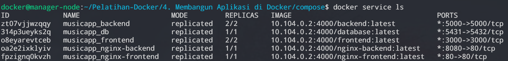

##### Task
Task pada Docker Swarm adalah unit terkecil yang digunakan untuk menjalankan container pada suatu service. Ketika sebuah service dijalankan pada Docker Swarm, Docker akan menugaskan sejumlah task untuk menjalankan container-container yang menyediakan layanan dari service tersebut.

Sebuah task terdiri dari sebuah image container dan konfigurasi yang diperlukan untuk menjalankan container tersebut, seperti port, volume, dan variabel lingkungan. Task juga dapat diatur sedemikian rupa sehingga hanya berjalan pada node-node tertentu dalam klaster, atau diatur sedemikian rupa sehingga hanya dijalankan pada node-node tertentu yang memenuhi kriteria tertentu, seperti memiliki spesifikasi hardware tertentu atau memiliki label-label khusus.

Dalam sebuah service, Docker Swarm secara otomatis akan menyebar task-task yang berjalan pada seluruh node dalam klaster, termasuk pada node manajer. Docker Swarm juga secara otomatis memantau kondisi dari task-task yang berjalan, dan jika terdapat task yang berhenti atau mengalami kegagalan, Docker Swarm akan otomatis memulai kembali task tersebut pada node lain dalam klaster.

Setiap task pada Docker Swarm memiliki task states. Task states adalah status dari sebuah task pada suatu service yang dijalankan pada worker node. Terdapat beberapa task states yang dapat terjadi, di antaranya adalah:

| Task State | Deskripsi |
| --- | ---- |
| `NEW` | Task baru telah dibuat, tetapi belum dimulai. |
| `PENDING` | Task sedang menunggu resource yang diperlukan untuk dimulai, seperti image container atau jaringan.
| `ASSIGNED` | Container untuk task telah dimulai, tetapi task belum dimulai.
| `ACCEPTED` | Task diterima oleh Worker node |
| `READY` | Worker node siap untuk memulai task |
| `PREPARING` |	Task sedang dalam proses persiapan, seperti download image atau mounting volume.
| `STARTING` | Task sedang dalam proses memulai. |
| `RUNNING` |	Task sedang berjalan. |
| `COMPLETE` |	Task telah selesai dijalankan. |
| `FAILED` |	Task gagal karena terjadi error. |
| `SHUTDOWN` | Docker mengirim sebuah permintaan untuk mematikan task |
| `REJECTED` |	Task ditolak oleh Worker node karena ada masalah dengan persyaratan task atau worker node. |
| `ORPHANED` |	Task tidak terikat ke service mana pun karena masalah pada worker node atau task itu sendiri. |
| `REMOVE` | Task dihapus oleh service meskipun belum selesai dijalankan |

Untuk dapat mengakses informasi tentang task dengan menggunakan perintah **`docker service ps <nama_service>`**. Perintah ini dapat untuk melihat informasi tentang task seperti ID, nama task, status, node yang menjalankan task, dan port yang digunakan oleh task tersebut.

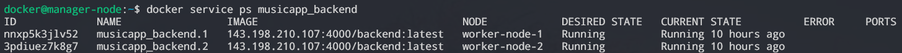

Task sangat berguna dalam Docker Swarm karena memungkinkan untuk menjalankan aplikasi pada berbagai node dalam klaster dengan mudah dan otomatis. Dengan menggunakan test dapat memastikan bahwa aplikasi yang dijalankan pada seluruh node dalam klaster memiliki konfigurasi yang serupa dan konsisten, sehingga memudahkan dalam manajemen dan pengembangan aplikasi.

##### Overlay Network
Masih ingatkah kalian dengan bahasan overlay network pada modul 3? Pada materi ini akan dibahas tentang overlay network pada Docker Swarm. Overlay network adalah salah satu jenis jaringan pada Docker Swarm yang memungkinkan komunikasi antara container yang dijalankan pada node-node yang berbeda dalam klaster Docker Swarm. Dengan menggunakan overlay network, container-container pada klaster dapat berkomunikasi satu sama lain tanpa perlu mengetahui lokasi fisik masing-masing container.


Overlay network pada Docker Swarm juga mendukung fitur load balancing, yaitu ketika sebuah request masuk ke sebuah service, Docker Swarm akan menyebar request tersebut ke salah satu task yang berjalan pada node yang paling sedikit beban nya. Hal ini membuat service yang dijalankan pada Docker Swarm dapat menangani request secara efisien dan terdistribusi pada setiap node dalam klaster.

Untuk membuat overlay network pada Docker Swarm, dapat menggunakan perintah **`docker network create`** dengan opsi **`--driver overlay`**, seperti contoh berikut:
```
docker network create --driver overlay <nama_network>
```
Setelah overlay network dibuat, dapat membuat service dengan menggunakan opsi **`-network`** untuk menentukan overlay network yang akan digunakan oleh service tersebut. Misalnya, untuk membuat sebuah service yang menggunakan overlay network dapat menggunakan perintah sebagai berikut:
```
docker service create --name <nama_service> --network <nama_network> <nama_image>
```
Dengan menggunakan overlay network pada Docker Swarm, tentunya mempermudah dalam membuat dan mengelola jaringan yang terdistribusi pada setiap node dalam klaster, sehingga memudahkan dalam membangun aplikasi yang terdiri dari beberapa service yang berjalan pada beberapa node dalam klaster.

### Membuat Aplikasi Microservice dengan Docker

Ada 2 opsi yang dilakukan dalam penerapan Docker Swarm.

 1. Menggunakan *cloud server* dengan jumlah instance yang sesuai.
 2. Menggunakan *virtual machine* dengan jumlah VM yang sesuai.

Untuk implementasi microservice dengan Docker kali ini akan menggunakan aplikasi yang terdapat dalam folder [berikut](compose/). Selain itu, untuk implementasi kali ini juga akan menggunakan Docker Swarm dengan jumlah 4 node (1 manager node dan 3 worker node). Secara umum, gambaran tentang Docker Swarm yang akan digunakan seperti berikut.

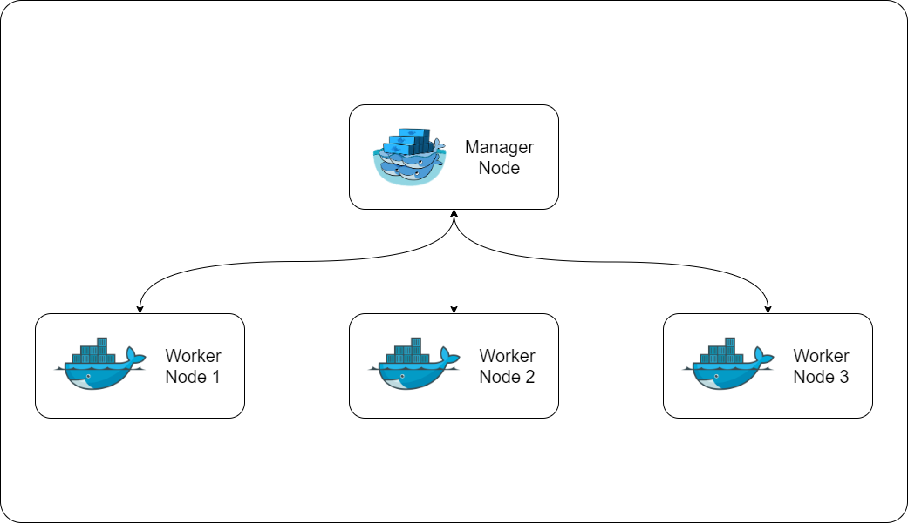

Untuk aplikasi yang akan menerapkan microservice terdiri dari 5 services, seperti gambar berikut.

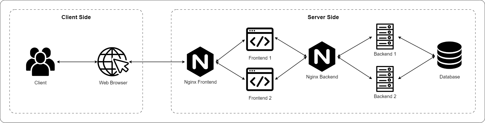

Pada gambar tersebut terdapat 5 services (**`nginx-frontend`**, **`frontend`**, **`nginx-backend`**, **`backend`**, dan **`database`**). **`nginx-frontend`** dan **`nginx-backend`** sama-sama bertugas sebagai web-server (penjelasan tentang masing-masing istilah dapat dilihat pada subbab [Pengantar Aplikasi Web](#pengantar-aplikasi-web)). Alur aplikasinya sebagai berikut:

1. Pada client side, client akan mengakses aplikasi menggunakan web browser masing-masing.
2. Web browser akan meneruskan permintaan client ke server, selanjutnya akan diurus oleh server (client sudah tidak perlu melakukan apa-apa lagi).
3. Pada server side, permintaan client akan diterima pertama kali oleh web server untuk **`frontend`** (**`nginx-frontend`**).
4. Permintaan client pada **`nginx-frontend`**, akan dilanjutkan untuk mendapat resource dari service **`frontend`**.
5. Jika halaman yang digunakan tidak memerlukan service dari **`backend`**, maka perjalanan permintaan client akan dikembalikan ke client. 
6. Jika memerlukan service **`backend`** (misal perlu data dari **`database`**, seperti login dan register), maka permintaan akan diteruskan ke web server untuk **`backend`** (**`nginx-backend`**).
7. Yang terakhir, **`backend`** akan berkomunikasi dengan **`database`** untuk memperoleh data dan akan dikembalikan hingga ke client.

#### 1. Inisiasi Docker Swarm

Untuk menginisiasi Docker Swarm, pada manager node jalankan perintah berikut.

```
docker swarm init --advertise-addr <ip-address-manager>
```

Setelah itu, manager node akan memberikan token beserta cara mengkoneksikan worker node pada Docker Swarm yang sudah dibuat.

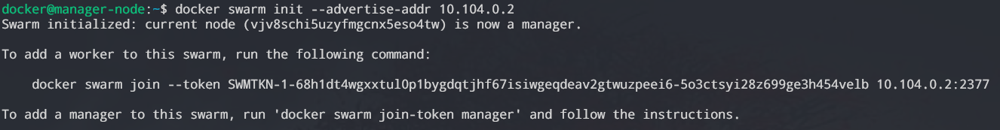

Kemudian masuk ke worker node dan jalankan perintah sesuai dengan yang ada diberikan oleh manager node. Lakukan pada semua worker node yang ingin dikoneksikan.

```
docker swarm join --token <swarm-token> <ip-address-manager>:<port-manager>
```

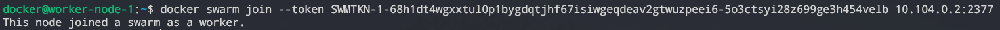

#### 2. Download Resource Aplikasi

Implementasi microservice kali ini menggunakan aplikasi yang tersedia pada folder [compose](compose) di repository ini dengan melakukan cloning 

> hanya perlu melakukan cloning pada manager node.

```
git clone https://github.com/arsitektur-jaringan-komputer/Pelatihan-Docker.git
```

Lalu masuk ke directory **`Pelatihan Docker/4. Membangun Aplikasi di Docker/compose/`** dan aplikasi siap untuk diimplementasikan.

#### 3. Konfigurasi File Nginx

> Jika tidak memiliki domain name atau tidak ingin mengkonfigurasikan domain name ke aplikasi, maka langkah ini bisa dilewati dan bisa langsung ke langkah [4. Konfigurasi File Environment](#4-konfigurasi-file-environment)

Pada folder **`nginx/`** terdapat 2 file, **`nginx-frontend.conf`** dan **`nginx-backend.conf`** yang perlu dikonfigurasi. Caranya dengan mengganti nilai **`server_name`** dari **`localhost`** ke domain name masing-masing

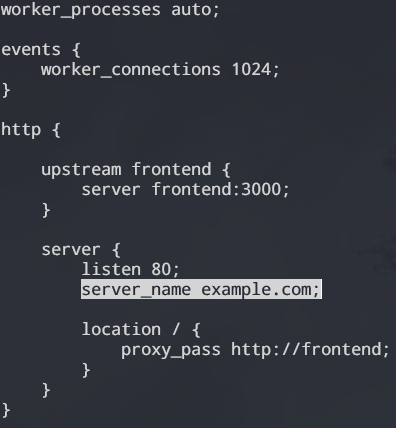

#### 4. Konfigurasi File Environment

> Jika dideploy pada manager node yang terdapat pada localhost, maka lewati langkah berikut dan bisa langsung ke langkah [5. Menyiapkan Docker Registry](#5-menyiapkan-docker-registry)

Pada folder **`frontend/`** terdapat file **`**.env`** yang perlu dikonfigurasi. Yang perlu dilakukan adalah mengubah nilai nya sesuai yang diinginkan.

```
NEXT_PUBLIC_APP_NAME="<nama-aplikasi>"
NEXT_PUBLIC_API_ENDPOINT="http://<alamat-nginx-backend>/" 
```

* **`NEXT_PUBLIC_APP_NAME`**: Nama dari aplikasi yang akan ditampilkan di Frontend
* **`NEXT_PUBLIC_API_ENDPOINT`**: Alamat dari web server untuk **`backend`**, dapat diisi dengan domain name atau IP public manager node

#### 5. Menyiapkan Docker Registry

Apa itu Docker Registry? Docker Registry adalah sebuah sistem untuk melakukan versioning, menyimpan, dan mendistribusikan Docker Images. Kita memerkulan Docker Registry untuk mendistribusikan image ke seluruh node yang ada pada Docker Swarm. Cara untuk menyiapkan Docker Registry sebenarnya cukup mudah. Yang perlu dilakukan adalah menjalankan image Docker Registry saja dengan perintah berikut pada manager node.

```
docker run -d -p 4000:5000 --restart=always --name registry registry:2
```

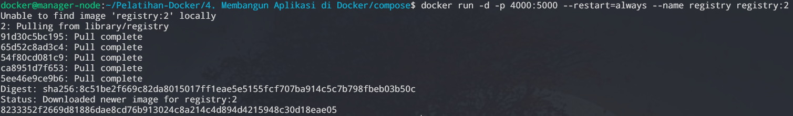

Setelah itu konfigurasi setiap node agar dapat mengakses registry pada jaringan http dengan cara menambahkan baris berikut pada file **`/etc/docker/daemon.json`** (jika file tidak ada, maka buat baru).

```json
{
  "insecure-registries": ["<ip-manager>:4000"]
}
```

#### 6. Menyiapkan NFS pada Manager Node

Masih ingatkah kalian dengan materi Network File System (NFS) pada [Modul 3](https://github.com/arsitektur-jaringan-komputer/Pelatihan-Docker/tree/master/3.%20Docker%20Service%20Lanjutan). Penggunaan NFS pada docker swarm sangatlah penting, khususnya agar ketika aplikasi dideploy ulang, isi dari database tidak hilang. Selain itu ketika memiliki lebih dari 1 sistem database, maka dapat dipastikan bahwa isinya sama.

Untuk menggunakan NFS, perlu menginstal **`nfs-kernel-server`** dengan menjalankan perintah berikut.

```
sudo apt install nfs-kernel-server
```

Setelah itu, buat directory untuk digunakan sebagai directory bersama. Sebagai contoh, **`sudo mkdir /etc/db-data`**. Kemudian edit file **`/etc/exports`** dan tambahkan baris berikut.

```
/etc/db-data *(rw,sync,no_subtree_check,no_root_squash)
```

Berikut adalah penjelasan dari baris diatas:

* **`/etc/db-data`**: Directory bersama yang akan dibagikan melalui NFS Server.
* **`*`**: Alamat IP yang dapat mengakses NFS Server
* **`rw`**: Memberikan akses Read-Write.
* **`sync`**: Perubahan yang dilakukan oleh Client (worker node) akan langsung ditulis di NFS Server.
* **`no_subtree_check`**: Menonaktifkan subtree checking.
* **`no_root_squash`**: Mengizinkan Client dengan root privileges untuk menulis file dengan root permission.

Selanjutnya, jalankan perintah **`sudo exportfs -ra`** untuk merestart **`exportfs`**.

#### 7. Melakukan Build dan Push Images ke Registry

Pada file **`docker-compose.yaml`**, **`<ip-manager>`** harus diganti menjadi alamat IP manager yang sebenarnya (ex. **`localhost`**). Selain itu, juga terdapat bagian **`build`** yang akan digunakan untuk mem-*build* images dengan **`Dockerfile`** yang telah disediakan pada masing-masing images. Yang perlu dilakukan untuk mem-*build* images adalah dengan menjalankan perintah berikut.

```
docker compose build
```

Setelah proses build selesai, semua images dapat dipastikan telah ter-*build* dengan menjalankan perintah berikut (total akan ada 5 images untuk service dan 1 image registry pada aplikasi ini).

```
docker images
```

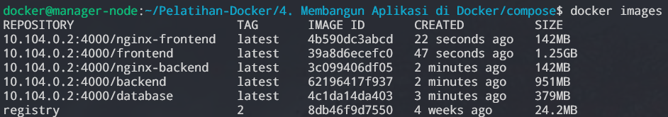

Setelah semua images dipastikan telah ter-*build*, selanjutnya adalah melakukan *push* images ke dalam Docker Registry dengan melakukan perintah berikut.

```
docker push <ip-manager>:4000/frontend
docker push <ip-manager>:4000/backend
docker push <ip-manager>:4000/database
docker push <ip-manager>:4000/nginx-frontend
docker push <ip-manager>:4000/nginx-backend
```

Untuk melihat images yang ada pada Docker Registry, dapat menjalankan perintah berikut.

```
curl -X GET http://<ip-manager>:4000/v2/_catalog | json_pp
```

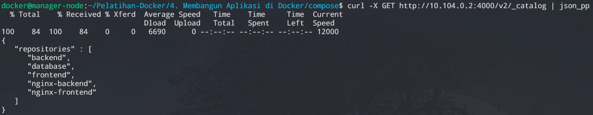

#### 8. Membuat Stack pada Docker Swarm

Apa itu Docker Stack? Docker Stack ada sekelompok machine yang tersebar di seluruh Docker Swarm serta berjalan pada Docker Daemon. Pada implementasi kali ini, akan dibuat Docker Stack bernama **`musicapp`** yang akan dideploy menggunakan konfigurasi pada **`docker-compose.yaml`**. Untuk membuat stack pada Docker, dapat menjalankan perintah berikut.

```
docker stack deploy -c <path-ke-docker-compose> <nama-stack>
```

#### 9. Cek Aplikasi

Untuk mengecek aplikasi telah berjalan dengan sesuai atau tidak, dapat menjalankan perintah **`docker stack services <nama-stack>`** lalu pastikan bahwa semua service telah ter-replika dengan sempurna (jumlah replika saat ini sama dengan jumlah replika yang telah disesuaikan pada **`docker-compose.yaml`**)

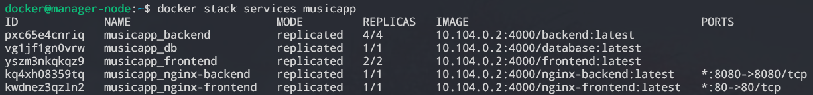

Selain itu, karena aplikasi ini berbasis web, aplikasi dapat dicek melalui web browser dengan memasukkan domain atau alamat IP manager.

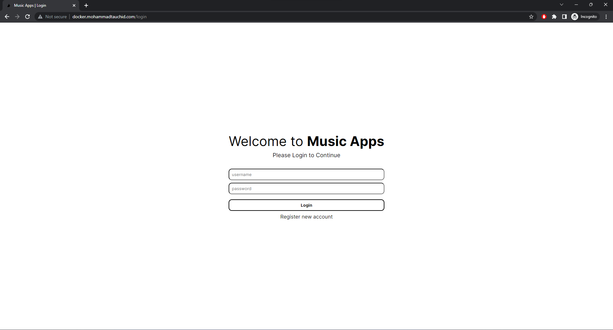

### Tambahan

#### Pengantar Aplikasi Web

1. Frontend

    Frontend adalah bagian dari sebuah aplikasi web yang berhubungan langsung dengan pengguna. Ini mencakup elemen-elemen visual dan interaktif yang dilihat dan digunakan oleh pengguna akhir. Bahasa pemrograman yang umum digunakan untuk mengembangkan frontend adalah HTML, CSS, dan JavaScript.

2. Backend

    Backend adalah bagian dari aplikasi web yang berada di sisi server. Ini melibatkan pemrosesan data, logika bisnis, dan interaksi dengan database. Beberapa bahasa pemrograman yang digunakan untuk mengembangkan backend antara lain Python, JavaScript (Node.js), dan Ruby.

3. Web Server

    Web server adalah perangkat lunak yang menjalankan aplikasi web dan mengirimkan konten ke pengguna melalui protokol HTTP. Web server bertindak sebagai penghubung antara klien (misalnya, browser web) dan backend aplikasi. Beberapa web server yang populer adalah Apache dan Nginx.

4. Database

    Database adalah tempat penyimpanan yang digunakan untuk menyimpan data yang diperlukan oleh aplikasi web. Database memungkinkan penyimpanan, pengambilan, dan pembaruan data dengan cara yang terstruktur. Beberapa jenis database yang umum digunakan adalah MySQL, PostgreSQL, MongoDB, dan SQLite.

## Sumber Referensi
- https://datacommcloud.co.id/microservices-adalah-perbedaan-monolithic-architecture/
- https://medium.com/pujanggateknologi/berkenalan-dengan-teknologi-mqtt-7e63cab9d00d
- https://aws.amazon.com/id/microservices/
- https://docs.docker.com/engine/swarm/how-swarm-mode-works/nodes/
- https://docs.docker.com/engine/swarm/how-swarm-mode-works/services/
- https://docs.docker.com/engine/swarm/how-swarm-mode-works/swarm-task-states/
- https://www.aquasec.com/cloud-native-academy/docker-container/docker-registry/
- https://www.ronaldjamesgroup.com/blog/docker-stack
