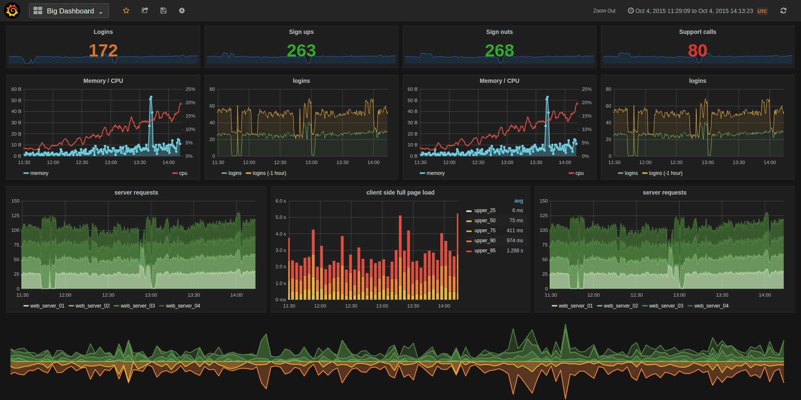

# **Pemantauan dan Keamanan di Docker**
- [**Glosarium**](#glosarium)
- [**Materi**](#materi)
  - [Docker Monitoring](#️docker-monitoring)
    - [Pengertian Docker Monitoring](#pengertian-docker-monitoring)
    - [Alat Pemantauan di Docker](#alat-pemantauan-di-docker)
      - [Docker Stats](#docker-stats)
      - [Prometheus](#prometheus)
      - [Grafana](#grafana)
      - [cAdvisor](#cadvisor)
      - [Sysdig](#sysdig)
    - [Jenis-Jenis Docker Monitoring](#jenis-jenis-docker-monitoring)
      - [Pemantauan Penggunaan CPU](#pemantauan-penggunaan-cpu)
      - [Pemantauan Penggunaan Memory](#pemantauan-penggunaan-memory)
      - [Pemantauan Penggunaan Jaringan](#pemantauan-penggunaan-jaringan)
      - [Pemantauan Filesystem](#pemantauan-filesystem)
      - [Pemantauan Log](#pemantauan-log)
    - [Implementasi Docker Monitoring](#implementasi-docker-monitoring)
  - [Docker Security](#docker-security)
    - [Pengertian Docker Security](#pengertian-docker-security)
    - [Ancaman Keamanan di Docker](#ancaman-keamanan-di-docker)
      - [Container Escape](#container-escape)
      - [Container Breakout](#container-breakout)
      - [Container Poisoning](#container-poisoning)
      - [Container Sprawl](#container-sprawl)
      - [Container Hijacking](#container-hijacking)
    - [Strategi Keamanan di Docker](#strategi-keamanan-di-docker)
      - [Pengaturan Kontrol Akses](#pengaturan-kontrol-akses)
      - [Konfigurasi Jaringan](#konfigurasi-jaringan)
      - [Manajemen Data dan Konfigurasi](#manajemen-data-dan-konfigurasi)
      - [Memperbarui Docker secara Teratur](#memperbarui-docker-secara-teratur)
- [**Sumber Referensi**](#sumber-referensi)

## Glosarium
## Materi
### Pengertian Docker Monitoring
Docker monitoring merujuk pada proses memantau dan menganalisis kinerja aplikasi yang dijalankan di dalam Docker Container. Docker monitoring melibatkan pengumpulan data dan metrik dari aplikasi yang dijalankan di dalam Docker Container, serta pemantauan sumber daya sistem yang digunakan oleh kontainer tersebut, seperti penggunaan CPU, memori, dan jaringan. Data ini kemudian dianalisis untuk memahami performa aplikasi dan untuk mengidentifikasi masalah atau kelemahan yang mempengaruhi performa.

Penggunaan alat monitoring Docker memungkinkan tim operasi untuk memantau kinerja aplikasi secara real-time, mendeteksi masalah dan mendiagnosa root cause, serta membuat keputusan berdasarkan data yang terkumpul. Dengan melakukan docker monitoring secara teratur, ini dapat memastikan bahwa sistem yang menggunakan teknologi Docker berjalan dengan lancar, memenuhi kebutuhan performa dan keamanan, serta menghindari terjadinya masalah yang dapat mempengaruhi bisnis Anda.

### Alat Pemantauan di Docker
Dalam praktiknya, docker monitoring dapat dilakukan dengan menggunakan berbagai alat dan layanan yang akan dijelaskan di bawah ini.

#### Docker Stats
Docker Stats adalah sebuah perintah dalam Docker CLI (Command Line Interface) yang digunakan untuk memantau penggunaan sumber daya sistem pada setiap kontainer yang berjalan di sebuah host Docker. Perintah Docker Stats memberikan informasi seperti penggunaan CPU, memori, I/O disk, dan jaringan pada kontainer Docker.

Docker Stats dapat digunakan untuk memantau kinerja aplikasi di dalam kontainer, mengidentifikasi masalah yang mempengaruhi performa, dan untuk menentukan waktu untuk mengubah konfigurasi sistem atau skala aplikasi. Informasi yang diberikan oleh Docker Stats juga dapat digunakan untuk menganalisis dan memperbaiki masalah kinerja pada aplikasi dan memastikan penggunaan sumber daya yang optimal pada host Docker.

Perintah Docker Stats dapat dijalankan dengan menjalankan perintah `docker stats` di terminal. Perintah ini akan menampilkan daftar semua kontainer yang sedang berjalan di host Docker, beserta informasi penggunaan sumber daya sistem yang terkait. Selain itu, Docker Stats juga dapat diberikan opsi seperti `--no-stream` untuk menampilkan informasi dalam format yang lebih ringkas, atau opsi `--format` untuk menentukan format output yang dihasilkan.

#### Prometheus
Prometheus adalah salah satu alat open-source yang digunakan dalam Docker monitoring untuk memantau dan mengumpulkan metrik pada lingkungan Docker. Prometheus menyediakan platform monitoring dan alerting yang kuat dengan model data fleksibel dan query language yang ekspresif. Dalam lingkungan Docker, Prometheus dapat digunakan untuk memantau kinerja aplikasi dan infrastruktur yang berjalan dalam kontainer Docker.

Prometheus dapat bekerja dengan berbagai jenis aplikasi dan layanan yang dijalankan di dalam kontainer Docker, dan dapat mengumpulkan data metrik dari berbagai sumber, termasuk layanan yang dijalankan di dalam kontainer, host Docker, atau bahkan lingkungan yang lebih luas. Metrik yang dikumpulkan oleh Prometheus dapat digunakan untuk memantau performa aplikasi secara real-time, menganalisis kecenderungan kinerja dari waktu ke waktu, dan mengidentifikasi masalah yang mempengaruhi performa.

Prometheus juga dapat digunakan untuk menghasilkan alert ketika metrik tertentu mencapai ambang batas tertentu, atau ketika terjadi perubahan yang signifikan dalam kinerja aplikasi. Alert ini dapat disampaikan melalui berbagai saluran, termasuk email, Slack, atau platform alerting lainnya.

Untuk mengintegrasikan Prometheus dalam lingkungan Docker, dapat digunakan beberapa tools seperti Docker Compose, Docker Swarm, atau Kubernetes. Selain itu, Prometheus juga menyediakan library client yang dapat digunakan dalam aplikasi yang dijalankan di dalam kontainer Docker, sehingga memungkinkan aplikasi untuk langsung mengirimkan metrik ke Prometheus.

#### Grafana


Grafana adalah platform open-source untuk memvisualisasikan dan memantau data dari berbagai sumber, termasuk lingkungan Docker. Dalam lingkungan Docker monitoring, Grafana digunakan untuk memvisualisasikan data metrik yang dikumpulkan oleh alat monitoring seperti Prometheus.

Grafana menyediakan berbagai jenis visualisasi, termasuk grafik garis, grafik batang, heatmap, dan tabel. Visualisasi ini dapat digunakan untuk memperlihatkan tren kinerja aplikasi dari waktu ke waktu, menganalisis keterkaitan antara berbagai metrik, dan mengidentifikasi masalah yang mempengaruhi performa.

Selain itu, Grafana juga menyediakan kemampuan untuk membuat dashboard, yang memungkinkan untuk memperlihatkan informasi metrik yang penting dalam satu tampilan yang terpadu. Dashboard dapat disesuaikan dan dikonfigurasi dengan berbagai jenis panel visualisasi, dan dapat berisi informasi metrik dari berbagai sumber.

Dalam lingkungan Docker monitoring, Grafana biasanya diintegrasikan dengan alat monitoring seperti Prometheus sehingga dapat memanfaatkan data metrik yang telah dikumpulkan. Grafana dapat diintegrasikan dengan mudah dengan platform seperti Docker Compose, Docker Swarm, atau Kubernetes, dan dapat digunakan bersama dengan alat monitoring lainnya seperti Alertmanager untuk menghasilkan alert ketika terjadi perubahan yang signifikan dalam kinerja aplikasi.

Grafana juga menyediakan banyak plugin dan integrasi dengan berbagai layanan dan platform yang berbeda, sehingga memungkinkan untuk mengintegrasikan dengan berbagai sumber data lainnya, termasuk basis data, layanan cloud, dan alat monitoring lainnya.

#### cAdvisor
cAdvisor (Container Advisor) adalah alat open-source yang dikembangkan oleh Google yang digunakan dalam Docker monitoring untuk memantau dan mengumpulkan metrik performa pada setiap kontainer Docker yang berjalan di dalam sebuah host. cAdvisor dirancang khusus untuk mengumpulkan data metrik seperti penggunaan CPU, memori, jaringan, dan I/O disk pada setiap kontainer Docker dan mengirimkannya ke alat monitoring seperti Prometheus atau Grafana untuk dianalisis.

cAdvisor berjalan sebagai sebuah layanan di dalam host Docker, dan secara otomatis memantau setiap kontainer Docker yang berjalan di host tersebut. Alat ini juga dapat mengumpulkan metrik dari host Docker sendiri, seperti penggunaan CPU dan memori, yang memungkinkan pengguna untuk memperoleh gambaran lengkap tentang performa seluruh lingkungan Docker.

Selain memantau performa, cAdvisor juga dapat memberikan informasi mengenai konfigurasi dan pengaturan pada setiap kontainer Docker, seperti port yang terbuka, volume yang digunakan, dan image yang digunakan untuk menjalankan kontainer. Informasi ini sangat berguna untuk membantu dalam mengelola lingkungan Docker, terutama ketika diperlukan untuk melakukan analisis masalah yang terkait dengan kinerja dan konfigurasi aplikasi.

cAdvisor juga mendukung beberapa fitur seperti HTTP API untuk mengambil data metrik dari kontainer dan host Docker secara programatik, dukungan untuk berbagai jenis sistem file yang berbeda, serta kemampuan untuk membatasi penggunaan sumber daya sistem pada kontainer Docker.

Dalam lingkungan Docker monitoring, cAdvisor sering digunakan bersama dengan alat monitoring lainnya seperti Prometheus dan Grafana untuk memantau performa aplikasi dan infrastruktur secara efektif. Alat ini juga dapat digunakan untuk membuat tindakan pemulihan otomatis ketika terjadi masalah pada performa aplikasi.

#### Sysdig
Sysdig adalah alat open-source yang digunakan dalam Docker monitoring untuk memantau sistem dan aplikasi pada kontainer Docker. Alat ini berjalan pada level kernel di host, sehingga memungkinkan pengguna untuk memantau seluruh sistem operasi yang berjalan di dalam lingkungan Docker, termasuk aplikasi dan layanan yang dijalankan di setiap kontainer Docker.

Sysdig dapat memantau banyak metrik yang berbeda, seperti penggunaan CPU dan memori, aktivitas I/O disk dan jaringan, serta aktivitas sistem seperti penggunaan sistem file dan jaringan. Selain itu, Sysdig juga dapat digunakan untuk memantau keamanan dan kepatuhan Docker, seperti pengawasan akses user pada setiap kontainer Docker dan deteksi aktivitas yang mencurigakan.

Sysdig dapat digunakan bersama dengan alat monitoring seperti Prometheus dan Grafana untuk memantau dan menganalisis data metrik performa dan keamanan pada lingkungan Docker secara efektif. Selain itu, Sysdig juga dapat menghasilkan laporan dan alert ketika terjadi masalah atau aktivitas mencurigakan pada lingkungan Docker.

Keunggulan Sysdig di antara alat monitoring Docker lainnya adalah kemampuannya untuk memantau aktivitas pada level kernel dan aplikasi di setiap kontainer Docker, sehingga memungkinkan pengguna untuk memperoleh gambaran yang lebih lengkap tentang performa dan keamanan seluruh lingkungan Docker. Selain itu, Sysdig juga dapat digunakan pada berbagai sistem operasi, termasuk Linux, Windows, dan Mac OS, sehingga dapat diimplementasikan pada lingkungan Docker yang beragam dan kompleks.

### Jenis-Jenis Docker Monitoring
#### Pemantauan Penggunaan CPU
Pemantauan Penggunaan CPU adalah proses memantau seberapa banyak sumber daya CPU yang digunakan oleh sistem atau aplikasi pada suatu waktu tertentu. CPU (Central Processing Unit) adalah salah satu komponen penting dalam sebuah sistem komputer yang bertugas untuk mengeksekusi instruksi yang diberikan oleh aplikasi atau sistem operasi.

Dalam konteks teknologi informasi, Pemantauan Penggunaan CPU biasanya digunakan untuk memantau kinerja suatu sistem atau aplikasi, dan dapat membantu mengidentifikasi masalah kinerja atau bottleneck yang terjadi pada sistem tersebut. Pemantauan ini dapat dilakukan pada level hardware, seperti server atau komputer, atau pada level software, seperti aplikasi atau service yang berjalan pada sistem tersebut.

Pemantauan Penggunaan CPU dapat dilakukan dengan menggunakan tools atau software monitoring yang khusus dirancang untuk tujuan tersebut. Beberapa tools monitoring populer untuk pemantauan penggunaan CPU meliputi Grafana, Nagios, Zabbix, dan Prometheus.

Dalam praktiknya, pemantauan penggunaan CPU dilakukan dengan memantau beberapa parameter kunci, seperti persentase penggunaan CPU, load average, dan CPU utilization. Dengan memantau parameter-parameter ini secara teratur, kita dapat mengidentifikasi kapan terjadi puncak penggunaan CPU, kapan terjadi bottleneck, dan kapan diperlukan untuk menambah kapasitas CPU untuk menjaga kinerja sistem atau aplikasi tetap optimal.

#### Pemantauan Penggunaan Memory
Memantau penggunaan memory pada Docker sangat penting karena memory adalah sumber daya yang sangat kritis dalam lingkungan Docker. Ketika container berjalan, itu harus mengalokasikan sejumlah memory untuk menjalankan aplikasi di dalamnya. Jika container kekurangan memory, performa aplikasi dapat menurun, dan dalam kasus ekstrim, dapat menyebabkan kegagalan aplikasi atau bahkan crash.

Docker menyediakan alat untuk memantau penggunaan memory pada container dengan menggunakan Docker stats command. Command ini dapat memberikan informasi terkini mengenai penggunaan CPU, memory, disk I/O, dan jaringan dari container Docker yang sedang berjalan.

Selain itu, terdapat juga tool pihak ketiga yang dapat digunakan untuk memantau penggunaan memory pada Docker, seperti Prometheus dan Grafana. Kedua tool ini dapat digunakan untuk memantau berbagai aspek dari performa aplikasi Docker, termasuk penggunaan memory.

Dalam pemantauan penggunaan memory pada Docker, penting untuk memantau penggunaan memory pada tingkat host dan tingkat container. Memantau penggunaan memory pada tingkat host dapat membantu menentukan seberapa banyak memory yang tersedia untuk menjalankan container, sementara memantau penggunaan memory pada tingkat container dapat membantu menentukan seberapa banyak memory yang digunakan oleh aplikasi di dalam container.


#### Pemantauan Penggunaan Jaringan
Dalam konteks Docker Monitoring, pemantauan penggunaan jaringan pada container Docker sangat penting untuk memastikan aplikasi berjalan dengan lancar dan aman. Penggunaan jaringan pada Docker dapat mempengaruhi performa dan kinerja aplikasi, dan memastikan keamanan jaringan dalam lingkungan Docker juga menjadi hal yang sangat penting.

Untuk memantau penggunaan jaringan pada container Docker, Docker menyediakan beberapa alat bawaan, seperti Docker Stats Command. Command ini dapat memberikan informasi terkini mengenai penggunaan jaringan dari container Docker yang sedang berjalan. Informasi tersebut dapat mencakup jumlah paket yang diterima dan dikirim, bandwidth, dan jumlah kesalahan yang terjadi.

Selain itu, terdapat juga tool pihak ketiga yang dapat digunakan untuk memantau penggunaan jaringan pada Docker, seperti Prometheus dan Grafana. Kedua tool ini dapat digunakan untuk memantau berbagai aspek dari performa aplikasi Docker, termasuk penggunaan jaringan.

Dalam pemantauan penggunaan jaringan pada Docker, penting untuk memantau koneksi masuk dan keluar dari container. Hal ini dapat membantu memastikan bahwa aplikasi berinteraksi dengan jaringan secara efektif dan aman. Selain itu, perlu juga memantau lalu lintas jaringan dan menganalisis data lalu lintas tersebut untuk mendeteksi adanya serangan atau masalah jaringan lainnya.

Selain itu, dapat pula melakukan pengaturan jaringan dengan membatasi akses pada container Docker menggunakan Docker Network. Docker Network menyediakan kontrol akses jaringan yang lebih baik dan memungkinkan pengaturan jaringan yang lebih fleksibel, seperti memisahkan lalu lintas jaringan antara beberapa container atau membatasi koneksi jaringan ke host.

#### Pemantauan Filesystem
Pemantauan Filesystem pada Docker Monitoring merujuk pada pemantauan sistem file yang digunakan oleh container Docker. Sistem file pada Docker adalah bagian penting dari container, karena berisi semua file dan data yang diperlukan untuk menjalankan aplikasi.

Dalam pemantauan Filesystem pada Docker, perlu untuk memantau penggunaan ruang disk pada container Docker untuk memastikan bahwa tidak ada kehabisan ruang disk yang dapat menyebabkan aplikasi crash atau kegagalan lainnya. Docker Stats Command juga dapat digunakan untuk memantau penggunaan ruang disk pada container Docker.

Selain itu, perlu juga memantau perubahan pada file sistem, seperti perubahan pada file konfigurasi atau data aplikasi. Docker menyediakan fitur log dan audit untuk memantau perubahan ini.

Dalam beberapa kasus, memantau file sistem dapat membantu mendeteksi serangan keamanan pada container Docker. Sebagai contoh, memantau perubahan pada file konfigurasi atau sistem file pada container Docker dapat membantu mendeteksi adanya perubahan yang tidak sah dan mengambil tindakan yang diperlukan.

Untuk memantau file sistem pada container Docker, terdapat juga tool pihak ketiga yang dapat digunakan, seperti Sysdig dan Fluentd. Kedua tool ini dapat digunakan untuk memantau berbagai aspek dari sistem file pada container Docker, termasuk penggunaan ruang disk dan perubahan pada file sistem.

Dalam pemantauan Filesystem pada Docker, penting juga untuk melakukan backup secara teratur dan mengatur mekanisme pengelolaan data agar data tidak hilang atau rusak pada saat pemindahan container ke lingkungan lain. Hal ini dapat dilakukan dengan melakukan backup data secara teratur dan mengelola data menggunakan layanan penyimpanan data yang aman dan andal.

#### Pemantauan Log
Pemantauan Log pada Docker Monitoring merujuk pada pemantauan catatan log yang dihasilkan oleh container Docker. Log pada Docker sangat penting untuk memastikan bahwa aplikasi berjalan dengan lancar dan aman, dan untuk membantu mengidentifikasi dan memecahkan masalah yang mungkin terjadi pada aplikasi.

Dalam pemantauan log pada Docker, perlu untuk memastikan bahwa log yang dihasilkan oleh container Docker dikumpulkan dan disimpan dengan baik. Docker menyediakan fitur logging bawaan yang dapat digunakan untuk memantau dan mengumpulkan log dari container Docker.

Selain itu, terdapat juga tool pihak ketiga seperti Fluentd dan ELK Stack yang dapat digunakan untuk memantau log pada Docker dengan lebih efektif. Kedua tool ini dapat mengumpulkan log dari beberapa container Docker secara bersamaan dan melakukan analisis log yang lebih kompleks.

Dalam pemantauan log pada Docker, penting juga untuk memastikan bahwa log disimpan dengan aman dan dapat diakses oleh orang yang berwenang. Hal ini dapat dilakukan dengan menggunakan sistem otentikasi dan otorisasi yang tepat untuk mengontrol akses ke log.

Pemantauan log pada Docker juga dapat membantu dalam mendeteksi serangan keamanan pada container Docker. Dalam beberapa kasus, penyerang dapat meninggalkan jejak pada log yang dapat digunakan untuk mendeteksi adanya serangan atau kebocoran data.

Selain itu, pemantauan log pada Docker juga dapat membantu dalam pemecahan masalah pada aplikasi. Dengan memantau log yang dihasilkan oleh container Docker, dapat membantu mengidentifikasi masalah pada aplikasi dan mengambil tindakan yang diperlukan untuk memperbaiki masalah tersebut.

Dalam kesimpulannya, pemantauan log pada Docker Monitoring sangat penting untuk memastikan bahwa aplikasi berjalan dengan lancar dan aman, dan untuk membantu mengidentifikasi dan memecahkan masalah yang mungkin terjadi pada aplikasi.

# Implementasi Docker Monitoring

Pada bagian ini kita akan mencoba melakukan implementasi monitoring pada arsitektur microservice Docker Swarm menggunakan beberapa tools yaitu cAdvisor, node-exporter, prometheus, dan grafana.

Sub-bagian ini akan dilakukan dengan asumsi bahwa kita telah melakukan Swarm Init dan Join pada modul 4

Berikut diagram implementasi


1. Buat Compose file

    Agar memudahkan kita untuk menginstal tools yang diperlukan untuk melakukan monitoring, kita akan membuat file docker-compose.yml pada folder monitoring. File tersebut akan mendifinisikan service prometheus, node-exporter, cAdvisor, dan grafana kita, serta sebuah monitoring bridge network

    Buat sebuah file docker-compose.yml pada folder monitoring dan paste kode berikut :

    ```yaml
    version: '3.2'
    services:
      ######################################
      # Prometheus
      # - runs on manager ndoe
      ######################################
      prometheus:
        image: prom/prometheus:latest
        container_name: prometheus
        ports:
        - 9090:9090
        command:
        - --config.file=/etc/prometheus/prometheus.yml
        volumes:
        - ./prometheus.yml:/etc/prometheus/prometheus.yml:ro
        deploy:
          labels:
            com.docker.stack.namespace: monitoring
          placement:
            constraints:
            - node.role == manager

      ######################################
      # Prometheus Node Exporter
      # for each node separate service need to be added
      ######################################
      node-exporter-manager:
        image: prom/node-exporter:latest
        container_name: node-exporter-manager
        volumes:
          - /proc:/host/proc:ro
          - /sys:/host/sys:ro
          - /:/rootfs:ro
        command:
          - '--path.procfs=/host/proc'
          - '--path.rootfs=/rootfs'
          - '--path.sysfs=/host/sys'
          - '--collector.filesystem.mount-points-exclude=^/(sys|proc|dev|host|etc)($$|/)'
        deploy:
          placement:
            constraints:
            # hostname of the manager node
            - node.hostname == manager-node

      node-exporter-worker-1:
        image: prom/node-exporter:latest
        container_name: node-exporter-worker-1
        volumes:
          - /proc:/host/proc:ro
          - /sys:/host/sys:ro
          - /:/rootfs:ro
        command:
          - '--path.procfs=/host/proc'
          - '--path.rootfs=/rootfs'
          - '--path.sysfs=/host/sys'
          - '--collector.filesystem.mount-points-exclude=^/(sys|proc|dev|host|etc)($$|/)'
        deploy:
          placement:
            constraints:
            # hostname of the worker node
            - node.hostname == worker-node-1
      node-exporter-worker-2:
        image: prom/node-exporter:latest
        container_name: node-exporter-worker-2
        volumes:
          - /proc:/host/proc:ro
          - /sys:/host/sys:ro
          - /:/rootfs:ro
        command:
          - '--path.procfs=/host/proc'
          - '--path.rootfs=/rootfs'
          - '--path.sysfs=/host/sys'
          - '--collector.filesystem.mount-points-exclude=^/(sys|proc|dev|host|etc)($$|/)'
        deploy:
          placement:
            constraints:
            # hostname of the worker node
            - node.hostname == worker-node-2

      node-exporter-worker-3:
        image: prom/node-exporter:latest
        container_name: node-exporter-worker-3
        volumes:
          - /proc:/host/proc:ro
          - /sys:/host/sys:ro
          - /:/rootfs:ro
        command:
          - '--path.procfs=/host/proc'
          - '--path.rootfs=/rootfs'
          - '--path.sysfs=/host/sys'
          - '--collector.filesystem.mount-points-exclude=^/(sys|proc|dev|host|etc)($$|/)'
        deploy:
          placement:
            constraints:
            # hostname of the worker node
            - node.hostname == worker-node-3

      ######################################
      # Cadvisor
      # - runs on every node
      ######################################
      cadvisor-manager:
        image: gcr.io/cadvisor/cadvisor:latest
        container_name: cadvisor-manager
        volumes:
        - /:/rootfs:ro
        - /var/run:/var/run:rw
        - /sys:/sys:ro
        - /var/lib/docker/:/var/lib/docker:ro
        deploy:
          placement:
            constraints:
            # hostname of the manager node
            - node.hostname == manager-node

      cadvisor-worker-1:
        image: gcr.io/cadvisor/cadvisor:latest
        container_name: cadvisor-worker-1
        volumes:
        - /:/rootfs:ro
        - /var/run:/var/run:rw
        - /sys:/sys:ro
        - /var/lib/docker/:/var/lib/docker:ro
        deploy:
          placement:
            constraints:
            # hostname of the worker node
            - node.hostname == worker-node-1

      cadvisor-worker-2:
        image: gcr.io/cadvisor/cadvisor:latest
        container_name: cadvisor-worker-2
        volumes:
        - /:/rootfs:ro
        - /var/run:/var/run:rw
        - /sys:/sys:ro
        - /var/lib/docker/:/var/lib/docker:ro
        deploy:
          placement:
            constraints:
            # hostname of the worker node
            - node.hostname == worker-node-2

      cadvisor-worker-3:
        image: gcr.io/cadvisor/cadvisor:latest
        container_name: cadvisor-worker-3
        volumes:
        - /:/rootfs:ro
        - /var/run:/var/run:rw
        - /sys:/sys:ro
        - /var/lib/docker/:/var/lib/docker:ro
        deploy:
          placement:
            constraints:
            # hostname of the worker node
            - node.hostname == worker-node-3

      ######################################
      # Grafana
      # - runs on manager node
      ######################################
      grafana:
        image: grafana/grafana:latest
        user: "$UID:$GID"
        ports:
        - 3100:3000
        volumes:
        - ./grafana_storage:/var/lib/grafana
        deploy:
          placement:
            constraints:
            - node.role == manager
    ```


2. Buat file konfigurasi Prometheus

    Pada step ini, kita akan membuat file konfigurasi Prometheus untuk melakukan scraping metrics node-exporter dan cAdvisor dan metrics tersebut akan divisualisasikan melalui grafana. Kita akan melakukan konfigurasi bagian berikut :

    - global :  ini ada konfigurasi default Global. Pada contoh, kita set scrape_interval untuk scraping metrics dari configured jobs sebesar 15 detik.
    - scrape_configs : mendefinisikan jobs yang akan di scraping metrics nya.

    Buat sebuah file konfigurasi Prometheus prometheus.yml pada folder yang sama dengan file docker-compose.yml sebelumnya dan paste kode berikut :

    ```yaml
    global:
      scrape_interval: 15s

    scrape_configs:
      - job_name: 'prometheus'
        static_configs:
        - targets: ['prometheus:9090']
          labels:
            alias: 'prometheus'
      - job_name: 'node-exporter'
        static_configs:
        - targets: ['node-exporter-manager:9100', 'node-exporter-worker-1:9100', 'node-exporter-worker-2:9100', 'node-exporter-worker-3:9100']
          labels:
            alias: 'node-exporter'
      - job_name: 'cadvisor'
        static_configs:
        - targets: ['cadvisor-manager:8080', 'cadvisor-worker-1:8080', 'cadvisor-worker-2:8080', 'cadvisor-worker-3:8080']
          labels:
            alias: 'cadvisor'
    ```

    - Pada file diatas, kita membuat 3 jobs dengan masing-masing jobs memiliki target yaitu service yang telah didefinisikan pada file docker-compose.yml
3. Melakukan deploy service monitoring

    Setelah melakukan konfigurasi pada file docker-compose.yml dan prometheus.yml, kita akan menggunakan fitur pada Docker Swarm yaitu docker stack untuk mendeploy service yang telah didefinisikan ke semua node pada cluster.

    ```bash
    docker stack deploy -c <path-to-file-compose> <stack-name>
    ```

    Dengan command tersebut, kita akan menggunakan file docker-compose.yml untuk mendeploy service yang telah didefinisikan sebagai sebuah stack.

    

4. Cek semua service

    Setelah melakukan deploy, kita akan cek setiap service apakah berhasil dideploy pada node yang telah ditentukan dengan perintah berikut:

    ```bash
    docker service ls
    ```

    

    Terlihat bahwa pada kolom REPLICAS, semua service telah berhasil dideploy

5. Cek target Prometheus

    Setelah memastikan semua service telah berhasil dideploy, kita akan melakukan cek status pada target prometheus yaitu node-exporter dan cAdvisor.

    Buka browser, lalu akses aplikasi Prometheus pada url berikut:

    ```bash
    http://<public-ip-manager-node>:9090
    ```

    setelah aplikasi Prometheus terbuka, pada tab status, pilih targets.

    

    Pada contoh berikut, semua target prometheus memiliki State (UP) yang artinya Prometheus bisa melakukan query metrics pada target node-exporter dan cAdvisor.

6. Menambah data source pada Grafana

    Pada step berikut, pada grafana kita akan menambah Prometheus sebagai data source. Akses aplikasi grafana pada port 3100 dan buka tab Connection untuk menambah data source

    

    Pada URL section, kita mengisinya dengan URL internal prometheus. Lalu klik save&test untuk memastikan bahwa data source dapat digunakan

7. Membuat Dashboard

    Di grafana kita bisa membuat berbagai macam dashboard sesuai kebutuhan kita. Atau melakukan import dashboard dari grafana community. Pada step ini kita akan membuat 2 dashboard masing-masing untuk monitoring container (cAdvisor) dan monitoring node (node-exporter).

    - Buka web grafana dashboard, lalu search dashbaord sesuai kebutuhan.
    - Copy ID dashboard, kemudian buka tab dashboard dan load Dashboard Grafana menggunakan ID sebelumnya.

        

    - PIlih data source sebelumnya yang telah ditambah pada section Prometheus.

        

    - Dashboard monitoring node (node-exporter) sudah tersedia.

        

    - Berikut dashboard monitoring container (cAdvisor) dengan mengimport dashbord Docker.

        

## Tambahan
Untuk memvisualisasi container yang berjalan pada setiap node Swarm, kita dapat menggunakan service Docker Swarm Visualizer

```bash
$ docker service create \
  --name=viz \
  --publish=8100:8080/tcp \
  --constraint=node.role==manager \
  --mount=type=bind,src=/var/run/docker.sock,dst=/var/run/docker.sock \
  dockersamples/visualizer
```
Kemudin kita dapat mengakses port 8081 dengan IP public manager node untuk mengakses visualizer tersebut
  
# Docker Security
## Pengertian Docker Security
Docker Security adalah upaya untuk menjaga keamanan pada kontainer Docker. ontainer Docker adalah unit yang terisolasi dari sistem operasi host, sehingga memberikan keuntungan seperti portabilitas, skalabilitas, dan efisiensi. Namun, karena kontainer Docker memiliki akses ke sistem operasi host, maka diperlukan upaya untuk menjaga keamanan pada kontainer tersebut.

## Ancaman Keamanan di Docker

### Container Escape

Container Escape atau disebut juga Container Breakout merupakan resiko kemanan pada Docker dimana “malicious user” dapat memanfaatkan kerentanan aplikasi dalam kontainer untuk menembus batas isolasi sehingga mendapatkan akses ke sumber daya sistem host.

Attacker yang memiliki akses ke kontainer dapat mengeksploitasi berbagai kerentanan yang dapat menyebabkan Container Escape :

- Memanfaatkan program apapun dalam privileged mode untuk melakukan operasi berbahaya pada host
- Melakukan mounting filesystem host dan menjalankan container dengan parameter bind untuk mengirim payload kepada mereka.
- Memanfaatkan kerentanan seperti bug kernel, konfigurasi yang buruk, atau kontrol akses yang lemah .
- Meningkatkan privilege host untuk mengakses kontainer yang lain.

### Container Poisoning

Container poisoning adalah serangan keamanan yang dilakukan dengan memasukkan kode berbahaya atau komponen yang tidak diinginkan ke dalam sebuah container yang dijalankan pada sistem. Dengan cara ini, penyerang dapat mengambil alih kontrol dari container tersebut atau bahkan mengambil alih sistem host tempat container berjalan.

Beberapa contoh teknik yang digunakan dalam container poisoning adalah memodifikasi atau menambahkan komponen saat membangun image container, menanamkan backdoor pada aplikasi yang dijalankan dalam container, atau mengubah konfigurasi container secara tidak sah.

### Container Sprawl

Container sprawl adalah fenomena ketika sebuah organisasi memiliki terlalu banyak kontainer yang berjalan di dalam infrastruktur mereka, yang dapat menyebabkan masalah seperti kurangnya transparansi dan visibilitas pada lingkungan kontainer, kesulitan dalam manajemen dan pemantauan kontainer, peningkatan biaya operasional, dan penurunan kinerja sistem secara keseluruhan. Hal ini dapat terjadi ketika organisasi mengadopsi teknologi kontainerisasi dan orkestrasi (seperti Kubernetes) tanpa strategi dan perencanaan yang matang, atau ketika *system administrator* tidak melakukan tindakan pemeliharaan atau penghapusan kontainer yang tidak terpakai.

### Container Hijacking

Container hijacking adalah serangan keamanan di mana seorang penyerang mencoba untuk mendapatkan akses yang tidak sah ke dalam suatu lingkungan container dengan tujuan mencuri data atau merusak lingkungan tersebut. Serangan ini dapat memanfaatkan kerentanan dalam software container, seperti Docker, atau memanfaatkan akses yang tidak terlindungi pada aplikasi container yang berjalan di dalamnya.

Beberapa teknik yang dapat digunakan oleh penyerang untuk melakukan container hijacking antara lain:

- Container Escape: Penyerang mencoba untuk melompat dari container yang terisolasi ke lingkungan host yang lebih luas.
- Privilege Escalation: Penyerang mencoba untuk mendapatkan akses root pada container untuk mendapatkan kontrol penuh atas environment tersebut.
- Malware Injection: Penyerang memasukkan malware ke dalam container untuk mencuri data atau merusak lingkungan.

## Strategi Keamanan di Docker

## Pengaturan Kontrol Akses

### #1 Set non-root user

Melakukan konfigurasi pada container untuk menggunakan unprivileged user adalah cara terbaik untuk mencegah serangan privilege escalation. Beberapa cara yang dapat dilakukan adalah

1. Saat runtime, gunakan flag -u pada command docker run :

    ```bash
    docker run -u 4000 alpine
    ```

2. Saat build time. Tambahkan user baru pada Dockerfile

    ```docker
    FROM alpine
    RUN groupadd -r myuser && useradd -r -g myuser myuser
    <HERE DO WHAT YOU HAVE TO DO AS A ROOT USER LIKE INSTALLING PACKAGES ETC.>
    USER myuser
    ```

3. Enable user namespace support(-userns-remap=default) pada Docker daemon.

    ```docker
    dockerd --userns-remap="testuser:testuser"
    ```


### #2 Batasi kapabilitas

[Linux kernel capabilities](https://man7.org/linux/man-pages/man7/capabilities.7.html) adalah kumpulan privileges yang dapat digunakan oleh user yang memiliki privilege. Secara default, Docker berjalan hanya dengan sebagian dari capabilities. Dengan membatasi capabilities, kita dapat mencegah kerentanan yang mungkin terjadi pada container.

Kita dapat mengubah dan melakukan drop beberapa capabilities menggunakan flag ( —can-drop) untuk lebih meningkatkan keamanan container, atau menambah beberapa capabilities (—cap-add) jika diperlukan. Pehatikan untuk tidak menjalankan container dengan flag (—privileged) karena hal ini akan menambah SEMUA linux kernel capabilities pada container.

Cara setup capabilities yang paling aman dengan melakukan drop semua capabilities (—can-drop-all) kemudian tambahkan hanya yang diperlukan.

```docker
docker run --cap-drop all --cap-add CHOWN alpine
```

### #3 **Add –no-new-privileges flag**

Saat akan menjalankan docker images, selalu gunakan flag -security-opt=no-new-privileges untuk mencegah privilege escalation yang menggunakan binary setuid dan setgid

## Konfigurasi Jaringan

Docker container sangat bergantung kepada Docker API dan jaringan untuk berkomunikasi satu sama lain. Sangat penting bagi kita untuk memastikan bahwa arsitektur jaringan dirancang dengan aman sehingga kita dapat memantau aktivitas jaringan terhadap anomali yang dapat mengindikasikan gangguan.

### #1 Buat sebuah overlay network yang terenksipsi

Docker swarm menghasilkan dua jenis lalu lintas yang berbeda :

- Control dan management plane traffic
- Application data plane traffic

Semua overlay network pada Docker memiliki control plane traffic yang terenkripsi secara default. Untuk melakukan enkripsi pada data plane traffic, kita harus menggunakan —opt encrypted flag pada command docker create

1. Buat overlay network baru bernama net1

```bash
docker network create -d overlay --opt encrypted net1
```

1. Inspect network net1 untuk memeriksa konfigurasi enkripsi

```docker
$ docker network inspect net1
[
	{
     "Name": "net1",
     "Id": "uaaw8ljwidoc5is2qo362hd8n",
     "Created": "0001-01-01T00:00:00Z",
     "Scope": "swarm",
     "Driver": "overlay",
     "EnableIPv6": false,
     "IPAM": {
         "Driver": "default",
         "Options": null,
         "Config": []
     },
     "Internal": false,
     "Attachable": false,
     "Containers": null,
     "Options": {
         "com.docker.network.driver.overlay.vxlanid_list": "4098",
         "encrypted": ""
     },
     "Labels": null
	}
]
```

### #2 List networks

1. Jalankan perintah docker network ls pada node1 (manager node)

```docker
node1$ docker network ls
NETWORK ID          NAME                DRIVER              SCOPE
70bd606f9f81        bridge              bridge              local
475a3b8f04de        docker_gwbridge     bridge              local
f94f673bfe7e        host                host                local
3ecc06xxyb7d        ingress             overlay             swarm
xt3jwgsq20ob        net1                overlay             swarm             swarm
b535831c780f        none                null                local
```

1. Jalankan perintah docker network ls pada node2 (worker node)

```docker
node2$ docker network ls
NETWORK ID          NAME                DRIVER              SCOPE
abe97d2963b3        bridge              bridge              local
42295053cd72        docker_gwbridge     bridge              local
ad4f60192aa0        host                host                local
3ecc06xxyb7d        ingress             overlay             swarm
1a85d1a0721f        none                null                local
```

Pada list diatas, network net1 tidak terlihat di node2 (worker node). Ini membuktikan bahwa Docker tidak memperluas jaringan yang baru dibuat ke semua worker node di Swarm. Hal ini meningkatkan skalabilitas dan keamanan.

### #3 Deploy service pada Swarm

1. Deploy service baru di semua nodes pada Swarm. Pastikan untuk menggunakan replica task yang cukup (memadai) sehingga memaksa Docker untuk memperluas network ke semua nodes pada Swarm.

```bash
$ docker service create --name service1 \
--network=net2 --replicas=4 \
alpine:latest sleep 1d

ivfei61h3jvypuj7v0443ow84
```

1. Cek apakah service yang baru telah berhasil dideploy

```bash
$ docker service ls
ID            NAME      MODE        REPLICAS  IMAGE
ivfei61h3jvy  service1  replicated  4/4       alpine:latest
```

1. Jalankan perintah docker network ls pada node2

```bash
node3$ docker network ls
NETWORK ID          NAME                DRIVER              SCOPE
abe97d2963b3        bridge              bridge              local
42295053cd72        docker_gwbridge     bridge              local
ad4f60192aa0        host                host                local
3ecc06xxyb7d        ingress             overlay             swarm
uaaw8ljwidoc        net2                overlay             swarm
1a85d1a0721f        none                null                local
```

Network net2 sekarang terlihat di node2. Hal ini karena node2 sedang menjalankan task service1 yang menggunakan network net2.

## Manajemen Data dan Konfigurasi

Pada Docker, sebuah *secret* adalah segala jenis informasi atau data yang tidak boleh disimpan dalam text files biasa yang tidak dienkripsi, seperti password, SSH private keys, certificates, atau API keys. Oleh sebab itu docker memiliki fitur untuk memanajemen sebuah secret yang disebut Docker secrets. Docker secrets merupakan salah satu fitur yang disediakan dari container orchestration stack (Docker Swarm).

Beberapa cara yang biasanya dilakukan untuk meyimpan secrets :

1. Menyimpan secret pada Docker Compose.

    ```yaml
    version: '3'

    services:

      my_database:
        container_name: my_database
        hostname: my_database
        image: postgres
        volumes:
          - ./volume:/var/lib/postgresql
        environment:
          - POSTGRES_DB=mydb, mydb_dev
          - POSTGRES_USER=notsecure
          - POSTGRES_PASSWORD=aStrongPassword
        ports:
          - 54321:5432
        restart: unless-stopped
    ```

    Hal berikut merupakan kesalahan umum dimana ini memungkinkan informasi sensitif (seperti DB Password) yang dibutuhkan oleh container akan mudah diakses oleh siapa saja yang memiliki akses ke repositori atau file

2. Melakukan embed secret ke Docker Images

    JIka secret dilakukan embed ke Docker Images, hal ini membuat Images tersebut bergantung pada file eksternal sehingga merusak prinsip reusability.

3. Menyimpan secret ke Environment Variable.

    Secret yang disimpan ke env variable akan lebih rentan terhadap kesalahan yang tidak disengaja seperti melakukan print terhadap semua variabel pada file .env saat proses debugging.


Beberapa cara diatas memiliki potensi untuk membahayakan kemanan sistem kita. Docker secrets memberikan sebuah solusi dengan benefit sebagai berikut :

- Secrets selalui terenkripsi
- Secret sulit untuk dibocorkan secara tidak sengaja oleh service yang menggunakannya.
- Akses pada secret mengikut the principle of least privilege (POLP)

### Implementasi Docker secrets pada Compose :

1. Enable Swarm mode

    ```bash
    docker swarm init
    ```

2. Tambahkan sebuah secret ke Docker

    ```bash
    openssl rand -base64 128 | docker secret create my_secret_data -
    ```

3. Buat sebuah service redis dan beri akses ke secret

    ```bash
    docker service  create --name redis --secret my_secret_data redis:alpine
    ```

4. Dapatkan ID dari service redis sehingga kita dapat terhubung ke container redis dan membaca isi data dari file secret

    ```bash
    docker ps --filter name=redis -q

    docker container exec $(docker ps --filter name=redis -q) cat /run/secrets/my_secret_data
    ```

5. Gunakan secret tersebut pada file docker-compsoe.yml

    ```yaml
    version: "3.9"
    services:
    	db:
         image: mysql:latest
         volumes:
           - db_data:/var/lib/mysql
         environment:
           MYSQL_ROOT_PASSWORD_FILE: /run/secrets/my_secret_data
           MYSQL_DATABASE: pelatihan_docker
           MYSQL_USER: pelatihan_docker
           MYSQL_PASSWORD_FILE: /run/secrets/db_password
         secrets:
           - my_secret
           - db_password
    	wordpress:
         depends_on:
           - db
         image: wordpress:latest
         ports:
           - "8000:80"
         environment:
           WORDPRESS_DB_HOST: db:3306
           WORDPRESS_DB_USER: wordpress
           WORDPRESS_DB_PASSWORD_FILE: /run/secrets/my_secret_data
         secrets:
           - my_secret_data
    secrets:
      my_secret_data:
        file: my_secret_data.txt
      db_password:
        external: true
    ```

    - keyword “secrets :” mendefinisikan dua secrets “my_secret_data :” dan “db_password :”
    - Ketika dideploy, Docker membuat dua secrets dan mengisinya dengan konten dari file yang ditentukan pada file compose
    - db services menggunakan dua secrets, sedangkan wordpress service menggunakan satu.
    - Saat deploy, Docker melakukan mounting file pada /run/secrets/<secret_name> di service tersebut. File ini tidak penah disimpan pada disk, tetapi di managed di memory/

    Dengan metode berikut, ini menjamin bahwa secret hanya tersedia untuk service yang diberikan akses secara eksplisit, dan secret tersebut hanya ada di sebuah in-memory filesystem saat service tersebut dijalankan.


## Memperbarui Docker secara Teratur

Containers tidak seperti virtual machines. Mereka berbagi kernel yang sama dengan host. Jika sebuah eksploit dijalankan di dalam container, hal tersebut bisa langsung mengenai atau merusak kernel host. Misalnya seperti eksploit kernel privilege escalation ([Dirty COW](https://github.com/scumjr/dirtycow-vdso)) yang saat dieksekusi di dalam container akan menghasilkan hak akses root di host.

Untuk mencegah container dari beberapa ancaman keamanan seperti container escape yang dapat mengarah ke peningkatan hak akses istimewa ke root/administrator, selalu melakukan patching terhadap Docker Engine dan Docker Machine ke versi terbaru adalah hal yang sangat krusial.
## Sumber Referensi
- https://docs.docker.com/engine/reference/commandline/stats/
- https://docs.docker.com/engine/security/
- https://cheatsheetseries.owasp.org/cheatsheets/Docker_Security_Cheat_Sheet.html