# **Pemantauan dan Keamanan di Docker**
- [**Glosarium**](#glosarium)
- [**Materi**](#materi)
  - [Docker Monitoring](#️docker-monitoring)
    - [Pengertian Docker Monitoring](#pengertian-docker-monitoring)
    - [Alat Docker Monitoring](#alat-docker-monitoring)
      - [Docker Stats](#docker-stats)
      - [Prometheus](#prometheus)
      - [Grafana](#grafana)
      - [cAdvisor](#cadvisor)
      - [Sysdig](#sysdig)
    - [Jenis-Jenis Docker Monitoring](#jenis-jenis-docker-monitoring)
      - [Pemantauan Penggunaan CPU](#pemantauan-penggunaan-cpu)
      - [Pemantauan Penggunaan Memori](#pemantauan-penggunaan-memori)
      - [Pemantauan Penggunaan Jaringan](#pemantauan-penggunaan-jaringan)
      - [Pemantauan Filesystem](#pemantauan-filesystem)
      - [Pemantauan Log](#pemantauan-log)
    - [Implementasi Docker Monitoring](#implementasi-docker-monitoring)
  - [Docker Security](#docker-security)
    - [Pengertian Docker Security](#pengertian-docker-security)
    - [Ancaman Keamanan di Docker](#ancaman-keamanan-di-docker)
      - [Container Escape](#container-escape)
      - [Container Breakout](#container-breakout)
      - [Container Poisoning](#container-poisoning)
      - [Container Sprawl](#container-sprawl)
      - [Container Hijacking](#container-hijacking)
    - [Implementasi Docker Security](#implementasi-docker-security)
- [**Sumber Referensi**](#sumber-referensi)

## Glosarium
## Materi
### Pengertian Docker Monitoring
Docker Monitoring merujuk pada proses memantau dan menganalisis kinerja aplikasi yang dijalankan di dalam Docker Container. Docker Monitoring melibatkan pengumpulan data dan metrik dari aplikasi yang dijalankan di dalam Docker Container, serta pemantauan sumber daya sistem yang digunakan oleh container tersebut, seperti penggunaan CPU, memori, jaringan, dan komponen lainnya. Data ini kemudian dianalisis untuk memahami performa aplikasi dan untuk mengidentifikasi masalah atau kelemahan yang mempengaruhi performa.

Penggunaan alat Docker Monitoring memungkinkan tim operasi untuk memantau kinerja aplikasi secara real-time, mendeteksi masalah dan mendiagnosa root cause, serta membuat keputusan berdasarkan data yang terkumpul. Dengan melakukan Docker Monitoring secara teratur, ini dapat memastikan bahwa sistem yang menggunakan teknologi Docker berjalan dengan lancar, memenuhi kebutuhan performa dan keamanan, serta menghindari terjadinya masalah yang dapat mempengaruhi proses bisnis.

### Alat Docker Monitoring
Dalam praktiknya, Docker Monitoring dapat dilakukan dengan menggunakan berbagai alat dan layanan yang akan dijelaskan di bawah ini.

#### Docker Stats
Docker Stats adalah sebuah perintah dalam Docker CLI (Command Line Interface) yang digunakan untuk memantau penggunaan sumber daya sistem pada setiap container yang berjalan di sebuah host Docker. Perintah Docker Stats memberikan informasi seperti penggunaan CPU, memori, I/O disk, dan jaringan pada Docker Container.

Docker Stats dapat digunakan untuk memantau kinerja aplikasi di dalam container, mengidentifikasi masalah yang mempengaruhi performa, dan untuk menentukan waktu untuk mengubah konfigurasi sistem atau skala aplikasi. Informasi yang diberikan oleh Docker Stats juga dapat digunakan untuk menganalisis dan memperbaiki masalah kinerja pada aplikasi dan memastikan penggunaan sumber daya yang optimal pada host Docker.

Perintah Docker Stats dapat dijalankan dengan menjalankan perintah **`docker stats`** di terminal. Perintah ini akan menampilkan daftar semua container yang sedang berjalan di host Docker, beserta informasi penggunaan sumber daya sistem yang terkait. Selain itu, Docker Stats juga dapat diberikan opsi seperti **`--no-stream`** untuk menampilkan informasi dalam format yang lebih ringkas, atau opsi **`--format`** untuk menentukan format output yang dihasilkan.

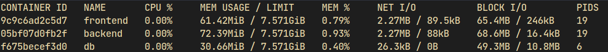

#### Prometheus
Prometheus adalah salah satu alat open-source yang digunakan dalam Docker Monitoring untuk memantau dan mengumpulkan metrik pada lingkungan Docker. Prometheus menyediakan platform monitoring dan alerting yang kuat dengan model data fleksibel dan query language yang ekspresif. Dalam lingkungan Docker, Prometheus dapat digunakan untuk memantau kinerja aplikasi dan infrastruktur yang berjalan dalam Docker Container.

Prometheus dapat bekerja dengan berbagai jenis aplikasi dan layanan yang dijalankan di dalam Docker Container, dan dapat mengumpulkan data metrik dari berbagai sumber, termasuk layanan yang dijalankan di dalam container, host Docker, atau bahkan lingkungan yang lebih luas. Metrik yang dikumpulkan oleh Prometheus dapat digunakan untuk memantau performa aplikasi secara real-time, menganalisis kecenderungan kinerja dari waktu ke waktu, dan mengidentifikasi masalah yang mempengaruhi performa.

Prometheus juga dapat digunakan untuk menghasilkan alert ketika metrik tertentu mencapai ambang batas tertentu, atau ketika terjadi perubahan yang signifikan dalam kinerja aplikasi. Alert ini dapat dikirim melalui berbagai saluran, termasuk email, Slack, atau platform alerting lainnya.

Untuk mengintegrasikan Prometheus dalam lingkungan Docker, dapat digunakan beberapa tools seperti Docker Compose, Docker Swarm, atau Kubernetes. Selain itu, Prometheus juga menyediakan library client yang dapat digunakan dalam aplikasi yang dijalankan di dalam Docker Container, sehingga memungkinkan aplikasi untuk langsung mengirimkan metrik ke Prometheus.

#### Grafana


Grafana adalah platform open-source untuk memvisualisasikan dan memantau data dari berbagai sumber, termasuk lingkungan Docker. Dalam lingkungan Docker monitoring, Grafana digunakan untuk memvisualisasikan data metrik yang dikumpulkan oleh alat monitoring seperti Prometheus.

Grafana menyediakan berbagai jenis visualisasi, termasuk grafik garis, grafik batang, heatmap, dan tabel. Visualisasi ini dapat digunakan untuk memperlihatkan tren kinerja aplikasi dari waktu ke waktu, menganalisis keterkaitan antara berbagai metrik, dan mengidentifikasi masalah yang mempengaruhi performa.

Selain itu, Grafana juga menyediakan kemampuan untuk membuat dashboard, yang memungkinkan untuk memperlihatkan informasi metrik yang penting dalam satu tampilan yang terpadu. Dashboard dapat disesuaikan dan dikonfigurasi dengan berbagai jenis panel visualisasi, dan dapat berisi informasi metrik dari berbagai sumber.

Dalam lingkungan Docker monitoring, Grafana biasanya diintegrasikan dengan alat monitoring seperti Prometheus sehingga dapat memanfaatkan data metrik yang telah dikumpulkan. Grafana dapat diintegrasikan dengan mudah dengan platform seperti Docker Compose, Docker Swarm, atau Kubernetes, dan dapat digunakan bersama dengan alat monitoring lainnya seperti Alert Manager untuk menghasilkan alert ketika terjadi perubahan yang signifikan dalam kinerja aplikasi.

Grafana juga menyediakan banyak plugin dan integrasi dengan berbagai layanan dan platform yang berbeda, sehingga memungkinkan untuk mengintegrasikan dengan berbagai sumber data lainnya, termasuk basis data, layanan cloud, dan alat monitoring lainnya.

#### cAdvisor
cAdvisor (Container Advisor) adalah alat open-source yang dikembangkan oleh Google yang digunakan dalam Docker Monitoring untuk memantau dan mengumpulkan metrik performa pada setiap Docker Container yang berjalan di dalam sebuah host. cAdvisor dirancang khusus untuk mengumpulkan data metrik seperti penggunaan CPU, memori, jaringan, dan I/O disk pada setiap Docker Container dan mengirimkannya ke alat monitoring seperti Prometheus atau Grafana untuk dianalisis.

cAdvisor berjalan sebagai sebuah layanan di dalam host Docker, dan secara otomatis memantau setiap Docker Container yang berjalan di host tersebut. Alat ini juga dapat mengumpulkan metrik dari host Docker sendiri, seperti penggunaan CPU dan memori, yang memungkinkan pengguna untuk memperoleh gambaran lengkap tentang performa seluruh lingkungan Docker.

Selain memantau performa, cAdvisor juga dapat memberikan informasi mengenai konfigurasi dan pengaturan pada setiap Docker Container, seperti port yang terbuka, volume yang digunakan, dan image yang digunakan untuk menjalankan container. Informasi ini sangat berguna untuk membantu dalam mengelola lingkungan Docker, terutama ketika diperlukan untuk melakukan analisis masalah yang terkait dengan kinerja dan konfigurasi aplikasi.

cAdvisor juga mendukung beberapa fitur seperti HTTP API untuk mengambil data metrik dari container dan host Docker secara programatik, dukungan untuk berbagai jenis sistem file yang berbeda, serta kemampuan untuk membatasi penggunaan sumber daya sistem pada Docker Container.

Dalam lingkungan Docker Monitoring, cAdvisor sering digunakan bersama dengan alat monitoring lainnya seperti Prometheus dan Grafana untuk memantau performa aplikasi dan infrastruktur secara efektif. Alat ini juga dapat digunakan untuk membuat tindakan pemulihan otomatis ketika terjadi masalah pada performa aplikasi.

#### Sysdig
Sysdig adalah alat open-source yang digunakan dalam Docker monitoring untuk memantau sistem dan aplikasi pada Docker Container. Alat ini berjalan pada level kernel di host, sehingga memungkinkan pengguna untuk memantau seluruh sistem operasi yang berjalan di dalam lingkungan Docker, termasuk aplikasi dan layanan yang dijalankan di setiap Docker Container.

Sysdig dapat memantau banyak metrik yang berbeda, seperti penggunaan CPU dan memori, aktivitas I/O disk dan jaringan, serta aktivitas sistem seperti penggunaan sistem file dan jaringan. Selain itu, Sysdig juga dapat digunakan untuk memantau keamanan dan kepatuhan Docker, seperti pengawasan akses user pada setiap Docker Container dan mendeteksi aktivitas yang mencurigakan.

Sysdig dapat digunakan bersama dengan alat monitoring seperti Prometheus dan Grafana untuk memantau dan menganalisis data metrik performa dan keamanan pada lingkungan Docker secara efektif. Selain itu, Sysdig juga dapat menghasilkan laporan dan alert ketika terjadi masalah atau aktivitas mencurigakan pada lingkungan Docker.

Keunggulan Sysdig di antara alat Docker Monitoring lainnya adalah kemampuannya untuk memantau aktivitas pada level kernel dan aplikasi di setiap Docker Container, sehingga memungkinkan pengguna untuk memperoleh gambaran yang lebih lengkap tentang performa dan keamanan seluruh lingkungan Docker. Selain itu, Sysdig juga dapat digunakan pada berbagai sistem operasi, termasuk Linux, Windows, dan Mac OS, sehingga dapat diimplementasikan pada lingkungan Docker yang beragam dan kompleks.

#### Docker Swarm Visualizer
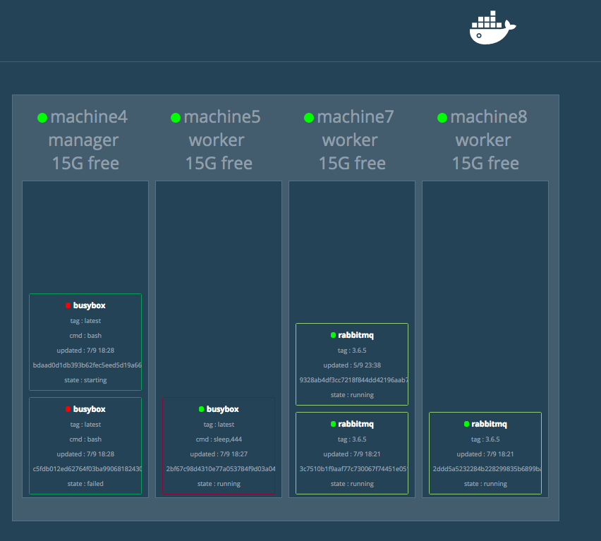

Docker Swarm Visualizer adalah sebuah tool yang memungkinkan pengguna untuk memvisualisasikan arsitektur dan status dari Docker Swarm cluster secara real-time. Tool ini menampilkan grafik interaktif yang memperlihatkan node, service, dan container yang ada pada cluster Docker Swarm. Dengan Docker Swarm Visualizer, pengguna dapat dengan mudah memantau kesehatan dan kinerja dari setiap node dan service pada cluster Docker Swarm. Pada gambar diatas menunjukan tampilan dari Docker Swarm Visualizer untuk Docker service yang sedang berjalan dan tidak pada tiap node Swarm. Service ini hanya dapat berjalan pada node yang sudah running Swarm. Biasanya service ini akan dijalankan pada node manager sehingga semua node yang bergabung ke Swarm akan dapat divisualisasikan.

### Jenis-Jenis Docker Monitoring
#### Pemantauan Penggunaan CPU
Pemantauan Penggunaan CPU adalah proses memantau seberapa banyak sumber daya CPU yang digunakan oleh sistem atau aplikasi pada suatu waktu tertentu. CPU (Central Processing Unit) adalah salah satu komponen penting dalam sebuah sistem komputer yang bertugas untuk mengeksekusi instruksi yang diberikan oleh aplikasi atau sistem operasi.

Dalam konteks teknologi informasi, Pemantauan Penggunaan CPU biasanya digunakan untuk memantau kinerja suatu sistem atau aplikasi, dan dapat membantu mengidentifikasi masalah kinerja atau bottleneck yang terjadi pada sistem tersebut. Pemantauan ini dapat dilakukan pada level hardware, seperti server atau komputer, atau pada level software, seperti aplikasi atau service yang berjalan pada sistem tersebut.

Pemantauan Penggunaan CPU dapat dilakukan dengan menggunakan tools atau software monitoring yang khusus dirancang untuk tujuan tersebut. Beberapa tools monitoring populer untuk pemantauan penggunaan CPU meliputi Grafana, Nagios, Zabbix, dan Prometheus.

Dalam praktiknya, pemantauan penggunaan CPU dilakukan dengan memantau beberapa parameter kunci, seperti persentase penggunaan CPU, load average, dan CPU utilization. Dengan memantau parameter-parameter ini secara teratur dapat mengidentifikasi kapan terjadi puncak penggunaan CPU, kapan terjadi bottleneck, dan kapan diperlukan untuk menambah kapasitas CPU untuk menjaga kinerja sistem atau aplikasi tetap optimal.

#### Pemantauan Penggunaan memori
Memantau penggunaan memori pada Docker sangat penting karena memori adalah sumber daya yang sangat kritis dalam lingkungan Docker. Ketika container berjalan, itu harus mengalokasikan sejumlah memori untuk menjalankan aplikasi di dalamnya. Jika container kekurangan memori, performa aplikasi dapat menurun, dan dalam kasus ekstrim, dapat menyebabkan kegagalan aplikasi atau bahkan crash.

Docker menyediakan alat untuk memantau penggunaan memori pada Docker Container dengan menggunakan Docker Stats Command. Command ini dapat memberikan informasi terkini mengenai penggunaan CPU, memori, disk I/O, dan jaringan dari Docker Container yang sedang berjalan.

Selain itu, terdapat juga tool pihak ketiga yang dapat digunakan untuk memantau penggunaan memori pada Docker, seperti Prometheus dan Grafana. Kedua tool ini dapat digunakan untuk memantau berbagai aspek dari performa aplikasi Docker, termasuk penggunaan memori.

Dalam pemantauan penggunaan memori pada Docker, penting untuk memantau penggunaan memori pada tingkat host dan tingkat container. Memantau penggunaan memori pada tingkat host dapat membantu menentukan seberapa banyak memori yang tersedia untuk menjalankan container, sementara memantau penggunaan memori pada tingkat container dapat membantu menentukan seberapa banyak memori yang digunakan oleh aplikasi di dalam container.


#### Pemantauan Penggunaan Jaringan
Dalam konteks Docker Monitoring, pemantauan penggunaan jaringan pada Docker Container sangat penting untuk memastikan aplikasi berjalan dengan lancar dan aman. Penggunaan jaringan pada Docker dapat mempengaruhi performa dan kinerja aplikasi, dan memastikan keamanan jaringan dalam lingkungan Docker juga menjadi hal yang sangat penting.

Untuk memantau penggunaan jaringan pada Docker Container, Docker menyediakan beberapa alat bawaan, seperti Docker Stats Command. Command ini dapat memberikan informasi terkini mengenai penggunaan jaringan dari Docker Container yang sedang berjalan. Informasi tersebut dapat mencakup jumlah paket yang diterima dan dikirim, bandwidth, dan jumlah kesalahan yang terjadi.

Selain itu, terdapat juga tool pihak ketiga yang dapat digunakan untuk memantau penggunaan jaringan pada Docker, seperti Prometheus dan Grafana. Kedua tool ini dapat digunakan untuk memantau berbagai aspek dari performa aplikasi Docker, termasuk penggunaan jaringan.

Dalam pemantauan penggunaan jaringan pada Docker, penting untuk memantau koneksi masuk dan keluar dari container. Hal ini dapat membantu memastikan bahwa aplikasi berinteraksi dengan jaringan secara efektif dan aman. Selain itu, perlu juga memantau lalu lintas jaringan dan menganalisis data lalu lintas tersebut untuk mendeteksi adanya serangan atau masalah jaringan lainnya.

Selain itu, dapat pula melakukan pengaturan jaringan dengan membatasi akses pada Docker Container menggunakan Docker Network. Docker Network menyediakan kontrol akses jaringan yang lebih baik dan memungkinkan pengaturan jaringan yang lebih fleksibel, seperti memisahkan lalu lintas jaringan antara beberapa container atau membatasi koneksi jaringan ke host.

#### Pemantauan Filesystem
Pemantauan Filesystem pada Docker Monitoring merujuk pada pemantauan sistem file yang digunakan oleh Docker Container. Sistem file pada Docker adalah bagian penting dari container, karena berisi semua file dan data yang diperlukan untuk menjalankan aplikasi.

Dalam pemantauan Filesystem pada Docker, perlu untuk memantau penggunaan ruang disk pada Docker Container untuk memastikan bahwa tidak ada kehabisan ruang disk yang dapat menyebabkan aplikasi crash atau kegagalan lainnya. Docker Stats Command juga dapat digunakan untuk memantau penggunaan ruang disk pada Docker Container.

Selain itu, perlu juga memantau perubahan pada file sistem, seperti perubahan pada file konfigurasi atau data aplikasi. Docker menyediakan fitur log dan audit untuk memantau perubahan ini.

Dalam beberapa kasus, memantau file sistem dapat membantu mendeteksi serangan keamanan pada Docker Container. Sebagai contoh, memantau perubahan pada file konfigurasi atau sistem file pada Docker Container dapat membantu mendeteksi adanya perubahan yang tidak sah dan mengambil tindakan yang diperlukan.

Untuk memantau file sistem pada Docker Container, terdapat juga tool pihak ketiga yang dapat digunakan, seperti Sysdig dan Fluentd. Kedua tool ini dapat digunakan untuk memantau berbagai aspek dari sistem file pada Docker Container, termasuk penggunaan ruang disk dan perubahan pada file sistem.

Dalam pemantauan Filesystem pada Docker, penting juga untuk melakukan backup secara teratur dan mengatur mekanisme pengelolaan data agar data tidak hilang atau rusak pada saat pemindahan container ke lingkungan lain. Hal ini dapat dilakukan dengan melakukan backup data secara teratur dan mengelola data menggunakan layanan penyimpanan data yang aman dan andal.

#### Pemantauan Log
Pemantauan Log pada Docker Monitoring merujuk pada pemantauan catatan log yang dihasilkan oleh Docker Container. Log pada Docker sangat penting untuk memastikan bahwa aplikasi berjalan dengan lancar dan aman, dan untuk membantu mengidentifikasi dan memecahkan masalah yang mungkin terjadi pada aplikasi.

Dalam pemantauan log pada Docker, perlu untuk memastikan bahwa log yang dihasilkan oleh Docker Container dikumpulkan dan disimpan dengan baik. Docker menyediakan fitur logging bawaan yang dapat digunakan untuk memantau dan mengumpulkan log dari Docker Container.

Selain itu, terdapat juga tool pihak ketiga seperti Fluentd dan ELK Stack yang dapat digunakan untuk memantau log pada Docker dengan lebih efektif. Kedua tool ini dapat mengumpulkan log dari beberapa Docker Container secara bersamaan dan melakukan analisis log yang lebih kompleks.

Dalam pemantauan log pada Docker, penting juga untuk memastikan bahwa log disimpan dengan aman dan dapat diakses oleh orang yang berwenang. Hal ini dapat dilakukan dengan menggunakan sistem otentikasi dan otorisasi yang tepat untuk mengontrol akses ke log.

Pemantauan log pada Docker juga dapat membantu dalam mendeteksi serangan keamanan pada Docker Container. Dalam beberapa kasus, Attacker dapat meninggalkan jejak pada log yang dapat digunakan untuk mendeteksi adanya serangan atau kebocoran data.

Selain itu, pemantauan log pada Docker juga dapat membantu dalam pemecahan masalah pada aplikasi. Dengan memantau log yang dihasilkan oleh Docker Container, dapat membantu mengidentifikasi masalah pada aplikasi dan mengambil tindakan yang diperlukan untuk memperbaiki masalah tersebut.

Dalam kesimpulannya, pemantauan log pada Docker Monitoring sangat penting untuk memastikan bahwa aplikasi berjalan dengan lancar dan aman, dan untuk membantu mengidentifikasi dan memecahkan masalah yang mungkin terjadi pada aplikasi.

### Implementasi Docker Monitoring

Pada implementasi Docker Monitoring akan diberikan contoh implementasi monitoring pada arsitektur microservice Docker Swarm menggunakan beberapa tools yaitu cAdvisor, Node Exporter, Prometheus, dan Grafana.

> **Catatan**<br>Sebelum masuk ke implementasi Docker Monitoring, pastikan telah mengimplementasikan konfigurasi Docker Compose dan Docker Swarm yang telah dicontohkan pada [Modul 4](https://github.com/arsitektur-jaringan-komputer/Pelatihan-Docker/tree/master/4.%20Membangun%20Aplikasi%20di%20Docker)

Berikut diagram implementasi Docker Monitoring

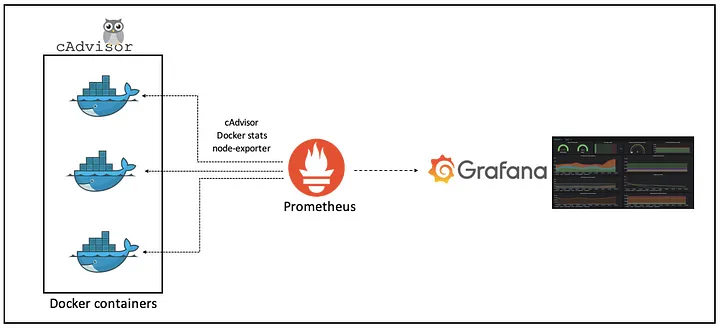

1. Buat Compose file

    Agar memudahkan untuk menginstal tools yang diperlukan untuk melakukan monitoring, maka buat sebuah file **`docker-compose.yml`** pada folder monitoring. File tersebut akan mendefinisikan service prometheus, Node Exporter, cAdvisor, dan Grafana, serta sebuah network bridge. Buat sebuah file **`docker-compose.yml`** pada folder monitoring dan paste kode berikut:

    ```yaml
    version: '3.2'
    services:
    ######################################
    # Prometheus
    # runs on manager node
    ######################################
    prometheus:
      image: prom/prometheus:latest
      container_name: prometheus
      ports:
      - 9090:9090
      command:
      - --config.file=/etc/prometheus/prometheus.yml
      volumes:
      - ./prometheus.yml:/etc/prometheus/prometheus.yml:ro
      deploy:
        labels:
          com.docker.stack.namespace: monitoring
        placement:
          constraints:
          - node.role == manager

    ######################################
    # Prometheus Node Exporter
    # for each node separate service need to be added
    ######################################
    node-exporter-manager:
      image: prom/node-exporter:latest
      container_name: node-exporter-manager
      volumes:
        - /proc:/host/proc:ro
        - /sys:/host/sys:ro
        - /:/rootfs:ro
      command:
        - '--path.procfs=/host/proc'
        - '--path.rootfs=/rootfs'
        - '--path.sysfs=/host/sys'
        - '--collector.filesystem.mount-points-exclude=^/(sys|proc|dev|host|etc)($$|/)'
      deploy:
        placement:
          constraints:
          # hostname of the manager node
          - node.hostname == manager-node

    node-exporter-worker-1:
      image: prom/node-exporter:latest
      container_name: node-exporter-worker-1
      volumes:
        - /proc:/host/proc:ro
        - /sys:/host/sys:ro
        - /:/rootfs:ro
      command:
        - '--path.procfs=/host/proc'
        - '--path.rootfs=/rootfs'
        - '--path.sysfs=/host/sys'
        - '--collector.filesystem.mount-points-exclude=^/(sys|proc|dev|host|etc)($$|/)'
      deploy:
        placement:
          constraints:
          # hostname of the worker node
          - node.hostname == worker-node-1
    node-exporter-worker-2:
      image: prom/node-exporter:latest
      container_name: node-exporter-worker-2
      volumes:
        - /proc:/host/proc:ro
        - /sys:/host/sys:ro
        - /:/rootfs:ro
      command:
        - '--path.procfs=/host/proc'
        - '--path.rootfs=/rootfs'
        - '--path.sysfs=/host/sys'
        - '--collector.filesystem.mount-points-exclude=^/(sys|proc|dev|host|etc)($$|/)'
      deploy:
        placement:
          constraints:
          # hostname of the worker node
          - node.hostname == worker-node-2

    node-exporter-worker-3:
      image: prom/node-exporter:latest
      container_name: node-exporter-worker-3
      volumes:
        - /proc:/host/proc:ro
        - /sys:/host/sys:ro
        - /:/rootfs:ro
      command:
        - '--path.procfs=/host/proc'
        - '--path.rootfs=/rootfs'
        - '--path.sysfs=/host/sys'
        - '--collector.filesystem.mount-points-exclude=^/(sys|proc|dev|host|etc)($$|/)'
      deploy:
        placement:
          constraints:
          # hostname of the worker node
          - node.hostname == worker-node-3

    ######################################
    # Cadvisor
    # - runs on every node
    ######################################
    cadvisor-manager:
      image: gcr.io/cadvisor/cadvisor:latest
      container_name: cadvisor-manager
      volumes:
      - /:/rootfs:ro
      - /var/run:/var/run:rw
      - /sys:/sys:ro
      - /var/lib/docker/:/var/lib/docker:ro
      deploy:
        placement:
          constraints:
          # hostname of the manager node
          - node.hostname == manager-node

          cadvisor-worker-1:
            image: gcr.io/cadvisor/cadvisor:latest
            container_name: cadvisor-worker-1
            volumes:
            - /:/rootfs:ro
            - /var/run:/var/run:rw
            - /sys:/sys:ro
            - /var/lib/docker/:/var/lib/docker:ro
            deploy:
              placement:
                constraints:
                # hostname of the worker node
                - node.hostname == worker-node-1

    cadvisor-worker-2:
      image: gcr.io/cadvisor/cadvisor:latest
      container_name: cadvisor-worker-2
      volumes:
      - /:/rootfs:ro
      - /var/run:/var/run:rw
      - /sys:/sys:ro
      - /var/lib/docker/:/var/lib/docker:ro
      deploy:
        placement:
          constraints:
          # hostname of the worker node
          - node.hostname == worker-node-2

    cadvisor-worker-3:
      image: gcr.io/cadvisor/cadvisor:latest
      container_name: cadvisor-worker-3
      volumes:
      - /:/rootfs:ro
      - /var/run:/var/run:rw
      - /sys:/sys:ro
      - /var/lib/docker/:/var/lib/docker:ro
      deploy:
        placement:
          constraints:
          # hostname of the worker node
          - node.hostname == worker-node-3

    ######################################
    # Grafana
    # - runs on manager node
    ######################################
    grafana:
      image: grafana/grafana:latest
      user: "$UID:$GID"
      ports:
      - 3100:3000
      volumes:
      - ./grafana-storage:/var/lib/grafana
      deploy:
        placement:
          constraints:
          - node.role == manager
    ```

    - Konfigurasi diatas akan membuat 10 services (1 Prometheus, 4 Node Exporter, 4 cAdvisor, 1 Grafana) dimana untuk Node Exporter dan cAdvisor berjalan di masing-masing node.
    - Untuk service Prometheus, pada bagian **`volumes`** akan dilakukan mounting file konfigurasi prometheus **`prometheus.yml`** ke container yang akan dibuat. Kemudian pada bagian **`deploy`** akan dilakukan deployment service ke node yang bersangkutan.
    - Untuk services Node Exporter dan cAdvisor, akan dilakukan deploy services ke masing-masing node sehingga pada bagian **`deploy`**, perlu untuk mendefinisikan constraint  **`node-hostname`** dengan value hostname tiap node.
    - Untuk service Grafana, pada bagian **`volumes`** akan dilakukan mounting folder **`grafana-storage`** ke container Grafana  untuk menyimpan data Grafana  seperti dashboard monitoring.

2. Buat file konfigurasi Prometheus

    Pada step ini, akan dilakukan konfigurasi Prometheus untuk melakukan scraping metrics Node Exporter dan cAdvisor dan metrics tersebut akan divisualisasikan melalui Grafana . Buat sebuah file konfigurasi Prometheus **`prometheus.yml`** pada folder yang sama dengan file **`docker-compose.yml`** sebelumnya dan paste kode berikut :

    ```yaml
    global:
      scrape_interval: 15s

    scrape_configs:
      - job_name: 'prometheus'
        static_configs:
        - targets: ['prometheus:9090']
          labels:
            alias: 'prometheus'
      - job_name: 'node-exporter'
        static_configs:
        - targets: ['node-exporter-manager:9100', 'node-exporter-worker-1:9100', 'node-exporter-worker-2:9100', 'node-exporter-worker-3:9100']
          labels:
            alias: 'node-exporter'
      - job_name: 'cadvisor'
        static_configs:
        - targets: ['cadvisor-manager:8080', 'cadvisor-worker-1:8080', 'cadvisor-worker-2:8080', 'cadvisor-worker-3:8080']
          labels:
            alias: 'cadvisor'
    ```
    Berikut adalah penjelasan dari konfigurasi **`prometheus.yml`**:

    - **`global`** :  ini ada konfigurasi default Global. Pada contoh, akan diset scrape_interval untuk scraping metrics dari configured jobs sebesar 15 detik.
    - **`scrape_configs`** : mendefinisikan jobs yang akan di scraping metrics nya.
    - Pada file diatas, akan dibuat 3 jobs dengan masing-masing jobs memiliki target yaitu service yang telah didefinisikan pada file **`docker-compose.yml`**.

3. Melakukan deploy service monitoring

    Setelah melakukan konfigurasi pada file **`docker-compose.yml`** dan **`prometheus.yml`**, akan dilakukan deployment service yang telah didefinisikan ke semua node pada cluster dengan menggunakan fitur pada Docker Swarm yaitu **`docker stack`**.

    ```bash
    docker stack deploy -c <path-to-file-compose> <stack-name>
    ```
    Dari command diatas **`docker stack`** akan menggunakan file **`docker-compose.yml`** untuk mendeploy service yang telah didefinisikan sebagai sebuah stack.

    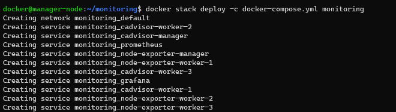

4. Cek semua service

    Setelah melakukan deployment, maka tahap selanjutnya adalah melakukan pengecekan untuk setiap service apakah berhasil dideploy pada node yang telah ditentukan dengan perintah berikut:

    ```bash
    docker service ls
    ```

    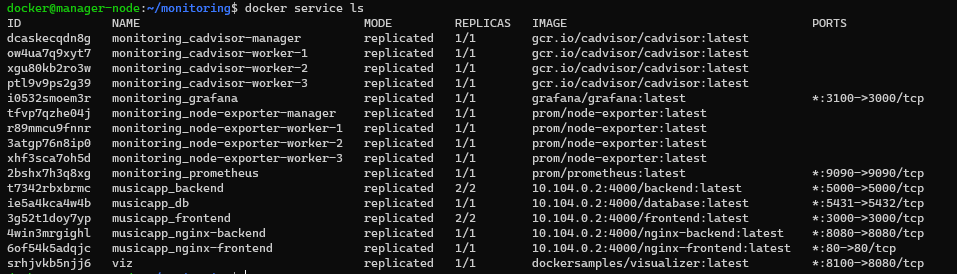

    Terlihat bahwa pada kolom **`REPLICAS`**, untuk melihat visualisasi dari tiap service yang jalan di masing-masing node menggunakan Docker Swarm Visualizer dapat menggunakan perintah sebagai berikut:

    ```bash
    docker service create \
    --name=viz \
    --publish=8100:8080/tcp \
    --constraint=node.role==manager \
    --mount=type=bind,src=/var/run/docker.sock,dst=/var/run/docker.sock \
    dockersamples/visualizer
    ```

    Kemudian akses port 8100 dengan IP public manager node untuk mengakses visualizer tersebut.
    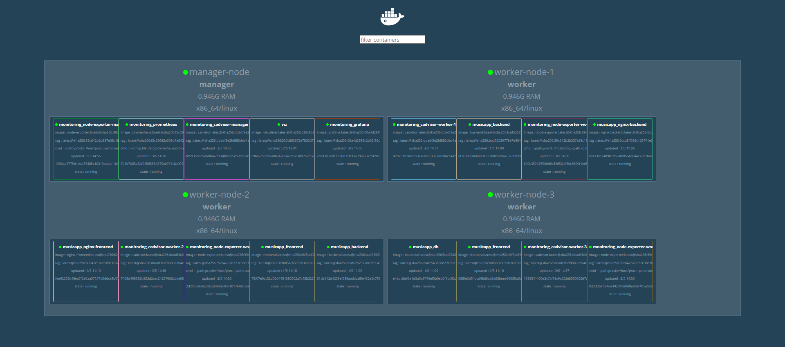

5. Cek target Prometheus

    Setelah memastikan semua service telah berhasil dideploy, akan dilakukan pengecekan status pada target prometheus yaitu Node Exporter dan cAdvisor. Buka browser, lalu akses aplikasi Prometheus pada url berikut:

    ```bash
    http://<public-ip-manager-node>:9090
    ```
    setelah aplikasi Prometheus terbuka, pada tab status, pilih targets.

    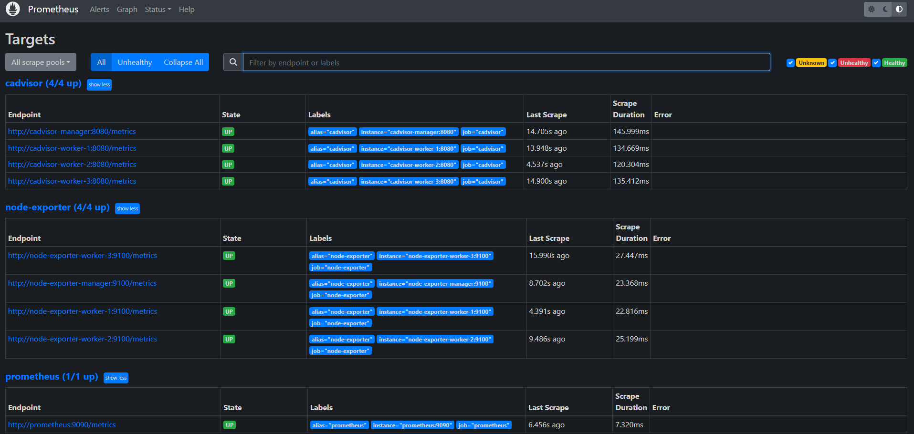

    Pada contoh berikut, semua target prometheus memiliki State (UP) yang artinya Prometheus bisa melakukan query metrics pada target Node Exporter dan cAdvisor.

6. Menambah data source pada Grafana

    Pada step berikut, akan dilakukan konfigurasi Grafana dengan Prometheus sebagai data source. Akses aplikasi Grafana  pada port 3100 dan buka tab Connection untuk menambah data source.

    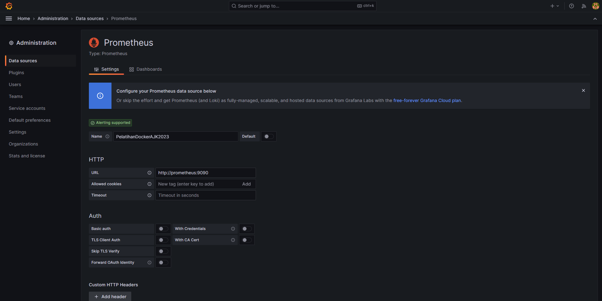

    Pada URL section, isi dengan URL internal prometheus. Lalu klik save&test untuk memastikan bahwa data source dapat digunakan.

7. Membuat Dashboard

    Grafana telah menyediakan fasilitas untuk bisa membuat berbagai macam dashboard sesuai kebutuhan. Atau melakukan import dashboard dari Grafana community. Pada step ini akan dilakukan pembuatan 2 dashboard masing-masing untuk monitoring container (cAdvisor) dan monitoring node (Node Exporter).

    - Buka web Grafana dashboard, lalu search dashboard sesuai kebutuhan.
    - Copy ID dashboard, kemudian buka tab dashboard dan load Dashboard Grafana menggunakan ID sebelumnya.
    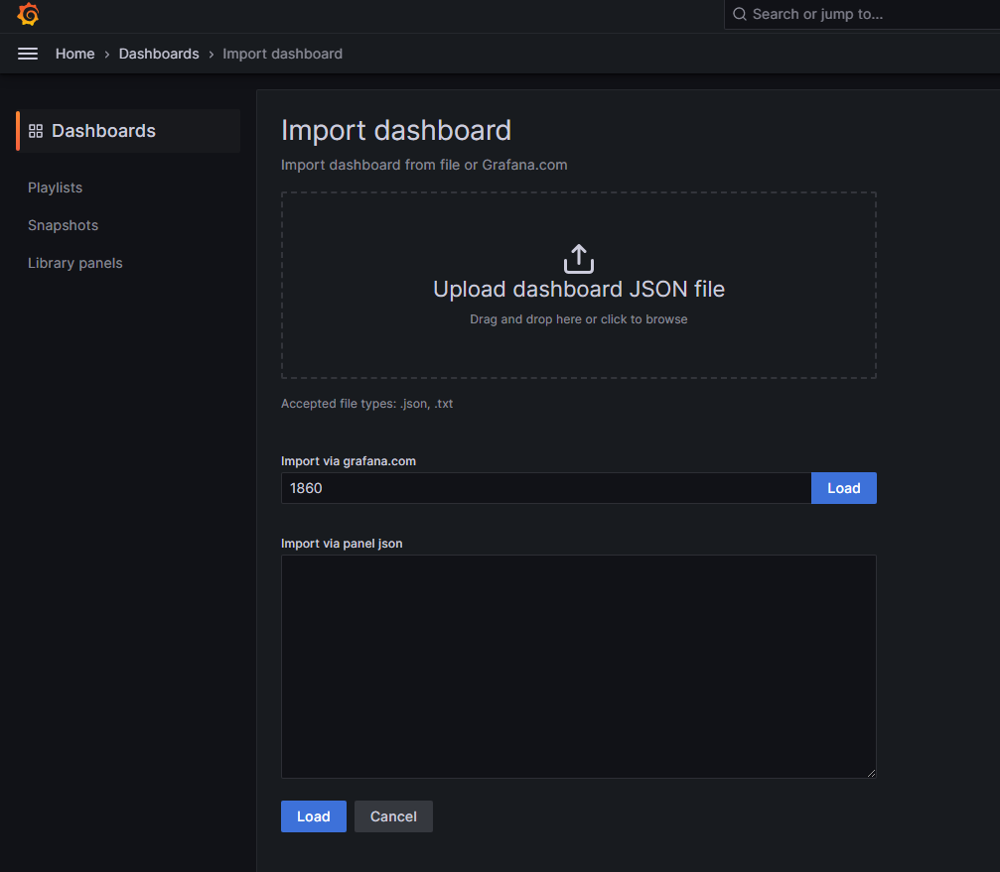

    - Pilih data source sebelumnya yang telah ditambah pada section Prometheus.
    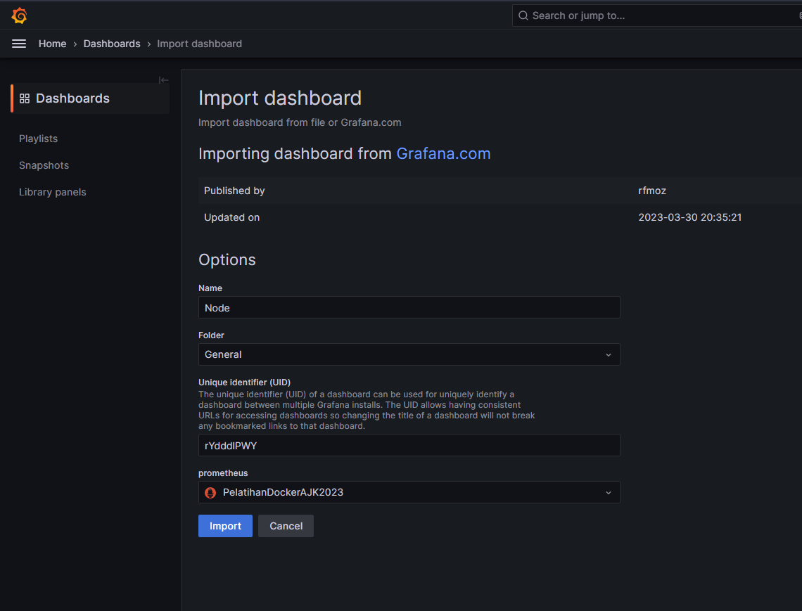

    - Dashboard monitoring node (Node Exporter) sudah tersedia.
    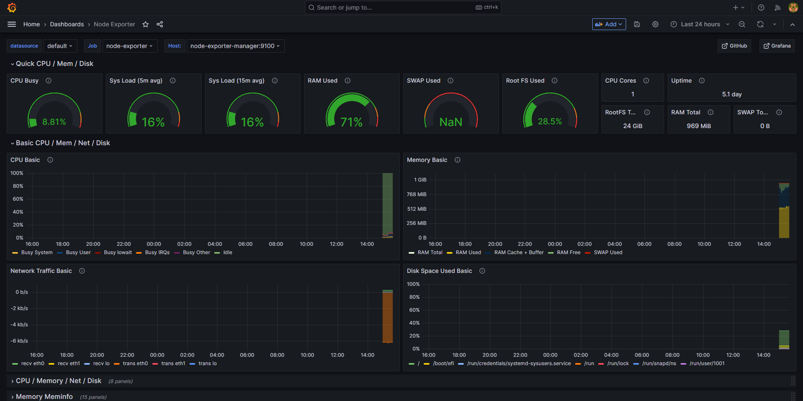

    - Berikut dashboard monitoring container (cAdvisor) dengan mengimport dashboard Docker.
    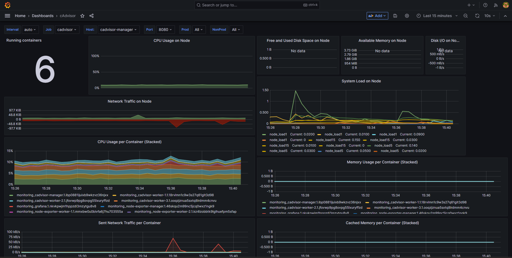

## Docker Security
### Pengertian Docker Security
Docker Security adalah upaya untuk menjaga keamanan pada Docker Container. Docker Container adalah unit yang terisolasi dari sistem operasi host, sehingga memberikan keuntungan seperti portabilitas, skalabilitas, dan efisiensi. Namun, karena Docker Container memiliki akses ke sistem operasi host, maka diperlukan upaya untuk menjaga keamanan pada container tersebut. Selain itu, Docker Security juga melibatkan upaya untuk mengamankan jaringan yang digunakan oleh container, seperti mengatur firewall, menggunakan jaringan yang terisolasi, dan membatasi akses ke port yang tidak diperlukan. Docker Security juga memperhatikan pengelolaan data sensitif, seperti password, kunci API, dan data rahasia lainnya yang dapat disimpan di dalam container. Upaya ini termasuk penggunaan variabel lingkungan, penyimpanan data yang terenkripsi, dan pengelolaan hak akses pada file dan direktori. Dalam keseluruhan Docker Security, upaya ini bertujuan untuk menjaga keamanan pada Docker Container dan meminimalkan risiko keamanan yang terkait dengan penggunaan Docker.

### Ancaman Keamanan di Docker
#### Container Escape

Container Escape atau disebut juga Container Breakout merupakan risiko keamanan pada Docker dimana “malicious user” dapat memanfaatkan kerentanan aplikasi dalam container untuk menembus batas isolasi sehingga mendapatkan akses ke sumber daya sistem host.

Attacker yang memiliki akses ke container dapat mengeksploitasi berbagai kerentanan yang dapat menyebabkan Container Escape :

- Memanfaatkan program apapun dalam privileged mode untuk melakukan operasi berbahaya pada host
- Melakukan mounting filesystem host dan menjalankan container dengan parameter bind untuk mengirim payload kepada mereka.
- Memanfaatkan kerentanan seperti bug kernel, konfigurasi yang buruk, atau kontrol akses yang lemah .
- Meningkatkan privilege host untuk mengakses container yang lain.

#### Container Poisoning

Container Poisoning adalah serangan keamanan yang dilakukan dengan memasukkan kode berbahaya atau komponen yang tidak diinginkan ke dalam sebuah container yang dijalankan pada sistem. Dengan cara ini, Attacker dapat mengambil alih kontrol dari container tersebut atau bahkan mengambil alih sistem host tempat container berjalan.

Beberapa contoh teknik yang digunakan dalam container poisoning adalah memodifikasi atau menambahkan komponen saat membangun image container, menanamkan backdoor pada aplikasi yang dijalankan dalam container, atau mengubah konfigurasi container secara tidak sah.

#### Container Sprawl

Container Sprawl adalah fenomena ketika sebuah organisasi memiliki terlalu banyak container yang berjalan di dalam infrastruktur mereka, yang dapat menyebabkan masalah seperti kurangnya transparansi dan visibilitas pada lingkungan container, kesulitan dalam manajemen dan pemantauan container, peningkatan biaya operasional, dan penurunan kinerja sistem secara keseluruhan. Hal ini dapat terjadi ketika organisasi mengadopsi teknologi containerisasi dan orkestrasi (seperti Kubernetes) tanpa strategi dan perencanaan yang matang, atau ketika system administrator tidak melakukan tindakan pemeliharaan atau penghapusan container yang tidak terpakai.

#### Container Hijacking

Container Hijacking adalah serangan keamanan di mana seorang Attacker mencoba untuk mendapatkan akses yang tidak sah ke dalam suatu lingkungan container dengan tujuan mencuri data atau merusak lingkungan tersebut. Serangan ini dapat memanfaatkan kerentanan dalam software container, seperti Docker, atau memanfaatkan akses yang tidak terlindungi pada aplikasi container yang berjalan di dalamnya.

Beberapa teknik yang dapat digunakan oleh Attacker untuk melakukan container hijacking antara lain:

- Container Escape: Attacker mencoba untuk melompat dari container yang terisolasi ke lingkungan host yang lebih luas.
- Privilege Escalation: Attacker mencoba untuk mendapatkan akses root pada container untuk mendapatkan kontrol penuh atas environment tersebut.
- Malware Injection: Attacker memasukkan malware ke dalam container untuk mencuri data atau merusak lingkungan.

### Implementasi Docker Security

Setelah melakukan deploy terhadap monitoring setiap node dan container pada Swarm, selanjutnya akan dilakukan implementasi Security. Pada tahap implementasi Security ini akan didasari berdasarkan ancaman keamanan Privilege Escalation dan Container Escape.

1. **Set non-root User pada Dockerfile**

    Pada tahap ini akan dilakukan konfigurasi agar container yang berjalan tidak memiliki hak akses root. Hal ini dapat dilakukan dengan menambahkan user baru pada Dockerfile saat akan melakukan build images.

    Berikut konfigurasi Dockerfile pada service backend dan frontend:

    ```docker
    FROM node:14

    WORKDIR /usr/src/backend

    COPY package*.json ./

    # add new group 'mygroup' and assign to new user 'myuser'
    RUN groupadd -r mygroup && useradd -r -g mygroup myuser

    RUN npm install --production
    RUN apt-get update && \
        apt-get install -y net-tools postgresql-client

    COPY . .

    EXPOSE 5000

    CMD [ "npm", "run", "start-prod", "--", "0.0.0.0" ]

    # set user for container using this image
    USER myuser
    ```

    ```docker
    FROM node:14

    WORKDIR /usr/src/frontend

    COPY package*.json ./

    # add new group 'mygroup' and assign to new user 'myuser'
    RUN groupadd -r mygroup && useradd -r -g mygroup myuser

    RUN npm install --production

    COPY . .

    RUN npm run build

    EXPOSE 3000

    CMD [ "npm", "start" ]

    # set user for container using this image
    USER myuser
    ```

    Pada kode diatas, user baru **myuser** dan group baru **mygroup** dibuat sebelum melakukan instalasi package pada container. Setelah perintah **cmd**, Dockerfile akan membaca file untuk menggunakan user **myuser** pada container yang jalan dari image yang akan dibuild (contoh diatas image Backend).

2. **Rebuild image Push Images ke Registry**

    Selanjutnya akan dilakukan rebuild image (backend dan frontend) dari Dockerfile yang sudah dimodifikasi

    ```bash
    docker compose build
    ```

    Setelah image baru telah terbuild, selanjutnya image baru tersebut akan di push ke Docker Registry.

    ```bash
    docker push <ip-manager>:4000/frontend
    docker push <ip-manager>:4000/backend
    ```

3. **Konfigurasi Docker Secret pada file Compose**

    Pada Docker, sebuah **`secret`** adalah segala jenis informasi atau data yang tidak boleh disimpan dalam text files biasa yang tidak dienkripsi, seperti password, SSH private keys, certificates, atau API keys. Oleh sebab itu docker memiliki fitur untuk memanajemen sebuah secret yang disebut Docker secrets. Docker secrets merupakan salah satu fitur yang disediakan dari Docker Swarm.

    Pada tahap ini, akan dilakukan implementasi Docker secret pada compose sehingga tidak ada informasi sensitif yang akan disimpan pada file compose.

    Hal pertama yang dapat dilakukan yaitu membuat secret untuk informasi sensitif dari nama, user dan password database yang akan dideploy. Untuk membuat secret dari file yang ada dapat menggunakan perintah berikut :

    ```bash
    printf "musicapp" | docker secret create postgres_db -
    printf "docker" |  docker secret create postgres_user -
    printf "docker" |  docker secret create postgres_password -
    ```

    dimana **postgres_db, postgres_user, postgres_password** merupakan nama dari secret.

    untuk melihat secret yang telah dibuat dapat menggunakan perintah berikut :

    ```bash
    docker secret ls
    ```

    Kemudian pada file `docker-compose.yaml` harus ditambahkan top-level entry secrets dan dife

    ```yaml
    version: '3.8'
    services:
    ...
    ...
    secrets:
      postgres_db:
        external: true
      postgres_user:
        external: true
      postgres_password:
        external: true
    ```

    Di sini, keyword "external" digunakan untuk menunjukkan bahwa external secret yang telah dibuat sebelumnya digunakan ketika Docker berada dalam mode Swarm.

    Kemudian tambahkan secret pada setiap service yang diperlukan. sebagai contoh berikut pada service `db` :

    ```yaml
    version: '3.8'
    services:
      db:
        ...
        ...
        environment:
          POSTGRES_USER: /run/secrets/postgres_user
          POSTGRES_PASSWORD: /run/secrets/postgres_password
          POSTGRES_DB: /run/secrets/postgres_db
        ...
        ...
        secrets:
          - postgres_user
          - postgres_password
          - postgres_db
    ```

    Setelah melakukan konfigurasi **non-root user** pada Dockerfile dan **Secret** pada compose, lakukan deploy ulang pada Stack bernama `musicapp` dengan perintah berikut:

    ```yaml
    docker stack deploy -c docker-compose.yaml musicapp
    ```

   Selanjutnya, dapat dilakukan pemeriksaan apakah hak akses container frontend dan backend pada worker node sudah tidak lagi sebagai root dengan perintah berikut ini: :

    ```yaml
    docker exec -it <id-container> sh
    #
    whoami
    # myuser
    ```

    Selamat. implementasi Docker Security telah berhasil.


**Tambahan (Memperbarui Docker)**

Container tidak seperti virtual machines. Container berbagi kernel yang sama dengan host. Jika sebuah eksploit dijalankan di dalam container, hal tersebut bisa langsung mengenai atau merusak kernel host. Misalnya seperti eksploit kernel privilege escalation ([Dirty COW](https://github.com/scumjr/dirtycow-vdso)) yang saat dieksekusi di dalam container akan menghasilkan hak akses root di host.

Untuk mencegah container dari beberapa ancaman keamanan seperti container escape yang dapat mengarah ke peningkatan hak akses istimewa ke root/administrator, selalu melakukan patching terhadap Docker Engine dan Docker Machine ke versi terbaru adalah hal yang sangat krusial.

## Sumber Referensi
- https://docs.docker.com/engine/reference/commandline/stats/
- https://docs.docker.com/engine/security/
- https://cheatsheetseries.owasp.org/cheatsheets/Docker_Security_Cheat_Sheet.html