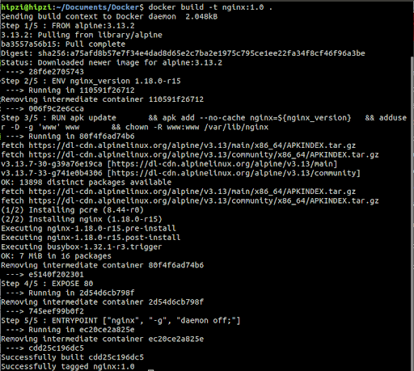

## **CONTENTS**
* [**Introduction**](#introduction)
* [**Docker Container**](#docker-container)
* [**Dockerfile**](#dockerfile)
* [**Docker Hub**](#docker-hub)

# Pelatihan-Docker
Modul Pelatihan Docker

 - Docker
	 * <a href="#docker-command">Command</a>
 - Dockerfile
	 * <a href="#dockerfile-command">Command</a>
	 * <a href="#dockerfile-example">Contoh</a>
 - Docker Hub
	 * <a href="#dockerhub-push-image">Push Image</a>

## Docker
Apa itu docker? (WIP)
<justify></justify>

Berikut merupakan sintaks yang terdapat pada Docker :

| Sintaks                                     | Deskripsi                                                                                                                            |
| ------------------------------------------- | ------------------------------------------------------------------------------------------------------------------------------------ |
| docker run                           | Menjalankan command di container baru                                                                                       |
| docker start | Menjalankan satu atau beberapa container                                                                                      |
| docker stop  | Memberhentikan satu atau beberapa container                                                                                         |
| docker build                               | Buat sebuah image dari dockerfile                                                                                   |
| docker pull                          | Mengambil image atau repo dari registry                                                                                      |
| docker push                   | Mengirim image atau repo ke registry                                                               |
| docker export                           | Mengekspor filesystem container sebagai arsip tar                                                               |
| docker exec                  | Menjalankan command di sebuah runtime container (container yang sedang berjalan)                                                                         |
| docker search                              | Mencari image di docker hub |
| docker attach                          | Menempelkan input output terminal pada suatu container, ini memungkinkaa kita melihat output atau mengontrol container secara interaktif                                                    |
| docker commit             | Membuat image baru setelah dilakukan perubahan pada container   

## Dockerfile
<justify></justify>

Berikut merupakan sintaks yang terdapat pada Dockerfile :

| Sintaks                                     | Deskripsi                                                                                                                            |
| ------------------------------------------- | ------------------------------------------------------------------------------------------------------------------------------------ |
| FROM \<base image>                           | Mendefinisikan image yang menjadi dasar kontainer.                                                                                   |
| COPY \[--chown=\<user>:\<group>\] \<src> \<dst> | Melakukan copy file atau folder ke dalam image.                                                                                      |
| ADD \[--chown=\<user><group>\] \<src> \<dst>  | Menambahkan file atau folder ke dalam image.                                                                                         |
| RUN \<command>                               | Menjalankan perintah shell pada saat proses build.                                                                                   |
| ENV \<key>=\<value>                           | Mendefinisikan variabel di dalam image.                                                                                              |
| WORKDIR \<path to folder>                    | Melakukan pindah folder dan menetapkannya sebagai direktori saat ini.                                                                |
| USER \<nama user>                            | Melakukan ganti user untuk mengeksekusi perintah-perintah setelahnya.                                                                |
| ENTRYPOINT \<command>                        | Menjalankan perintah shell pada saat kontainer dijalankan.                                                                           |
| CMD \<command>                               | Menjalankan perintah shell pada saat kontainer dijalankan, tetapi dapat digantikan dengan paramater lain saat menjalankan kontainer. |
| ARGS \<key>=\<value>                          | Mengirimkan variabel dari perintah docker untuk dijalankan pada saat proses build                                                    |
| EXPOSE \<portNumber>/\[tcp/udp\]             | Membuka port image yang berada di dalam kontainer.                                                                                   |

Berikut merupakan contoh Dockerfile :

    FROM alpine:3.13.2

    ENV nginx_version 1.18.0-r15

    RUN apk update \
        && apk add --no-cache nginx=${nginx_version} \
        && adduser -D -g 'www' www \
        && chown -R www:www /var/lib/nginx 

    EXPOSE 80
    ENTRYPOINT ["nginx", "-g", "daemon off;"]

## Docker Hub
<justify></justify>

Docker Hub merupakan registry yang berisi kumpulan image docker, kita juga dapat melakukan custom image docker menggunakan Dockerfile dan meletakkannya pada Docker Hub.

Berikut merupakan langkah-langkah untuk meletakkan image docker pada Docker Hub :

1. Melakukan login docker

    docker login

2. Melakukan build image (jika sudah terdapat docker image, maka langkah ini dapat dilewati)

    docker built -t <nama image>:<version image> .

3. Melihat image docker yang nantinya akan diletakan pada Docker Hub

    docker images

4. Membuat tag pada docker image

    docker tag <nama image>:<version image> <nama repository>/<nama image>:<version image>

5. Melakukan 'docker push' agar image tersimpan dalam docker hub

     docker push <nama repository>/<nama image>:<version image>   

6. Melihat image yang telah di push pada Docker Hub

